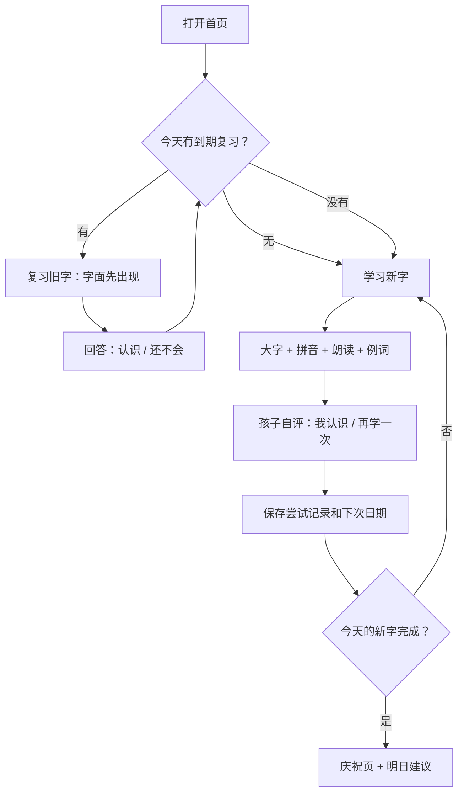

# 01｜产品方案与 MVP

## 1. 产品目标与边界

### 核心目标

帮助孩子在一个可持续的节奏里认识汉字，并不是把 1300 个字“刷完”。系统应同时解决四件事：

1. 每次只学一个字，降低注意力负担。
2. 当场留下“会/不会”的学习证据，而不是只有完成进度。
3. 在快忘记前再次出现，直到形成稳定识认。
4. 让家长能看见进度并调整每日量，而不需要人工记忆复习时间。

### 非目标（第一版不做）

- 不做开放式儿童聊天、社交、排行榜或广告。
- 不做笔顺手写识别、摄像头识字、录音打分。
- 不做古诗背诵和音乐演唱的完整学习页。
- 不强制推送通知；iOS 上先以应用内“今日任务”作为可靠提醒。
- 不允许孩子自行上传、删除或发布内容。

## 2. 人物与使用场景

| 人物 | 主要设备 | 要完成的事 | 系统应给的反馈 |
| --- | --- | --- | --- |
| 孩子 | iPhone 为主，iPad 为辅 | 每天学新字、复习旧字、听读音 | 大字、少选项、即时鼓励、清楚的下一步 |
| 家长 | iPad/电脑优先，iPhone 可查看 | 导入字表、创建孩子档案、看薄弱点、调每日量 | 易读的进度、建议和可撤销的管理操作 |
| 内容管理员（初期就是家长） | iPad/电脑 | 补全拼音、例词、AI 内容，发布一批内容 | 草稿/已发布状态、导入错误提示、审核入口 |

建议把“家长账号”与“孩子档案”分开。一个家长将来可以管理多个孩子；孩子用头像 + 昵称 + 可选四位 PIN 进入自己的学习区，无需邮箱和密码。

## 3. MVP 的功能清单

| 优先级 | 功能 | 说明 |
| --- | --- | --- |
| P0 | 家长登录与孩子档案 | Supabase Auth 只给家长；孩子是受控档案。 |
| P0 | 汉字内容库与 CSV 导入 | 导入 1300 字、拼音、年级/批次、例词等基础资料。 |
| P0 | 今日学习队列 | 固定顺序：先到期复习，再学习当日新字；家长可设每日新字数量。 |
| P0 | 单字学习卡 | 大字、拼音（可显示/隐藏）、朗读、基础释义/例词、会/不会。 |
| P0 | 复习调度与全量记录 | 每次回答、日期、间隔、下次复习日都写入数据库。 |
| P0 | 孩子首页与家长进度页 | “现在学什么”与“孩子掌握到哪里”分别清晰。 |
| P1 | 拼音小助手 | 点击拼音拆出声母/韵母/声调，播放完整读音。 |
| P1 | AI 内容卡 | 每字生成 1 句儿童例句、1 个短语、可选古诗句；缓存并可由家长审核。 |
| P1 | 字库搜索与薄弱字回顾 | 家长可搜索、重置单字或加入额外复习。 |
| P2 | 古诗学习模块 | 复用同一复习引擎，增加按句背诵与熟练度。 |
| P2 | 音乐学习模块 | 上传 MP3、封面与歌词/诗歌文本，记录听过/会唱/会背。 |
| P3 | 语音跟读、背诵识别 | Azure Speech 的语音识别和评分，须有儿童录音的隐私设置。 |

**MVP 的明确边界**：第一版只提供完整拼音的显示/隐藏与预制朗读；声母/韵母/声调拆解、拼音错误聚合、AI 例句生成与审核均属于 1.1，不作为 MVP 的交付前提。

## 4. 最关键的学习流程

### 4.1 首次使用

1. 家长登录，创建孩子头像、昵称、学习阶段和每日新字数（默认 5）。
2. 选择已发布的“学前 1300 字”学习包。
3. 孩子选自己的头像，看到一句欢迎语和“开始今天的 5 个字”。
4. 第一次只做 3 个字的引导，避免把首次体验做成设置向导。

### 4.2 每日一轮学习

### 4.3 一张字卡的正确节奏

1. **看字**：先让“山”单独占据主要视觉区域，孩子先猜或读。
2. **揭示**：点击“听一听”或“看看答案”，显示 `shān`、基础含义、一个常见词（山上）。
3. **联想**：显示一条短句，例如“山上有一棵树。”；AI 生成内容只作为补充，不能替代字义。
4. **自评**：两个等权大按钮：`我认识`、`再学一次`。不要问“掌握了吗”，儿童更容易理解“认识”。
5. **确认**：页面短暂显示“下次我们在 3 天后见到它”，然后自动进入下一张。

首次学习可以先给出答案；复习时先隐藏拼音和释义，点击后再展开。这样才是真正的“识认”而不只是看过。

## 5. 记忆曲线：先用可解释的简化算法

第一版不必马上引入难以解释的复杂模型。采用固定间隔，便于家长理解、便于后续按数据调整。

| 阶段 | 最近一次结果 | 建议下次出现 | 状态文案 |
| --- | --- | --- | --- |
| 0 新字 | 首次学习 | 当天学习结束前再遇一次 | 刚认识 |
| 1 不稳 | 认识 / 再学一次后认识 | 1 天后 | 需要再看看 |
| 2 初步认识 | 认识 | 3 天后 | 正在记住 |
| 3 巩固 | 认识 | 7 天后 | 越来越熟 |
| 4 熟悉 | 认识 | 14 天后 | 已经很熟 |
| 5 稳定 | 认识 | 30 天后 | 稳定认识 |
| 6 维护 | 认识 | 60 天后 | 稳定认识 |
| 7 长期维护 | 刚进入 stage 7 / 再次认识 | 首次 90 天后；stage 7 再答对后 180 天 | 稳定认识 |

### MVP 阶段转移真值表

| 当前情形 | 本次回答 | 新阶段 | 下次时间 | 当天队列动作 |
| --- | --- | --- | --- |
| 首次接触新字 | 认识 / 再学一次 | 0 | 当前会话 | 在本批新字末尾追加 1 次 `reinforcement` |
| 当天强化复现（stage 0） | 认识 | 1 | 1 天后 | 不再追加 |
| 当天强化复现（stage 0） | 再学一次 | 0 | 次日优先 | 不再追加 |
| stage 1 | 认识 | 2 | 3 天后 | 不追加 |
| stage 2 | 认识 | 3 | 7 天后 | 不追加 |
| stage 3 | 认识 | 4 | 14 天后 | 不追加 |
| stage 4 | 认识 | 5 | 30 天后 | 不追加 |
| stage 5 | 认识 | 6 | 60 天后 | 不追加 |
| stage 6 | 认识 | 7 | 90 天后 | 不追加 |
| stage 7 | 认识 | 保持 7，并标记长期稳定 | 180 天后 | 不追加 |
| stage 1–7（当日尚未强化过） | 再学一次 | `max(0, 当前阶段 - 2)` | 当前会话 | 在本次会话末尾追加 1 次 `error_reinforcement` |
| stage 1–7（当日已强化过） | 再学一次 | `max(0, 当前阶段 - 2)` | 次日优先 | 不再追加 |
| `error_reinforcement` | 认识 / 再学一次 | **保持已经降级后的阶段** | 次日优先 | 不再追加 |

这是本次确认后的关键改动：**答错时先降级；当天的强化复现只是确认，不会因为答对而恢复等级。** 例如，一个 stage 5 的字答错后会降为 stage 3；即使当天强化答对，仍保持 stage 3，并在明天优先出现。明天答对后才正常进入 stage 4 的 14 天间隔。这个规则更保守，也更符合“答错要真正多复习”的目标。

补充规则：同一学习项每天最多出现一次强化复现；强化项不计入“15 个到期复习”上限。孩子退出或跨日时，未完成的强化项保留为 `pending`，次日优先出现。阶段 7 的字再次答对后记为“长期稳定”，但仍在 180 天后维护复习；一旦答错则按降两级规则回退。

无论哪个分支：

- 每个回答都写入 `learning_attempts`，绝不只覆盖当前状态。这样日后能查看“哪次会、哪次不会”。
- 每日上限默认：新字 5、复习 15；到期复习超过上限时优先展示最久未复习和最不稳定的字，并显示积压数给家长。

这是“可用的遗忘曲线”，不是医学或教育诊断。等积累 2–3 个月真实记录后，再评估是否切换为 FSRS 或保留当前规则。

## 6. 拼音学习如何自然嵌入

拼音不应变成另一个突然出现的大课程。它附着在每一个汉字卡片上，按需展开：

- 常态显示完整拼音：`mā`；点击才显示“声母 m + 韵母 a + 第一声”。
- 使用颜色之外的符号/文字区分声调，不能只依赖颜色。
- “朗读”默认读汉字 + 拼音；孩子可切换为只读拼音。
- 当某一声母、韵母或声调的错误集中时，在家长页提示“本周可多听 `an` 韵母”；第二阶段再做独立拼音小游戏。

## 7. AI 与语音的正确位置

### AI 生成内容

Azure OpenAI 适合生成：儿童短句、常见搭配、联想提示、关联古诗句的候选项。它**不适合**成为汉字拼音和释义的唯一来源。

- 规范资料（字、标准拼音、基础义）来自导入字库并可人工修正。
- AI 在服务器端按结构化 JSON 输出；结果缓存到内容表，不在孩子学习时每张卡实时调用。
- 内容标为“待审核/已发布”；家长可以编辑或隐藏。
- 提示词限制年龄、长度、敏感话题和虚构事实；生成失败时仅隐藏 AI 卡，不影响学习。

### Azure Speech

- MVP：使用 Azure Speech 合成每个字/词/例句的朗读音频，并缓存到私有 Storage；或按需换取短期 token 后播放。
- 后续：孩子跟读或背诵时上传录音前需由家长明确开启；录音默认私有、可一键删除，并设置自动清理周期。
- 语音评分只能说“可再练习”，不把低分当成孩子能力标签。

## 8. 古诗与音乐的扩展方式

不要另外造一套“进度系统”。它们都抽象成同一种 `learning_item`：有内容、有学习模式、有当前调度状态、有每次尝试。

| 模块 | 第一版接入时的学习项 | 回答方式 | 特有内容 |
| --- | --- | --- | --- |
| 汉字 | 单个字 | 认识 / 再学一次 | 拼音、释义、例词、朗读 |
| 古诗 | 一首诗（后续可到句） | 会背 / 还不熟 | 作者、朝代、分句、朗读 |
| 音乐 | 一首导入 MP3 | 会唱/会背/还不熟 | 音频、封面、歌词、播放位置 |

古诗 P2 先做“听/看/自评 + 复习提醒”，不承诺自动判断背诵正确性。音乐 P2 只允许家长上传自己有权使用的 MP3，文件放在私有 bucket 中。

## 9. 迭代顺序与取舍原则

| 阶段 | 交付 | 什么时候开始下一阶段 |
| --- | --- | --- |
| 0 内容试跑 | 用 30 个汉字走通导入、学习、复习、进度 | 一位孩子可连续使用 7 天 |
| MVP | 1300 字、全流程、家长页、PWA 安装 | 每次记录都可靠，首页不会漏掉到期任务 |
| 1.1 | 拼音拆解、AI 内容审核、薄弱字回顾 | 有至少 4 周真实数据 |
| 2 | 古诗模块 | 汉字的学习/复习引擎无需复制即可复用 |
| 3 | 音乐模块、上传与播放 | Storage 权限、私有链接和删除机制已验证 |
| 4 | 跟读/背诵识别 | 家长明确接受录音隐私和成本方案 |

判断是否该“加功能”的原则：若它不能提高孩子每天完成今日任务的概率，或不能提高家长理解学习情况的能力，就先不做。
