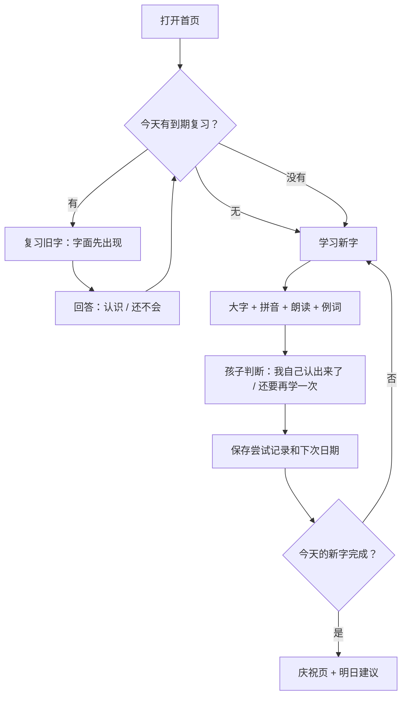

# 01｜产品方案与 MVP

## 1. 产品目标与边界

### 核心目标

帮助孩子在一个可持续的节奏里认识汉字，并不是把 1300 个字“刷完”。系统应同时解决四件事：

1. 每次只学一个字，降低注意力负担。
2. 当场留下“会/不会”的学习证据，而不是只有完成进度。
3. 在快忘记前再次出现，直到形成稳定识认。
4. 让家长能看见进度并调整每日量，而不需要人工记忆复习时间。

### 非目标（第一版不做）

- 不做开放式儿童聊天、社交、排行榜或广告。
- 不做笔顺手写识别、摄像头识字、录音打分。
- 不做古诗逐句教学、自动背诵识别和音乐演唱的完整学习页；当前提供诗词导入、打卡与家长评分记录。
- 不强制推送通知；iOS 上先以应用内“今日任务”作为可靠提醒。
- 不允许孩子自行上传、删除或发布内容。

## 2. 人物与使用场景

| 人物 | 主要设备 | 要完成的事 | 系统应给的反馈 |
| --- | --- | --- | --- |
| 孩子 | iPhone 为主，iPad 为辅 | 每天学新字、复习旧字、听读音 | 大字、少选项、即时鼓励、清楚的下一步 |
| 家长 | iPad/电脑优先，iPhone 可查看 | 创建本家庭孩子、看概况、调每日量、提交内容 | 易读的进度、建议、自适应说明和待审核状态 |
| 空间 owner / 管理员 | iPad/电脑 | 看全部孩子概况、审核并分配资源；owner 另管账号、邀请和重复资源清理 | 用户目录、待审清单、建议分配对象、重复提示、可追踪管理操作 |

建议把“家长账号”与“孩子档案”分开。一个家长将来可以管理多个孩子；孩子用头像 + 昵称 + 可选四位 PIN 进入自己的学习区，无需邮箱和密码。

## 3. MVP 的功能清单

| 优先级 | 功能 | 说明 |
| --- | --- | --- |
| P0 | 家长登录与孩子档案 | Supabase Auth 只给家长；孩子是受控档案。 |
| P0（已实现） | 多家庭与空间管理员 | 家庭之间 RLS 隔离；owner/admin 审核、分配并查看全局概况。 |
| P0（已实现） | Owner 用户管理 | owner 创建/停用账号、分配角色/家庭、重置临时密码；首次登录强制改密。 |
| P0 | 汉字内容库与 CSV 导入 | 导入 1300 字、拼音、年级/批次、例词等基础资料。 |
| P0 | 今日学习队列 | 先补带、再到期、再新字；依积压和 7 天首答率在安全上限内调整复习/新字量。 |
| P0 | 单字学习卡 | 大字、拼音（可显示/隐藏）、朗读、基础释义/例词、会/不会。 |
| P0 | 复习调度与全量记录 | 每次回答、日期、间隔、下次复习日都写入数据库。 |
| P0 | 孩子首页与家长进度页 | “现在学什么”与“孩子掌握到哪里”分别清晰。 |
| P1 | 拼音小助手 | 点击拼音拆出声母/韵母/声调，播放完整读音。 |
| P1 | AI 内容卡 | 每字生成 1 句儿童例句、1 个短语、可选古诗句；缓存并可由家长审核。 |
| P1 | 字库搜索与薄弱字回顾 | 家长可搜索、重置单字或加入额外复习。 |
| P1（已实现） | 跨字册重点字 | 家长可勾选与线下绘本配套的重点字；到期重点字和未学重点字优先，但不提前复习、不增加每日总量。 |
| P1（已实现记录版） | 诗词背诵模块 | CSV 导入、同日可多次打卡、可空的 1–10 分家长评分、低频/未评分提示；暂不自动判断背诵与调度。 |
| P1（已实现记忆版） | 要理问答 | 多问答册 CSV、中英双语、答案揭晓、人工判断、答错降级、每日新问与到期复习。 |
| P2（已实现） | 音乐学习模块 | 上传 MP3、封面与歌词/诗歌文本，记录听过/会唱/会背。 |
| P2（已实现） | 小芽贴纸奖励 | 完成汉字自动贴纸，诗词/音乐积累成长星，数学手工奖励，礼物兑换与可撤销流水。 |
| P3 | 语音跟读、背诵识别 | Azure Speech 的语音识别和评分，须有儿童录音的隐私设置。 |

**MVP 的明确边界**：第一版只提供完整拼音的显示/隐藏与预制朗读；声母/韵母/声调拆解、拼音错误聚合、AI 例句生成与审核均属于 1.1，不作为 MVP 的交付前提。

## 4. 最关键的学习流程

### 4.1 首次使用

1. 家长登录，创建孩子头像、昵称、学习阶段和每日新字数（默认 5）。
2. 选择已发布的“学前 1300 字”学习包。
3. 孩子选自己的头像，看到一句欢迎语和“开始今天的 5 个字”。
4. 第一次只做 3 个字的引导，避免把首次体验做成设置向导。

### 4.2 每日一轮学习

```mermaid
flowchart TD
  A[打开首页] --> B{今天有到期复习？}
  B -- 有 --> C[复习旧字：字面先出现]
  B -- 无 --> E[学习新字]
  C --> D[回答：认识 / 还不会]
  D --> B
  B -- 没有 --> E
  E --> F[大字 + 拼音 + 朗读 + 例词]
  F --> G[孩子判断：我自己认出来了 / 还要再学一次]
  G --> H[保存尝试记录和下次日期]
  H --> I{今天的新字完成？}
  I -- 否 --> E
  I -- 是 --> J[庆祝页 + 明日建议]
```

### 4.3 一张字卡的正确节奏

1. **看字**：先让“山”单独占据主要视觉区域，孩子先猜或读。
2. **揭示**：点击“听一听”或“看看答案”，显示 `shān`、基础含义、一个常见词（山上）。
3. **联想**：显示一条短句，例如“山上有一棵树。”；AI 生成内容只作为补充，不能替代字义。
4. **自评**：两个等权大按钮：`我认识`、`再学一次`。不要问“掌握了吗”，儿童更容易理解“认识”。
5. **确认**：页面短暂显示“下次我们在 3 天后见到它”，然后自动进入下一张。

首次学习可以先给出答案；复习时先隐藏拼音和释义，点击后再展开。这样才是真正的“识认”而不只是看过。

## 5. 记忆曲线：先用可解释的简化算法

第一版不必马上引入难以解释的复杂模型。采用固定间隔，便于家长理解、便于后续按数据调整。

| 阶段 | 最近一次结果 | 建议下次出现 | 状态文案 |
| --- | --- | --- | --- |
| 0 新字 | 首次学习 | 当天学习结束前再遇一次 | 刚认识 |
| 1 不稳 | 认识 / 再学一次后认识 | 1 天后 | 需要再看看 |
| 2 初步认识 | 认识 | 3 天后 | 正在记住 |
| 3 巩固 | 认识 | 7 天后 | 越来越熟 |
| 4 熟悉 | 认识 | 14 天后 | 已经很熟 |
| 5 稳定 | 认识 | 30 天后 | 稳定认识 |
| 6 维护 | 认识 | 60 天后 | 稳定认识 |
| 7 长期维护 | 刚进入 stage 7 / 再次认识 | 首次 90 天后；stage 7 再答对后 180 天 | 稳定认识 |

### 动态双确认真值表

“今日认出”与“长期阶段”分开：当天通过表示孩子今天能独立认出，跨天阶段仍由到期复习验证。独立认出要求本轮没有听朗读、看拼音/答案/联想图或得到口头提示。

| 当前情形 | 今日通过标准 | 通过后的阶段处理 | 没有独立认出后的处理 |
| --- | --- | --- | --- |
| 新字、stage 0–2 | 连续 2 次独立认出 | 完成第 2 次后正常升一级 | 清空确认进度、柔和降级一次、放到队尾 |
| stage 3–6 到期复习 | 第 1 次独立认出 | 正常升一级 | 柔和降级一次，并改为连续 2 次独立认出 |
| stage 7 到期复习 | 第 1 次独立认出 | 保持 stage 7，180 天后维护 | 降到 stage 5、取消长期稳定，并改为双确认 |
| 当天已经降级的重试 | 连续 2 次独立认出 | 保持降级后阶段，次日优先验证 | 只清空确认进度，不再次降级，继续放到队尾 |
| 使用朗读、答案、拼音、词句或联想图 | 本轮不计独立确认 | 无 | 按得到帮助处理，稍后重新隐藏答案再认 |

柔和降级为：`0→0、1→0、2→1、3→1、4→2、5→3、6→4、7→5`。每个字每天最多降级一次；后续重试次数不限，每一轮仍写入 `learning_attempts`。例如 stage 5 第一次没认出后降到 stage 3；即使当天后来连续两次认出，仍保持 stage 3 并在明天优先出现，明天独立认出后才升到 stage 4。

队列项按回答次数编号，同一时刻每个未通过字只保留一张 `pending` 卡；未通过就生成新的 `same_day_retry` 放到队尾。孩子退出后当天回来会继续；跨日仍未完成则作为 `carry` 优先带入，但昨日确认次数不跨天继承。

重点字是孩子级的队列排序设置，不是新的记忆阶段。家长可以从孩子所有活跃字册中选择一批重点字：旧日已开始但未完成的字先占当天复习名额；到期重点字排在到期普通字前；未学重点字先占当天新字名额；普通新字再按“字册分配顺序 + CSV 顺序”补齐。重点字必须到 `due_at` 后才复习，取消重点不会删除状态或历史。若孩子一两天未学习，到期内容继续保留，不能仅因未打开 APP 自动降级。

学习页按“不同汉字”显示 `今日已认出 X / Y 个字`，不按动态卡片次数显示进度。新字完成第一次确认但还差一次时，总字数不变；全部汉字达到各自确认标准后才发放当天汉字贴纸。

无论哪个分支：

- 每个回答都写入 `learning_attempts`，绝不只覆盖当前状态。这样日后能查看“哪次会、哪次不会”。
- 默认新字 5、基础复习 15、安全上限 25。积压不超基础量时正常加新字；积压 16–30 时复习量增加 5 且新字减半；31–60 时按安全上限复习且新字最多 2；超过 60 时暂停新字。
- 近 7 天至少 5 个首答且独立认出率低于 60% 时，暂停新字，复习量最多 20（但不低于家长设定的基础量）。队列在当天第一次打开时快照，当天改设置第二天生效。

这是“可用的遗忘曲线”，不是医学或教育诊断。等积累 2–3 个月真实记录后，再评估是否切换为 FSRS 或保留当前规则。

## 6. 拼音学习如何自然嵌入

拼音不应变成另一个突然出现的大课程。它附着在每一个汉字卡片上，按需展开：

- 常态显示完整拼音：`mā`；点击才显示“声母 m + 韵母 a + 第一声”。
- 使用颜色之外的符号/文字区分声调，不能只依赖颜色。
- “朗读”默认读汉字 + 拼音；孩子可切换为只读拼音。
- 当某一声母、韵母或声调的错误集中时，在家长页提示“本周可多听 `an` 韵母”；第二阶段再做独立拼音小游戏。

## 7. AI 与语音的正确位置

### AI 生成内容

Azure OpenAI 适合生成：儿童短句、常见搭配、联想提示、关联古诗句的候选项。它**不适合**成为汉字拼音和释义的唯一来源。

- 规范资料（字、标准拼音、基础义）来自导入字库并可人工修正。
- AI 在服务器端按结构化 JSON 输出；结果缓存到内容表，不在孩子学习时每张卡实时调用。
- 内容标为“待审核/已发布”；家长可以编辑或隐藏。
- 提示词限制年龄、长度、敏感话题和虚构事实；生成失败时仅隐藏 AI 卡，不影响学习。

### Azure Speech

- MVP：使用 Azure Speech 合成每个字/词/例句的朗读音频，并缓存到私有 Storage；或按需换取短期 token 后播放。
- 后续：孩子跟读或背诵时上传录音前需由家长明确开启；录音默认私有、可一键删除，并设置自动清理周期。
- 语音评分只能说“可再练习”，不把低分当成孩子能力标签。

## 8. 诗词、音乐与要理问答的扩展方式

### 8.1 当前诗词背诵模块

诗词采用独立的记录模型，而不是临时复用汉字的 stage。家长可导入题目、作者、朝代和分行正文；孩子在任意渠道背过或读过后，家长点一次“今天背过一次”。每一次点击均新增一条历史记录，**同一天两次背诵就是两条记录**。评分允许为空，方便先打卡、后观察。

页面聚合展示每首诗的背诵次数、练习过的日期数、最近一次打卡日期、最近评分和平均评分；推荐顺序优先未打卡、只背一次、已练但未评分、低分或久未复习的诗。它是提示，不宣称自动判断孩子是否会背。

后续若需要间隔提醒，新增 `poem_recitation_states` 等诗词专用调度表；不要将 `poem_id` 塞进现有汉字的 `learning_states`/`learning_attempts`。

### 8.2 当前音乐学习模块

音乐模块已实现三类家庭练习：

- **唱一唱**：维护标题、歌词、MP3、可选封面与 1–5 张琴谱；记录“只听过 / 跟着唱 / 提示下会唱 / 独立会唱”。
- **辨声音**：先播放音频，孩子可选填写实际猜测，再揭晓乐器答案与可选图片；只记录认出/没认出。
- **打节奏**：可有示范音频、节奏谱和练习说明；只记录能打出/需要再练。

每次点击都保留独立历史，同日多次不合并。成功时逐级延长间隔；辨音/节奏失败时降两级、第二天重练。这是可解释的复习建议，不代替专业音乐评估。

文件本体放在私有 Cloudflare R2，封面不是必填。家长已确认对导入的 MP3/图片拥有使用授权。

### 8.3 当前要理问答模块

首份内容为已获授权的《要理问答》（*First Catechism: Biblical Truth for God’s Children*）。中文和英文问题同时显示，答案默认隐藏；孩子口头回答后由家长揭晓答案，并按内容与原答案基本相同（约 80%–100%）判断“背出来了 / 还要再背”。

每位孩子默认每天 3 个新问题、最多 10 个到期复习，家长可独立调整。答出时上升一级，未答出时下降两级并次日复习；每次点击都追加不可变历史，同日多次不合并。不同问答册版本不自动合并，获授权文本不由 AI 翻译或改写。

### 8.4 当前小芽贴纸奖励

完成当天全部汉字卡会自动得到 1 枚贴纸，每个孩子每天一次。诗词、跟唱、辨音和节奏练习先积累成长小星星：同一项目同一天最多一颗、一天最多两颗，三颗自动换一枚贴纸。歌曲仅听不加星；辨音和节奏奖励认真尝试，无论结果是否正确。

线下数学由家长每天手工补 1 枚。礼物默认建议 10 枚兑换；兑换扣贴纸，误操作用撤销返还，所有变化都保留不可覆盖流水。奖励系统只读取真实学习记录，不改变原模块阶段；奖励暂时不可用时，学习记录仍必须成功。

### 8.5 统一学习项的长期方向

不要另外造一套“进度系统”。它们都抽象成同一种 `learning_item`：有内容、有学习模式、有当前调度状态、有每次尝试。

| 模块 | 第一版接入时的学习项 | 回答方式 | 特有内容 |
| --- | --- | --- | --- |
| 汉字 | 单个字 | 认识 / 再学一次 | 拼音、释义、例词、朗读 |
| 古诗 | 一首诗（后续可到句） | 打卡 / 家长评分；后续会背 / 还不熟 | 作者、朝代、分句、朗读 |
| 音乐 | 歌曲 / 乐器声音 / 节奏练习 | 多级跟唱或二值结果 | 音频、可选封面、歌词、琴谱、可选猜测备注 |
| 要理问答 | 一个中英双语问题 | 背出来了 / 还要再背 | 双语答案、经文出处、家长备注、分别朗读 |

古诗、音乐与要理问答都不承诺自动判断背诵/演唱正确性；当前分类和判断由家长人工确认。

## 9. 迭代顺序与取舍原则

| 阶段 | 交付 | 什么时候开始下一阶段 |
| --- | --- | --- |
| 0 内容试跑 | 用 30 个汉字走通导入、学习、复习、进度 | 一位孩子可连续使用 7 天 |
| MVP | 1300 字、全流程、家长页、PWA 安装 | 每次记录都可靠，首页不会漏掉到期任务 |
| 1.1 | 拼音拆解、AI 内容审核、薄弱字回顾 | 有至少 4 周真实数据 |
| 2 | 诗词提醒与按句背诵 | 已有背诵历史足以验证提醒规则，不破坏汉字复习引擎 |
| 3（当前已交付 MVP） | 唱一唱、辨声音、打节奏、R2 上传/删除与复习建议 | 先用 3–5 条真实内容连续验收 7 天，再批量导入 30–40 条 |
| 3.1（当前已交付 MVP） | 要理问答 145 问、双语朗读、人工判断与间隔复习 | 先用模板 2 问验收，再导入获授权的完整内容 |
| 3.2（当前已交付 MVP） | 小芽贴纸册、成长星、数学贴纸、礼物兑换与撤销 | 先按默认 10 枚目标真实使用两周，再决定是否开放家长调整门槛 |
| 3.3（当前已交付 MVP） | 多家庭 RLS、管理员审核/分配、家长看板和自适应汉字量 | 用两个真实家长账号连续验收 14 天，再考虑多空间切换或班级功能 |
| 4 | 跟读/背诵识别 | 家长明确接受录音隐私和成本方案 |

判断是否该“加功能”的原则：若它不能提高孩子每天完成今日任务的概率，或不能提高家长理解学习情况的能力，就先不做。
