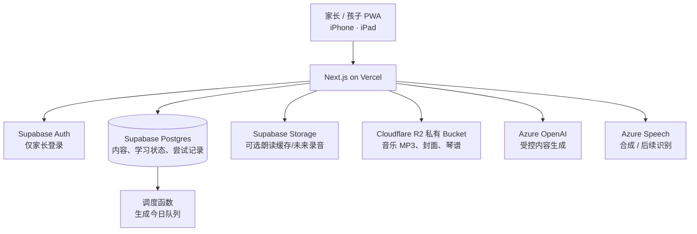

# 03｜数据模型与技术架构

## 1. 总体架构



### 职责边界

| 服务 | 做什么 | 不做什么 |
| --- | --- | --- |
| Vercel / Next.js | 页面、Route Handlers、服务器端 Azure 调用、导入编排 | 不长期保存密钥或学习数据到本地文件 |
| Supabase Auth | 家长身份、会话 | 不直接把儿童昵称当成可登录账号 |
| Supabase Postgres | 内容、当前学习状态、不可变尝试记录、调度 | 不保存 Azure 密钥 |
| Supabase Storage | 可选的朗读缓存与未来孩子录音 | 当前不存音乐 MP3/琴谱 |
| Cloudflare R2 | 私有音乐 MP3、可选封面、琴谱、乐器图与节奏谱 | 不公开 Bucket，不保存学习状态 |
| Azure OpenAI | 生成候选例句/诗词关联 | 不决定标准拼音、字义或学习状态 |
| Azure Speech | 朗读；以后做受控的跟读/背诵识别 | 不在浏览器暴露 Azure key |

## 2. 账号与权限模型

### 推荐模型

```text
auth.users（家长） 1 ── N learner_profiles（孩子档案）
learner_profiles 1 ── N learning_states（每个学习项当前状态）
learning_states 1 ── N learning_attempts（每一次回答）
```

- 家长用邮箱魔法链接或密码登录；早期只需一种登录方式，减少支持成本。
- 孩子档案不直接接触 Supabase Auth；在同一个家长会话下，选择 `learner_id` 后进入儿童模式。
- 若未来需要孩子独立设备登录，再增加受限的 child session，而不是把家长账号共享给孩子。
- 家庭成员/多个家长可作为后续功能，不是 MVP 的前置条件。

### RLS 不可妥协的规则

1. `public` 中每一张表启用 RLS。
2. 家长只可读取/写入自己拥有的 `learner_profiles` 及其派生记录。
3. 内容库可给已登录家长只读；孩子通过其家长会话读取已发布内容，不能读草稿、其他家庭记录或管理员提示词。
4. `service_role` 只存在于 Vercel 服务端环境变量，绝不以 `NEXT_PUBLIC_` 开头，也绝不放入浏览器。
5. Storage 使用私有 bucket；下载经服务端校验归属后签发短时 URL。
6. `UPDATE` policy 同时配置 `USING` 与 `WITH CHECK`；且有配套 `SELECT` policy。

这些规则与 Supabase 对公开 schema 使用 RLS、基于 `auth.uid()` 做行级归属校验的建议一致；实现阶段应以官方文档和当时版本为准。

### 可验收的跨家庭隔离策略

每张带 `learner_id` 的表均用同一个归属条件：

```sql
exists (
  select 1
  from learner_profiles lp
  where lp.id = learner_id
    and lp.parent_user_id = (select auth.uid())
)
```

它应出现在该表的 `SELECT`、`DELETE` 的 `USING` 条件，以及 `INSERT` 的 `WITH CHECK`、`UPDATE` 的 `USING` 和 `WITH CHECK` 条件中。媒体 bucket 的路径第一段必须等于当前家长的 `auth.uid()`，再通过 Storage RLS 校验。验收时准备 A、B 两个真实测试账号：B 对 A 的 `learner_profiles`、`learning_states`、`learning_attempts`、`daily_sessions` 和媒体路径发起读写，必须全部被拒绝。

## 3. MVP 数据模型

字段命名可按项目习惯调整；重点是把“内容”“当前状态”“每次尝试”分开。

### 内容域

| 表 | 关键字段 | 用途 |
| --- | --- | --- |
| `content_packages` | `id, title, stage, status, version` | 学前 1300 字、小学字、中学字等可发布学习包。 |
| `characters` | `id, character, pinyin_marked, pinyin_numbered, meaning, radical, strokes, status` | 一个规范汉字一条记录；`character` 唯一。 |
| `package_characters` | `package_id, character_id, sequence, grade, is_required` | 字与学习包的关系及推荐顺序。 |
| `character_examples` | `id, character_id, type, text, source, status, sort_order` | 例词、例句、古诗句候选；AI/人工来源与发布状态独立。 |
| `audio_assets` | `id, content_type, content_id, variant, storage_path, duration_ms, status` | 单字/词/句音频缓存，不把二进制塞进数据库。 |

### 学习域

| 表 | 关键字段 | 用途 |
| --- | --- | --- |
| `learner_profiles` | `id, parent_user_id, display_name, avatar_key, daily_new_limit, active_package_id` | 孩子档案与个人设置。 |
| `learning_states` | `id, learner_id, item_type, item_id, stage, due_at, last_result, consecutive_known, total_attempts` | 当前调度状态；`(learner_id, item_type, item_id)` 唯一。 |
| `learning_attempts` | `id, learner_id, item_type, item_id, state_id, result, mode, answered_at, previous_stage, next_stage, due_at` | 事实日志：每一次认识/再学一次都留痕。 |
| `daily_sessions` | `id, learner_id, date_local, started_at, finished_at, new_count, review_count` | 每日会话和统计。 |
| `daily_session_items` | `session_id, character_id, queue_kind, queue_position, status` | 固定当天队列，避免学习中刷新页面导致顺序漂移。 |

### 诗词与音乐扩展表（已实现）

| 表 | 用途 |
| --- | --- |
| `poems`, `poem_recitation_attempts` | 诗词内容、同日可多次的背诵打卡与可空评分。 |
| `music_items`, `music_assets` | 三类音乐内容，以及 R2 对象键/文件元数据。 |
| `learner_music_items` | 家长明确把哪些音乐内容分配给哪个孩子。 |
| `music_learning_states`, `music_practice_attempts` | 音乐当前记忆阶段、到期日与每次不可覆盖的练习历史。 |

汉字、诗词和音乐暂保持各自清晰的状态/历史表；不为了“通用性”把三种不同的学习语义塞进一张充满 nullable 字段的表。

## 4. 复习调度的服务端职责

建议用数据库函数或受权限保护的 Route Handler 完成以下原子操作：

1. 用孩子的 IANA 时区计算 `date_local`，以 `(learner_id, date_local)` 唯一键读取或创建当天会话；不能用 Vercel 服务器时区代替孩子时区。
2. 把前一天或更早仍为 `pending` 的队列项放在最前面，且不重复创建。
3. 读取某孩子到期的 `learning_states`。
4. 按 `due_at`、不稳定次数、是否逾期排序，取不超过每日复习上限的项目。
5. 补入按 `package_characters.sequence` 排序的新字，取不超过每日新字上限的项目。
6. 首次接触或“再学一次”需要强化时，在同一 `daily_session` 追加 1 个 `queue_kind=new_reinforcement` 或 `error_reinforcement` 项，位置为当前新字/复习批次末尾；同一 item 一天最多追加一次，且不计入到期复习上限。`error_reinforcement` 答对也保留已降级阶段，次日优先复查。
7. 用户答题后，在同一事务里写 `learning_attempts`、更新 `learning_states`、更新队列项状态。

重要：不要在浏览器中自行计算后直接覆盖阶段或下次日期。浏览器只提交 `result = known | again`、`session_item_id` 和唯一的 `answer_request_id`；服务端以幂等键去重，重复提交只返回首次结果。未答项目保持 `pending`，刷新/退出不算一次尝试。

## 5. API / Route Handler 轮廓

| 路径 | 方法 | 用途 |
| --- | --- | --- |
| `/api/learners` | `GET/POST/PATCH` | 查看/创建/编辑孩子档案（家长）。 |
| `/api/learners/:id/today` | `GET` | 获取或创建今日队列。 |
| `/api/sessions/:id/answer` | `POST` | 提交一次 `known/again`，原子更新调度。 |
| `/api/characters/:id/audio` | `POST` | 获取或生成受控朗读，返回短时播放地址。 |
| `/api/admin/import/characters` | `POST` | 校验 CSV、预览、导入草稿。 |
| `/api/admin/content/:id/publish` | `POST` | 发布内容包或 AI 候选内容。 |
| `/api/admin/ai/character-content` | `POST` | 批量生成候选内容；只给家长/管理员。 |
| `/api/music/assets/upload-url` | `POST` | 验证家长与文件，生成限时 R2 PUT URL；文件由浏览器直传。 |

写操作需要在服务端再次验证“当前登录家长拥有该 `learner_id`”。不能仅依靠前端隐藏按钮或 Next.js 中间件。

## 6. Azure 使用建议

### Azure OpenAI

- 用 Route Handler 调用，密钥只保留在 Vercel 环境变量。
- 输入：固定汉字、标准拼音、基础释义、年龄段、受限长度；输出：严格 JSON schema。
- 生成任务按批次运行（例如每次 20–50 字），支持重试与失败日志；不要让用户一次触发 1300 个同步请求。
- 所有输出带 `model`, `prompt_version`, `generated_at`, `review_status`，方便日后重新生成或人工审核。
- 同一字的已发布内容直接读数据库缓存，学习页不等待模型响应。

### Azure Speech

- 首选提前为已发布内容合成单字音频并缓存；播放延迟更稳定，也便于成本控制。
- 若即时合成，Token 或音频 URL 的有效期应短；Azure key 永不下发给客户端。
- 跟读功能上线前，确认语音数据区域、保留期、家长同意和删除流程。

## 7. Storage 规划

| Bucket | 可见性 | 存放 | 权限 |
| --- | --- | --- | --- |
| `published-audio` | 私有 | 已发布单字/例句/古诗朗读 | 仅已授权家庭经短时签名 URL 读 |
| Cloudflare R2 `fisher-learning-media` | 私有 | 家长导入 MP3、封面、琴谱、乐器/节奏图 | Vercel 校验归属后签发短时 URL；浏览器不持有 R2 密钥 |
| `recitations`（后续） | 私有 | 孩子录音 | 默认仅家长；支持删除/自动过期 |

R2 文件路径为 `music/{parent_user_id}/{item_id}/{asset_type}/{uuid.ext}`。每次签发上传 URL 前，Next.js 都重新核验 `music_items.created_by = auth.uid()`；Bucket 保持私有，只向当前已授权页面返回限时 URL。

## 8. 性能、缓存与可靠性

- 1300 个字及其元数据很小；首屏只取今日队列和必要卡片内容，不把全库下载到手机。
- 已发布的字库可在服务端短期缓存；孩子个人状态始终按登录用户读取，不能走共享页面缓存。
- 使用数据库索引：`learning_states(learner_id, due_at)`、`learning_attempts(learner_id, item_id, answered_at desc)`、`package_characters(package_id, sequence)`。
- 有网络失败时，保留未提交答案到本地待同步队列，并明确显示“等待保存”；第一版至少保证提交失败可重试，不可静默丢失。
- 每天计算“逾期复习数”；若积压连续三天，家长页建议临时将新字数降至 0–2。

## 9. 开发安全检查表

- [ ] 新表均启用 RLS，并有最小权限 policy。
- [ ] 浏览器环境变量只有 Supabase URL 与 publishable/anon key；没有 service role、Azure key 或存储管理 key。
- [ ] 所有 `learner_id`、`family_id` 在每个服务器端写操作中重新校验归属。
- [ ] 导入文件做 MIME、大小、列名和行数校验；错误行可下载，不覆盖已发布内容。
- [ ] AI 生成和音频合成有速率限制、成本上限、审计日志和超时降级。
- [ ] 音频、录音、孩子昵称不出现在公开 URL、日志或分析工具中。
- [ ] 删除孩子档案时，明确级联/软删除策略及媒体清理方案。

## 10. 外部参考（实施前再核对）

- [Supabase Row Level Security](https://supabase.com/docs/guides/database/postgres/row-level-security)
- [Supabase Storage Access Control](https://supabase.com/docs/guides/storage/security/access-control)
- [Vercel Function Duration](https://vercel.com/docs/functions/configuring-functions/duration)

Supabase、Vercel、Azure 的功能和限制会变动；真正开始建库、鉴权与部署前，应重新核对当期官方文档和 changelog，不依赖本文的版本假设。
