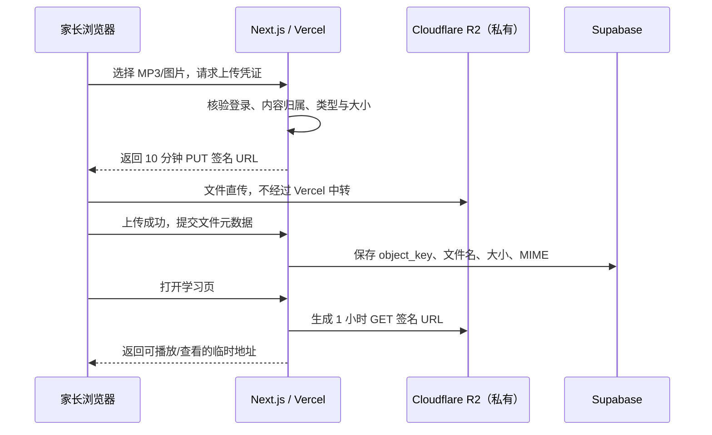

# 音乐模块｜Cloudflare R2 保姆级配置教程

> 适用于当前 `Fisher_Learning_System`，更新日期：2026-07-18。这份教程从您截图中的 **R2 Object Storage 空白首页** 开始，不需要 Cloudflare Workers，也不需要 Supabase Edge Functions。

## 0. 先理解这套存储方式



这样做的好处：

- MP3 不经过 Vercel Function 中转，大文件上传更稳定。
- R2 Bucket 不公开；知道对象路径也不能直接访问。
- R2 密钥只在 Vercel 服务器中，浏览器只拿到限时、限单个文件、限操作的 URL。
- Supabase 只保存学习数据和 R2 对象键，不保存 MP3/大图片本体。

Cloudflare 官方说明：[R2 Bucket 默认不公开](https://developers.cloudflare.com/r2/buckets/create-buckets/)；浏览器使用预签名 URL 时仍需 [配置 CORS](https://developers.cloudflare.com/r2/buckets/cors/)。

## 1. 先在 Supabase 运行音乐 SQL

1. 打开 Supabase Dashboard → 您的项目 → **SQL Editor** → **New query**。
2. 打开本地 [supabase/009_music_learning_mvp.sql](./supabase/009_music_learning_mvp.sql)。
3. 全选、复制全部 SQL，粘贴到 SQL Editor，点 **Run**。
4. 不要只运行建表部分；脚本后半段还包含 RLS 与 `record_music_practice` RPC。

运行后用以下 SQL 验证：

```sql
select table_name
from information_schema.tables
where table_schema = 'public'
  and table_name in (
    'music_items', 'music_assets', 'learner_music_items',
    'music_learning_states', 'music_practice_attempts'
  )
order by table_name;

select routine_name
from information_schema.routines
where routine_schema = 'public'
  and routine_name = 'record_music_practice';
```

第一段应返回 5 张表，第二段应返回 1 个函数。

## 2. 在您的截图页面创建 Bucket

1. 在 Cloudflare Dashboard 打开 **R2 Object Storage**。
2. 点截图右上角蓝色的 **+ Create bucket**。
3. **Bucket name** 填：

```text
fisher-learning-media
```

4. **Location** 保持 `Automatic`。这个家庭学习项目不需要 EU/FedRAMP 等特殊 jurisdiction。
5. **Default storage class** 保持 `Standard`。音频会被经常读取，不适合低频存储类。
6. 点 **Create bucket**。

Bucket 名必须与 `.env.local` 和 Vercel 的 `R2_BUCKET_NAME` 完全一致。若您自定义了其他名字，后面也要填同一个值。

## 3. 保持 Bucket 私有

进入 `fisher-learning-media` 后，打开 **Settings**，找到公开访问相关区域：

- **Public Development URL / r2.dev**：保持 `Disabled`。
- **Custom Domains**：本版不需要添加。

`le.fisherai6.top` 仍然只指向 Vercel，不要指向 R2。学习页会由 Vercel 核验身份后签发临时读取 URL。

## 4. 配置 CORS（直传成败的关键）

1. 在 `fisher-learning-media` 中打开 **Settings**。
2. 找到 **CORS Policy**。
3. 点 **Add CORS policy**。
4. 选择 **JSON** 页签，粘贴：

```json
[
  {
    "AllowedOrigins": [
      "http://localhost:3000",
      "https://fisher-learning-system.vercel.app",
      "https://le.fisherai6.top"
    ],
    "AllowedMethods": ["GET", "PUT", "HEAD"],
    "AllowedHeaders": ["Content-Type"],
    "ExposeHeaders": ["ETag"],
    "MaxAgeSeconds": 3600
  }
]
```

5. 点 **Save**。

注意：

- Origin 不带路径，不要写 `/music`，也不要在末尾加 `/`。
- 如果 Vercel 项目真实默认域名不是上面这个，将它替换为您 Vercel **Domains** 页显示的精确地址。
- 如果需要在某一个 Vercel Preview 部署中测试，将那个 Preview 的完整 Origin 临时添入数组；不建议为方便而改成 `*`。
- 上传时代码会对 `Content-Type` 签名，浏览器必须发送完全一致的值；否则 R2 会拒绝。

Cloudflare 官方 CORS 步骤：[R2 → Bucket → Settings → CORS Policy](https://developers.cloudflare.com/r2/buckets/cors/)。

## 5. 创建只能访问这个 Bucket 的 API Token

1. 回到您截图中的 R2 首页。
2. 右下角 **Account Details** 区域，在 **API Tokens** 右边点 **Manage**。
3. 点 **Create Account API token**（若页面只显示 `Create API token`，就点这个）。
4. Token name 填：

```text
fisher-learning-vercel
```

5. Permissions 选 **Object Read & Write**。
6. Bucket scope 选 **Apply to specific buckets only**，然后只勾选 `fisher-learning-media`。
7. TTL 可保持长期；若 Cloudflare 页面要求到期日，选一个您能提前轮换的日期。
8. 点 **Create Account API token**。
9. 创建成功后会显示：
   - `Access Key ID`
   - `Secret Access Key`
10. 立即复制到密码管理器。**Secret Access Key 离开该页后无法再查看**。

不要选 `Admin Read & Write`：应用只需读写文件，不需要创建/删除 Bucket 的权限。Cloudflare 官方也支持将 `Object Read & Write` Token [限制到指定 Bucket](https://developers.cloudflare.com/r2/api/tokens/)。

## 6. 复制 Account ID

回到 R2 首页，在截图右下角 **Account Details** 中可看到 **Account ID**，点右边的复制图标。

Account ID 是一串字母数字，不是邮箱，也不是 zone ID。程序会用它生成 S3 endpoint：

```text
https://<ACCOUNT_ID>.r2.cloudflarestorage.com
```

## 7. 配置本地 `.env.local`

在项目根目录 `.env.local` 末尾加入：

```dotenv
R2_ACCOUNT_ID=第6步复制的AccountID
R2_ACCESS_KEY_ID=第5步的AccessKeyID
R2_SECRET_ACCESS_KEY=第5步的SecretAccessKey
R2_BUCKET_NAME=fisher-learning-media
```

规则：

- 不加引号，等号两边不要加空格。
- 这 4 个变量都**不得**以 `NEXT_PUBLIC_` 开头。
- 不要将 `.env.local` 上传 GitHub、发到聊天或截图。
- 修改后必须停止并重新运行 `npm run dev`。

## 8. 配置 Vercel 生产环境

1. 打开 Vercel Dashboard → `fisher-learning-system` 项目。
2. 进入 **Settings → Environment Variables**。
3. 逐个新建下列变量：

| Name | Value | 环境 |
| --- | --- | --- |
| `R2_ACCOUNT_ID` | Cloudflare Account ID | Production / Preview / Development |
| `R2_ACCESS_KEY_ID` | Token 的 Access Key ID | Production / Preview / Development |
| `R2_SECRET_ACCESS_KEY` | Token 的 Secret Access Key | Production / Preview / Development |
| `R2_BUCKET_NAME` | `fisher-learning-media` | Production / Preview / Development |

4. 填写时不要加引号。
5. 保存后打开 **Deployments**，对最新生产部署点 **Redeploy**。仅保存环境变量不会改造已经运行的部署。

## 9. 第一次完整测试

1. 以家长账号登录。
2. 点顶部 **学习模块 → 音乐天地**。
3. 点 **家长管理**。
4. 先创建一条“唱一唱”内容，保持草稿。
5. 进入编辑页，填写歌词，勾选要分配的孩子，将状态改为“已发布”并保存。
6. 上传一个小 MP3，等到页面显示该文件。
7. 可选上传封面和 1–5 张琴谱。
8. 回到 **音乐天地**，选择孩子，打开内容。
9. 确认音频可播放，点一次“只听过”或“跟着唱”。
10. 到 Supabase Table Editor 检查：

```sql
select title, item_type, status from public.music_items order by created_at desc;
select result, practiced_local_date, practiced_at
from public.music_practice_attempts
order by practiced_at desc
limit 20;
```

## 10. 如果上传失败，按这个顺序排查

### 显示“R2 尚未配置”

- 检查 4 个 `R2_*` 变量是否都填了。
- 本地是否重启 `npm run dev`。
- Vercel 是否在保存环境变量后 Redeploy。

### 浏览器显示 `Failed to fetch` 或 CORS 错误

- 重新检查 Bucket 的 **Settings → CORS Policy**。
- `AllowedOrigins` 必须和浏览器地址栏的 Origin 完全一致。
- 本机是 `http://localhost:3000`，不是 `https`。
- 正式域名是 `https://le.fisherai6.top`。

### 显示 `403` / `SignatureDoesNotMatch`

- `R2_ACCOUNT_ID` 是否误填成 zone ID。
- `R2_BUCKET_NAME` 是否和 Bucket 名完全一致。
- API Token 是否为 **Object Read & Write** 并包含该 Bucket。
- 文件 MIME 是否被浏览器正确识别。将 MP3 后缀伪改成其他类型不会通过。
- 电脑时间若严重不准，先打开系统自动校时。

### 文件已上传，但学习页无法播放

- 请不要手工将 R2 对象改名或移动；Supabase 保存的 `object_key` 会失效。
- 确认 Vercel 中仍有正确的 R2 密钥。
- 确认内容是“已发布”，且已分配给当前孩子。

### 只有 Preview 部署不能上传

把那个 Preview 的精确 Origin 加入 CORS，或仅在 `le.fisherai6.top` 生产环境做文件上传。

## 11. 文件规则与上限

| 内容 | 格式 | 单文件上限 | 数量 |
| --- | --- | --- | --- |
| 歌曲/辨音/节奏音频 | MP3、M4A、AAC、WAV | 100 MB | 每条内容 1 个；播放时循环 |
| 封面 | JPG、PNG、WebP | 10 MB | 可选，最多 1 张 |
| 琴谱 | JPG、PNG、WebP | 10 MB | 最多 5 张 |
| 乐器图 | JPG、PNG、WebP | 10 MB | 可选，最多 1 张 |
| 节奏谱 | JPG、PNG、WebP | 10 MB | 可选 |

“唱一唱”封面不是必填。没有封面时，孩子页会显示简洁的音乐占位卡，不影响播放、歌词和打卡。

## 12. 安全、费用与维护

- 预签名 URL 在有效期内就像临时通行证，不要写入公开日志或转发给他人。
- 当前上传 URL 有效 10 分钟，读取 URL 有效 1 小时。过期后重新打开页面即可。
- 建议在 R2 Overview 的 Usage 区域点 **Add Budget Alert**，设置您能接受的月度提醒。
- 删除媒体资源会同时删除 R2 文件和 Supabase 元数据；删除整条音乐内容会删除该内容的学习记录，界面已要求二次确认。
- 定期备份 Supabase 数据库；R2 原始 MP3/图片建议在本地或云盘保留一份源文件。
- 如果 R2 Secret 出现在截图、Git 或聊天中，立即到 **Manage R2 API Tokens** 撤销该 Token，新建 Token，更新 Vercel 变量并 Redeploy。

Cloudflare 对预签名 URL 的安全说明参见 [Presigned URLs](https://developers.cloudflare.com/r2/api/s3/presigned-urls/)。

## 13. 是否需要 Supabase Edge Functions？

**当前不需要。**

- Supabase Postgres RPC 负责“记一次练习 + 更新记忆阶段 + 计算下次日期”的原子事务。
- Next.js Route Handler 负责验证登录和生成 R2 预签名 URL。
- Vercel 环境变量保管 R2 密钥。

这个边界已经足够简单且安全。只有将来出现“超大文件异步转码、自动生成音频波形、长时间后台任务”时，才值得再评估 Edge Functions / Queues / Workers。
