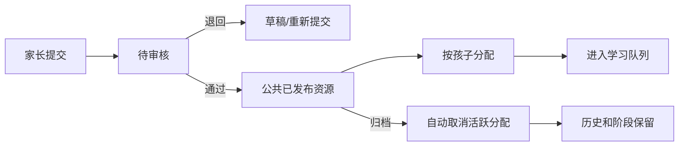

# 15｜多家庭管理员、公共资源与智能复习

## 1. 这次解决了什么

系统从“一个家长、一个孩子、资源各自私有”升级为一个小型学习空间：

- 一个空间可以有多个家庭，每个家庭只能看自己的孩子和学习记录。
- 空间管理员像班主任，可看全部孩子概况、审核内容、分配/取消分配。
- 家长可以提交字册、诗词册、音乐内容和问答册，但未审核前不会进入孩子队列。
- 公共资源和孩子学习事实分开：取消分配、归档字册都不删除历史。
- 汉字复习由固定 15 个升级为有安全上限的自适应量，但不改变动态双确认和降级真值表。

## 2. 角色与可见范围

| 角色 | 看孩子 | 改学习设置 | 提交资源 | 审核/分配 | 邀请家庭 |
| --- | --- | --- | --- | --- | --- |
| `owner` | 空间全部 | 可以 | 可以 | 可以 | 可以 |
| `admin` | 空间全部 | 可以 | 可以 | 可以 | 不可以 |
| `parent` | 自己家庭 | 可以 | 可以，进待审核 | 不可以 | 不可以 |

权限以 Supabase 表关系和 RLS 为准，不使用可由客户端改写的 `user_metadata` 判断角色。孩子仍然不需要登录账号，由家长会话操作孩子档案。

当前版本一个家长账号只加入一个学习空间。邀请第二个家庭时，应使用尚未加入其他字芽空间的邮箱。这个约束避免在还没有“空间切换器”时登录到错误空间。

## 3. 资源审核与分配

审核页会显示家长建议分配的孩子。汉字、诗词、音乐和问答导入会保存 SHA-256 内容指纹；同类资源指纹相同时，审核页会标记“可能重复”。管理员可以归档；owner 还可按 [16 号说明](./16_用户家庭管理与资源安全清理说明.md) 安全合并完全相同的重复项。

“取消分配”表示停止后续学习，不是删除记录。重新分配后，该孩子从原有 stage、到期日和练习次数继续。

## 4. 自适应汉字复习

### 4.1 每日输入

- `daily_new_limit`：家长设定的原始每日新字量。
- `hanzi_base_review_limit`：正常日基础复习量，默认 15。
- `hanzi_max_review_limit`：积压时的安全上限，默认 25。
- `due_backlog`：当天队列创建时，所有有效字册中已到期的不同汉字数。
- 最近 7 天首答独立认出率：只看每字每日的第一次回答，不用队尾反复记忆美化成绩。

### 4.2 推荐表

| 当日到期积压 | 复习目标 | 新字目标 |
| --- | --- | --- |
| `积压 ≤ 基础量` | 基础量 | 家长设定值 |
| `基础量 < 积压 ≤ 30` | `基础量 + 5`，不超过安全上限 | 减半，向上取整 |
| `30 < 积压 ≤ 60` | 安全上限 | 最多 2 个 |
| `积压 > 60` | 安全上限 | 0，先消化旧字 |
| 近 7 天至少 5 个首答且独立认出率 `< 60%` | 最多 20，但不低于家长设定的基础量 | 0 |

这是“有界自适应”，不是积压越多就无限加题。它优先停新字，再在家长允许的安全上限内增加复习，避免孩子因为前几天状态不好而被滚雪球队列压垮。

### 4.3 当天快照

第一次打开当天队列时，数据库把复习量、新字量、积压和首答率存到 `daily_sessions`。家长当天修改设置不会让正在学的队列突然变化；孩子时区的第二天创建新队列时才使用新设置。

### 4.4 不变的记忆规则

- 新字和 stage 0–2 仍需要连续两次独立认出。
- stage 3–7 的第一次独立认出仍可当日通过。
- 任何没认出、得到提示、听读音、看答案或联想图，都转为双确认。
- 每字每天最多降级一次；同日重试不限次，直到连续两次独立认出。
- 漏学一两天不会自动降级；到期日保留，实际回答才改阶段。

## 5. 界面入口

### 家长

- `/parent`：查看当日完成、稳定认识、当前到期、7 天首答率和各模块分配数。
- 可设智能/固定复习、基础复习量和安全上限。
- 导入内容时需选择建议分配的孩子；普通家长的提交不直接发布。

### 管理员

- `/admin`：空间总览和每个孩子的学习脉搏。
- `/admin/resources`：审核、退回、归档，查看提交目标和重复指纹提示。
- `/admin/assignments`：按孩子、按模块分配资源。
- `/admin/members`：仅 owner 可生成 7 天有效的一次性邀请，或撤销未使用邀请。
- `/admin/users`：仅 owner 可创建账号、分配角色/家庭、停用和重置临时密码。

## 6. 数据边界

主要新表：

- `learning_workspaces` / `workspace_members`：空间和 owner/admin/parent 角色。
- `families` / `family_members`：家庭及其可见孩子范围。
- `workspace_invitations`：只存邀请 token 的 SHA-256，明文只出现在创建结果中一次。
- `workspace_audit_events`：邀请、审核和分配操作的追踪事件。

根资源表增加 `workspace_id` / `review_status` / `fingerprint` / `submitted_for_learner_id`。分配表增加 `assignment_status` / `assigned_by` / `unassigned_at`。旧的 `parent_user_id` 和 `created_by` 保留做历史归属和渐进迁移，不应从旧记录中批量清除。

## 7. 升级与验收

1. 已有库依次整段运行 `supabase/015_multi_family_admin.sql`、`supabase/016_adaptive_queue_and_shared_content_rpcs.sql` 和 `supabase/017_owner_user_management_and_duplicate_cleanup.sql`。
2. 不要只复制建表段；RLS、函数和 grant 是同一个安全单元。
3. 旧账号会回填为自己空间的 `owner`，旧孩子、资源、回答、奖励和 R2 对象不删除。
4. 用全新邮箱接受邀请，创建第二个家庭的孩子。
5. 用家长 B 确认看不到家庭 A 的孩子/记录；用管理员确认两个家庭都可见。
6. 家长 B 提交一份测试资源，验证审核前孩子不可见；管理员通过并分配后才可见。
7. 取消分配后检查队列不再出题，再次分配后检查原有 stage 和历史仍在。
8. 给测试孩子制造 31 个到期字，第二天检查复习量达安全上限、新字不超过 2；当天修改设置后队列不重排。

## 8. 已知边界

- 当前不做学校班级、多空间切换、孩子独立登录和家长自定义管理员角色。
- 重复指纹默认仍是审核提示；只有 owner 主动选择保留项时才合并。汉字/诗词保留底层历史，音乐/问答已有历史时拒绝永久删除并要求归档。
- 高于安全上限的积压会逐日消化；不应为了“当天清零”绕过上限。如果连续两周积压上升，应先降低新字量或检查内容难度。

## 9. 给后续 AI Agent 的硬约束

1. 权限判断使用 `private.can_access_learner` / `private.is_workspace_admin` 及 RLS，不用前端隐藏按钮代替数据库权限。
2. 孩子学习事实不得因取消分配、资源归档或家长离开页面而删除。
3. 只有 `approved + published + active assignment` 的内容可以进入孩子队列。
4. 复习阶段只由数据库 RPC 修改；不在 React 组件重算 stage。
5. 自适应只决定当天取多少个候选，不改动态双确认、柔和降级和间隔表。
6. 任何 SQL 变更都新增编号迁移，不回改已在生产运行的 `001`–`017`。
