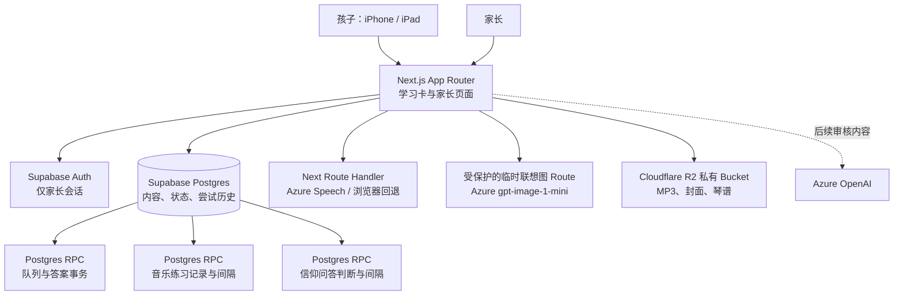
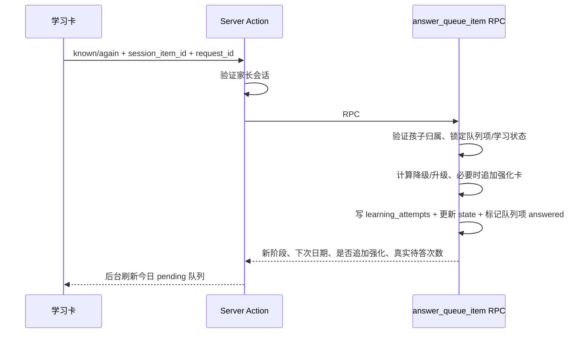

# 字芽 MVP｜详细架构与 AI Agent 交接说明

本文件是后续人类开发者或 AI Agent 的工作约束。目标不是抽象得“万能”，而是在不破坏孩子学习记录的前提下持续迭代。

## 1. 产品与技术边界



### 核心原则

1. **内容、当前状态、历史事实三者不能混在一张表。**
2. **前端只提交人工判断，不计算下一阶段。** 汉字走 `answer_queue_item`、音乐走 `record_music_practice`、信仰问答走 `record_catechism_attempt`；复习规则只在对应数据库 RPC 中执行。
3. **孩子没有 Supabase 登录账号。** 当前 MVP 使用家长会话访问孩子档案；以后独立儿童会话必须重新设计授权模型。
4. **AI / Azure 不可用不能阻塞学习。** 它们是内容与朗读增强，不是系统事实来源。
5. **任何跨家庭读取都必须失败。** 前端隐藏、页面跳转不是权限控制，RLS 和函数内验证才是。

## 2. 目录与责任地图

| 路径 | 职责 | 修改注意 |
| --- | --- | --- |
| `app/(app)/learn/page.tsx` | 已登录后的儿童学习入口 | 不在此处写复习算法。 |
| `components/learning-experience.tsx` | 卡片状态、揭示答案、提交回答、朗读回退、临时联想图 | 图片只留在当前浏览器内存，不能阻塞答题。 |
| `app/(app)/parent/page.tsx` | 家长档案、导入、基础进度 | 所有写入走 `lib/actions.ts`。 |
| `app/(app)/poems/page.tsx` | 诗词背诵概览、筛选、推荐、分页 | 只展示记录与建议，不运行汉字复习算法。 |
| `app/(app)/poems/[poemId]/page.tsx` | 单首诗正文、打卡历史、评分概况 | 每条记录必须来自 `poem_recitation_attempts`。 |
| `components/poem-recitation-form.tsx` | “今天背过一次”可重复打卡表单 | 不在客户端合并同日点击。 |
| `app/(app)/music/page.tsx` | 音乐总览、孩子切换、类型筛选与建议 | 只展示数据库已计算的阶段和到期日。 |
| `app/(app)/music/[itemId]/page.tsx` | 播放、歌词/琴谱、辨音揭晓、结果打卡与历史 | 读取 R2 文件前必须验证孩子已被分配。 |
| `app/(app)/music/manage/*` | 家长内容创建、编辑、发布、孩子分配与媒体维护 | 删除内容/资源是破坏性操作，保留二次确认。 |
| `app/(app)/catechism/page.tsx` | 问答册概览、掌握状态、来源筛选、搜索与分页 | 汇总所有已分配问答册；不在页面计算新的学习阶段。 |
| `app/(app)/catechism/study/page.tsx` | 生成当日到期复习与新问题队列 | 默认每天 3 新问 / 10 复习，实际值来自孩子档案。 |
| `app/(app)/catechism/manage/*` | CSV 导入、问答册发布/分配、逐问修正与归档 | 获授权文本不得由 AI 自动改写；已有历史时使用归档。 |
| `components/catechism-study-experience.tsx` | 答案揭晓、双语朗读和二值人工判断 | 只提交 `recited/again`，不计算升降级。 |
| `lib/catechism.ts` / `lib/catechism-actions.ts` | 问答聚合、今日建议、CSV 写入边界与练习 RPC | 每次判断必须带唯一 `request_id`。 |
| `app/api/music/assets/upload-url/route.ts` | 验证文件类型/大小/归属，签发 R2 PUT URL | R2 密钥永远不返回浏览器。 |
| `lib/music-actions.ts` / `lib/music-data.ts` | 音乐写入边界与只读聚合 | 练习结果走 `record_music_practice`，不在 Action 中计算阶段。 |
| `lib/r2.ts` | S3 Client、上传/读取签名 URL、R2 删除 | 延迟初始化，避免无 R2 变量时阻断 Next.js 构建。 |
| `lib/actions.ts` | Server Actions、CSV 校验/导入、RPC 调用 | 必须先 `auth.getUser()`；不可用 service role。 |
| `lib/poems.ts` | 诗词册、内容与背诵记录的只读聚合 | 供诗词页面使用；不要混入汉字 stage。 |
| `lib/supabase/*`、`proxy.ts` | Supabase SSR cookie 会话刷新 | 跟随 Supabase SSR 官方模式；不要改为 localStorage-only。 |
| `app/api/speech/route.ts` | 持有 Azure Speech key 的服务器端语音代理 | 绝不把 Azure key 返回给浏览器。 |
| `app/api/ai/character-content/route.ts` | 预留的受保护 AI 生成接口 | 输出必须审核/缓存后才给孩子端。 |
| `app/api/ai/character-memory-image/route.ts` | 临时儿童联想图 | 先验证家长、孩子和字库归属；只传服务端规范内容给 Azure。 |
| `supabase/001_hanzi_mvp.sql` | 识字基础表、RLS、RPC、索引 | 当前数据库结构以已按顺序执行的迁移脚本累计结果为准。 |
| `supabase/009_music_learning_mvp.sql` | 音乐表、RLS、索引与练习 RPC | 不修改汉字/诗词表；必须整段运行。 |
| `supabase/010_catechism_learning_mvp.sql` | 信仰问答表、孩子设置、RLS、索引与练习 RPC | 不修改旧模块历史；必须整段运行。 |
| `samples/characters-sample.csv` | 30 字真实试跑内容 | 修改后需重新人工检查拼音/例句。 |

## 3. 数据模型与归属

```mermaid
erDiagram
  AUTH_USERS ||--o{ LEARNER_PROFILES : owns
  AUTH_USERS ||--o{ CONTENT_PACKAGES : creates
  AUTH_USERS ||--o{ CHARACTERS : creates
  CONTENT_PACKAGES ||--o{ PACKAGE_CHARACTERS : contains
  CHARACTERS ||--o{ PACKAGE_CHARACTERS : appears_in
  LEARNER_PROFILES ||--o{ LEARNING_STATES : has
  CHARACTERS ||--o{ LEARNING_STATES : tracks
  LEARNER_PROFILES ||--o{ DAILY_SESSIONS : starts
  DAILY_SESSIONS ||--o{ DAILY_SESSION_ITEMS : queues
  LEARNING_STATES ||--o{ LEARNING_ATTEMPTS : records
  DAILY_SESSION_ITEMS ||--|| LEARNING_ATTEMPTS : answers_once
  AUTH_USERS ||--o{ POEM_COLLECTIONS : creates
  AUTH_USERS ||--o{ POEMS : creates
  POEM_COLLECTIONS ||--o{ POEM_COLLECTION_ITEMS : contains
  POEMS ||--o{ POEM_COLLECTION_ITEMS : appears_in
  LEARNER_PROFILES ||--o{ LEARNER_POEM_COLLECTIONS : receives
  POEM_COLLECTIONS ||--o{ LEARNER_POEM_COLLECTIONS : links
  LEARNER_PROFILES ||--o{ POEM_RECITATION_ATTEMPTS : practices
  POEMS ||--o{ POEM_RECITATION_ATTEMPTS : is_recited
  AUTH_USERS ||--o{ MUSIC_ITEMS : creates
  MUSIC_ITEMS ||--o{ MUSIC_ASSETS : has
  LEARNER_PROFILES ||--o{ LEARNER_MUSIC_ITEMS : receives
  MUSIC_ITEMS ||--o{ LEARNER_MUSIC_ITEMS : assigns
  LEARNER_PROFILES ||--o{ MUSIC_LEARNING_STATES : tracks
  MUSIC_ITEMS ||--o{ MUSIC_LEARNING_STATES : is_practiced
  LEARNER_PROFILES ||--o{ MUSIC_PRACTICE_ATTEMPTS : practices
  MUSIC_ITEMS ||--o{ MUSIC_PRACTICE_ATTEMPTS : records
  AUTH_USERS ||--o{ CATECHISM_COLLECTIONS : creates
  CATECHISM_COLLECTIONS ||--o{ CATECHISM_ITEMS : contains
  LEARNER_PROFILES ||--o{ LEARNER_CATECHISM_COLLECTIONS : receives
  CATECHISM_COLLECTIONS ||--o{ LEARNER_CATECHISM_COLLECTIONS : links
  LEARNER_PROFILES ||--o{ CATECHISM_LEARNING_STATES : tracks
  CATECHISM_ITEMS ||--o{ CATECHISM_LEARNING_STATES : is_memorized
  LEARNER_PROFILES ||--o{ CATECHISM_ATTEMPTS : practices
  CATECHISM_ITEMS ||--o{ CATECHISM_ATTEMPTS : records
```



### 每张表的含义

| 表 | 一句话定义 | 不能做什么 |
| --- | --- | --- |
| `content_packages` | 一批由某家长创建的字册 | 不存孩子进度。 |
| `characters` | 家长私有的规范字、拼音、释义和基础例词 | 不直接存“孩子认识吗”。 |
| `package_characters` | 字册内的顺序 | 不存复习阶段。 |
| `learner_profiles` | 孩子昵称、每日新字数、当前字册 | 不是可登录的 Auth 用户。 |
| `learning_states` | 一个孩子对一个字当前的阶段/到期日 | 不可代替历史记录。 |
| `daily_sessions` | 孩子本地日期的一次今日任务容器 | 不代表每次点击。 |
| `daily_session_items` | 今日/补带/强化卡的固定队列 | 每张项只允许回答一次。 |
| `learning_attempts` | 每一次 `known/again` 的不可变事实 | 不更新、不覆盖。 |
| `poem_collections` | 一次 CSV 导入形成的一份诗词册 | 不存孩子的背诵次数。 |
| `poems` | 家长私有的诗词正文与作者信息，由 `poem_key` 稳定识别 | 不存某个孩子的评分。 |
| `learner_poem_collections` | 诗词册与孩子的长期关联 | 新导入必须追加，不能覆盖旧关联。 |
| `poem_recitation_attempts` | 每次“今天背过一次”的历史事实，含本地日期、可空评分与备注 | 不合并同一天的多次打卡。 |
| `music_items` | 唱一唱、辨声音或打节奏的内容与发布状态 | 不存 MP3 二进制，不存孩子进度。 |
| `music_assets` | R2 `object_key`、原文件名、MIME、大小、类型与顺序 | 不存公开 URL；读取 URL 必须临时签发。 |
| `learner_music_items` | 内容与孩子的分配关系 | 未分配内容不能出现在孩子页。 |
| `music_learning_states` | 某孩子对某音乐项的阶段、到期日和最近结果 | 不可代替历史。 |
| `music_practice_attempts` | 每一次听/唱/辨认/节奏结果，含孩子本地日期和可选猜测备注 | 不覆盖或合并；同日多次就是多行。 |
| `catechism_collections` | 一次导入形成的一份有版本、来源与授权说明的问答册 | 不跨版本自动合并问题。 |
| `catechism_items` | 某一版本内的中英文问题、答案、经文和稳定编号 | 不存孩子进度，不由 AI 自动改写。 |
| `learner_catechism_collections` | 问答册与孩子的分配关系 | 取消分配不删除历史，重新分配后可恢复。 |
| `catechism_learning_states` | 某孩子对某问题的当前阶段、次数和到期日 | 不可代替不可变历史。 |
| `catechism_attempts` | 每次 `recited/again` 的事实、前后阶段、本地日期与幂等键 | 同日多次不合并，不更新覆盖。 |

## 4. 当前复习算法（不可拆分）

阶段间隔：stage 1/2/3/4/5/6/7 分别对应 1/3/7/14/30/60/90 天；stage 7 再答对进入 180 天长期维护。

### 标准复习

| 当前 | 答对 | 答错 |
| --- | --- | --- |
| 新字 | 留在 stage 0，安排当天 `new_reinforcement` | 同左 |
| `new_reinforcement` | stage 1，1 天后 | stage 0，次日优先 |
| stage 1–6 | 上升一级，按新阶段间隔 | 降两级，添加当天 `error_reinforcement` |
| stage 7 | 留在 stage 7，180 天后，写入 `mastered_at` | 降到 stage 5，清除 `mastered_at`，添加强化 |
| `error_reinforcement` | **保持已降级阶段**，次日优先 | **保持已降级阶段**，次日优先 |

### 为什么 `error_reinforcement` 不升级

若 stage 5 字答错后降到 stage 3，却在 5 分钟后强化答对，说明它刚被提醒过，不能当成真正稳定的记忆。因此答对后仍保持 stage 3，翌日再验证。这个规则直接实现了用户确认的“答错降级”要求。

### 更新算法的硬规则

若要调间隔/增加评级，必须同一 PR 同时修改：

1. `01_产品方案与MVP.md` 的真值表；
2. `supabase/001_hanzi_mvp.sql` 中 `answer_queue_item`；
3. `ARCHITECTURE.md` 本节；
4. SQL 函数测试用例（未来加入）；
5. 学习页的提示文案（不要向孩子显示“失败/降级”）。

不得把这段规则搬到 `components/learning-experience.tsx` 计算；客户端可以刷新、断线、重复提交，数据库才有事务和幂等性。

## 5. 一次答题的数据流



幂等键是 `learning_attempts.request_id`。网络重试时，前端使用同一个 request id；数据库只处理第一次请求。每个 `daily_session_item` 也有唯一回答记录，避免双击导致两次升级。

## 6. Auth、RLS 与数据库函数

### RLS

- 每张 `public` 表显式启用 RLS。
- 家长归属来自 `auth.uid()` 与 `learner_profiles.parent_user_id` 的关系，不读取 `user_metadata` 做授权。
- 所有派生表都通过 `exists (...) learner_profiles ... parent_user_id = auth.uid()` 判断归属。
- 导入的字册与汉字也按 `created_by = auth.uid()` 私有隔离；本 MVP 没有跨家庭公开内容库。

### 为什么使用 `SECURITY DEFINER` RPC

`get_today_queue` 和 `answer_queue_item` 要跨多张表、保持同一事务，若让前端分多次写会出现重复题、丢记录或竞态。因此使用经过严格约束的函数：

- 函数 `set search_path = ''`，所有 relation 显式写 `public.`。
- 默认 `PUBLIC`/`anon` 执行权被收回，只 `grant execute` 给 `authenticated`。
- 每次调用先查 `parent_user_id = auth.uid()`，没有归属即抛错。
- 函数不接受 SQL 字符串、表名、其他家长 ID 或服务角色 key。

以后如改函数签名，必须相应更新最后的 `revoke/grant execute`；否则旧函数可能仍默认对 `PUBLIC` 可执行。

`record_music_practice` 采用 `SECURITY INVOKER`：它在调用家长的 RLS 权限下运行，仍会显式检查孩子归属、内容归属、已分配和已发布状态。`request_id` 唯一，同一次点击即使网络重试也只记一次。

`record_catechism_attempt` 采用受限的 `SECURITY DEFINER`，因为 `catechism_learning_states` 和 `catechism_attempts` 对普通登录用户只开放读取，所有写入必须经过同一事务。函数必须保持空 `search_path`、全限定表名、显式 `auth.uid()` 归属检查，并只向 `authenticated` 授予执行权。问答历史不允许前端直接更新或删除。

### 迁移纪律

- 已部署环境的真实结构是 `001` 加后续适用的 `002`–`010` 累计结果，不要回头改已经在线执行过的旧脚本来“假装升级”。
- 新的数据库变化应新增下一个编号脚本，并在执行前备份相关内容表、状态表和历史表。
- SQL 文件要尽量可重复运行；函数签名变化时同时清理旧签名权限，外键和 RLS 变更要验证已有数据能安全通过。
- 内容只有错字/标点修正可原地更新；答案含义、授权文本版本或译本变化必须创建新问答册。

## 7. Next.js 与认证边界

- Server Component 默认读取数据；页面在 `(app)` 路由组内，layout 用 `auth.getUser()` 拦截未登录访问。
- `proxy.ts` 每个请求刷新 Supabase SSR cookie，会话响应强制 `Cache-Control: private, no-store`。
- Client Component 仅用于卡片点击、浏览器朗读和局部状态；不含任何管理员密钥。
- `lib/actions.ts` 是 server-only 的写入边界。每一个 Action 都先获取用户再写入。
- `/api/speech`、`/api/ai/*` 都先校验登录，并且只在服务器读取 Azure 变量。
- `/api/music/assets/upload-url` 在 Node.js Route Handler 中校验登录、内容归属、MIME 与大小，再返回单个对象的短时 PUT URL。
- R2 SDK 只在签名/删除时延迟初始化；因此未配置 R2 时仍可构建、登录并使用汉字/诗词模块。

## 8. 环境变量与部署边界

| 变量 | 可到浏览器？ | 用处 |
| --- | --- | --- |
| `NEXT_PUBLIC_SUPABASE_URL` | 可以 | Supabase 项目地址。 |
| `NEXT_PUBLIC_SUPABASE_ANON_KEY`/`PUBLISHABLE_KEY` | 可以 | 受 RLS 保护的公开客户端 key。 |
| `AZURE_SPEECH_KEY` | 不可以 | Route Handler 调 Azure TTS。 |
| `AZURE_OPENAI_API_KEY` | 不可以 | Route Handler 调 Azure OpenAI。 |
| `AZURE_IMAGE_DEPLOYMENT` / `AZURE_IMAGE_API_VERSION` | 不可以 | Azure `gpt-image-1-mini` 的服务器端部署配置。 |
| `R2_ACCOUNT_ID` | 不可以 | 生成 Cloudflare R2 S3 endpoint。 |
| `R2_ACCESS_KEY_ID` / `R2_SECRET_ACCESS_KEY` | 不可以 | 生成短时预签名 URL 与删除对象。 |
| `R2_BUCKET_NAME` | 不可以 | 当前音乐私有 Bucket，默认 `fisher-learning-media`。 |
| `SUPABASE_SERVICE_ROLE_KEY` | 不需要；禁止前端 | 本 MVP 没有理由使用。 |

## 9. 计划内扩展点

### 拼音小助手（1.1）

新增 `pinyin_parts` 或由服务端可靠词典预计算，不要在浏览器用正则猜所有拼音。卡片只展示，学习状态仍使用 `learning_states`。

### AI 内容审核（1.1）

增加 `character_ai_candidates`：`character_id, prompt_version, model, generated_json, review_status, approved_at`。AI endpoint 只能创建候选；只有家长发布后的人工内容才进入孩子卡片。绝不让生成结果覆盖 `pinyin_marked` 和 `meaning`。

### 临时联想图（当前已实现）

- 它是帮助孩子记忆字义的**联想**，不是任何汉字的字源考据结论；界面和提示词均不得把它表述为“真实造字来历”。
- 只在家长已登录、该字确实属于所选孩子字库时才能调用；浏览器只持有一次生成后的临时图片，收起或换卡不改变数据库内容。
- 图片模型不可用、被安全过滤或网络失败时，只显示失败提示，不能影响“我认识 / 再学一次”与复习记录。

### 诗词背诵记录（当前已实现）

- 诗词模块目前是独立的“内容 + 记录”模型：`poem_recitation_attempts` 允许同日多行，`recited_local_date` 是孩子时区的真实练习日期，`score` 可为 null。
- 首次和后续 CSV 都会创建独立诗词册并关联到所选孩子；页面默认汇总所有导入批次，并可按来源筛选。
- 当前没有把诗词接入汉字的 `get_today_queue` / `answer_queue_item`，这是刻意的边界：背诵事实可靠后，再另做诗词调度状态与可解释的间隔提醒。
- 若将来加入按句背诵或自动提醒，请新增诗词专用状态表与迁移，不要给 `learning_states` / `learning_attempts` 临时加 nullable `poem_id`。

### 音乐学习（当前已实现）

- 内容类型为 `song / instrument / rhythm`，分别对应“唱一唱 / 辨声音 / 打节奏”。封面、乐器图和节奏谱都可空；歌曲可维护最多 5 张统一命名的“琴谱”。
- 每条内容当前只保留 1 个主音频：一条辨音记录对应一种要辨认的声音。如果有两个 MP3 要检查两种声音，应建立两条辨音内容，让各自拥有独立的记忆阶段和历史。播放器会循环播放当前音频。
- 歌曲结果有“只听过 / 跟着唱 / 提示下会唱 / 独立会唱”；只听过不升阶。辨音与节奏采用二值结果，答错降两级并第二天再练。
- 阶段 0–7 的正向间隔为 1/1/3/7/14/30/60/90 天；阶段 7 再次成功后间隔 180 天。该算法是家庭学习建议，不是音乐能力评价。
- 每次点击都追加 `music_practice_attempts`；同一天练习多次就有多行。乐器实际猜测放在可选 `guess_note`，不强制填写。
- 文件放在私有 Cloudflare R2；上传 URL 10 分钟过期，读取 URL 1 小时过期。R2 密钥只存在 Vercel 服务器环境变量。
- 当前不需要 Supabase Edge Functions：事务走 Postgres RPC，签名走 Next.js Route Handler。未来需要转码、波形或长任务时再评估异步工作流。

### 儿童信仰问答（当前已实现）

- 首份内容是已获授权的《儿童信仰问答》（*First Catechism: Biblical Truth for God’s Children*）；系统只保存和展示家长导入的正式文本，不自动翻译或改写。
- 中文和英文同时显示并分别朗读；`/api/speech` 根据 `lang=zh/en` 选择 Azure 声音，失败时由浏览器系统朗读回退。
- 家长按“与原答案基本相同，约 80%–100%”人工判断 `recited/again`。未来语音转写只能辅助家长，不能覆盖人工事实。
- `record_catechism_attempt` 通过受限 `SECURITY DEFINER` 再次核验家长归属后锁定状态，检查 `request_id`，追加历史并更新阶段。答出上升一级，未答出下降两级且次日再问；同日答对不连续升级、同日连续答错不重复降级；正向间隔为 1/3/7/14/30/60/90/180 天。
- 每位孩子独立设置每日新问题（默认 3）和到期复习上限（默认 10）。前端只选择今日候选，不写阶段；同一问题可从问答册“单独练这一问”产生额外独立记录。
- 不需要 Supabase Edge Functions：数据库事务走 Postgres RPC，CSV/维护走 Server Actions，朗读走 Next.js Route Handler。

### 跟读/背诵（4）

音频录入前要增加家长同意、私有 Storage policy、录音删除与自动过期。Azure Speech 评分只能作为“再练习建议”，不作为孩子的能力/排名数据。

## 10. 后续 AI Agent 的启动提示

在让新的 AI Agent 修改项目时，先把下面内容给它：

```text
请先阅读 ARCHITECTURE.md、DEPLOYMENT.md、01_产品方案与MVP.md、09_诗词背诵模块说明.md、10_Cloudflare_R2保姆级配置教程.md、11_儿童信仰问答模块说明.md、supabase/001_hanzi_mvp.sql、supabase/009_music_learning_mvp.sql 和 supabase/010_catechism_learning_mvp.sql。
这是一个 Next.js + Supabase SSR + 私有 Cloudflare R2 的儿童家庭学习 PWA，包含汉字、诗词、音乐和儿童信仰问答。
不要在前端计算复习阶段；不要暴露 Azure、R2 或 Supabase service key；汉字回答必须追加 learning_attempts，诗词打卡必须追加 poem_recitation_attempts，音乐练习必须通过 record_music_practice 追加 music_practice_attempts，信仰问答必须通过 record_catechism_attempt 追加 catechism_attempts；获授权问答不得由 AI 自动改写；修改复习算法时同步修改 SQL、文档和测试。
```

并要求 Agent 完成真实检查：`npm run lint`、`npm run build`、移动端浏览器验收；若修改 SQL，使用两个测试家长账号验证跨家庭 RLS。
