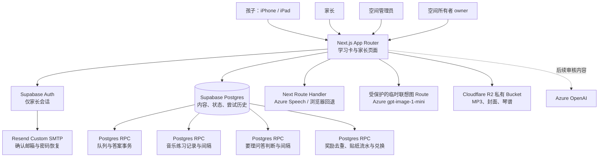
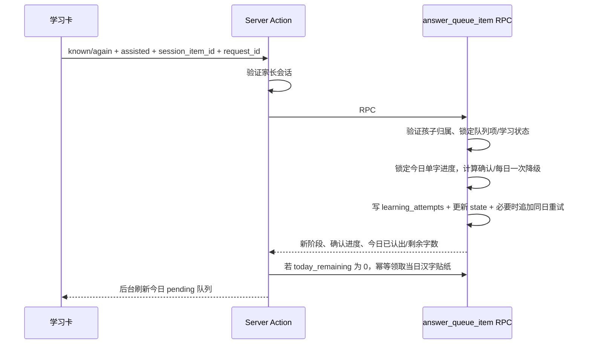

# 字芽 MVP｜详细架构与 AI Agent 交接说明

本文件是后续人类开发者或 AI Agent 的工作约束。目标不是抽象得“万能”，而是在不破坏孩子学习记录的前提下持续迭代。

## 1. 产品与技术边界


```mermaid
flowchart TB
  Kid[孩子：iPhone / iPad] --> UI[Next.js App Router\n学习卡与家长页面]
  Parent[家长] --> UI
  Admin[空间管理员] --> UI
  Owner[空间所有者 owner] --> UI
  UI --> Auth[Supabase Auth\n仅家长会话]
  Auth --> Mail[Resend Custom SMTP\n确认邮箱与密码恢复]
  UI --> DB[(Supabase Postgres\n内容、状态、尝试历史)]
  UI --> Speech[Next Route Handler\nAzure Speech / 浏览器回退]
  UI --> Image[受保护的临时联想图 Route\nAzure gpt-image-1-mini]
  UI --> R2[Cloudflare R2 私有 Bucket\nMP3、封面、琴谱]
  UI -.后续审核内容.-> AI[Azure OpenAI]
  DB --> Scheduler[Postgres RPC\n队列与答案事务]
  DB --> MusicScheduler[Postgres RPC\n音乐练习记录与间隔]
  DB --> CatechismScheduler[Postgres RPC\n要理问答判断与间隔]
  DB --> RewardLedger[Postgres RPC\n奖励去重、贴纸流水与兑换]
```

### 核心原则

1. **内容、当前状态、历史事实三者不能混在一张表。**
2. **前端只提交人工判断，不计算下一阶段。** 汉字走 `answer_queue_item`、音乐走 `record_music_practice`、要理问答走 `record_catechism_attempt`；复习规则只在对应数据库 RPC 中执行。
3. **孩子没有 Supabase 登录账号。** 当前 MVP 使用家长会话访问孩子档案；以后独立儿童会话必须重新设计授权模型。
4. **AI / Azure 不可用不能阻塞学习。** 它们是内容与朗读增强，不是系统事实来源。
5. **任何跨家庭读取都必须失败。** 前端隐藏、页面跳转不是权限控制，RLS 和函数内验证才是。
6. **奖励只能引用真实学习记录，且不能反向改变学习历史。** 贴纸余额由不可变流水求和；奖励失败时原学习记录仍然成功。
7. **owner 是 admin 的严格超集。** admin 审核/分配，owner 额外管理用户、邀请、临时密码和永久清理；破坏性操作默认归档，必须证明历史安全才删除。

## 2. 目录与责任地图

| 路径 | 职责 | 修改注意 |
| --- | --- | --- |
| `app/(app)/learn/page.tsx` | 已登录后的儿童学习入口 | 不在此处写复习算法。 |
| `components/learning-experience.tsx` | 卡片状态、揭示答案、提交回答、朗读回退、临时联想图 | 图片只留在当前浏览器内存，不能阻塞答题。 |
| `app/(app)/library/page.tsx` | 全字册掌握统计、服务端筛选与分页 | `get_library_rows` 的参数/返回字段必须与最新 SQL 同步。 |
| `components/library-priority-manager.tsx` | 本页重点字勾选、批量保存反馈与字卡详情 | 只提交选择，不计算复习日或阶段。 |
| `app/(app)/parent/page.tsx` | 家长档案、导入、基础进度 | 所有写入走 `lib/actions.ts`。 |
| `app/(app)/admin/*` | 空间看板、资源审核、按孩子分配；`users/members` 为 owner 专属 | 页面、Action、RLS/RPC 都要验证角色，不只隐藏入口。 |
| `app/account/change-password/page.tsx` | 临时密码首次登录后的强制改密 | 成功修改 Auth 密码后才清除 `must_change_password`。 |
| `app/forgot-password/page.tsx` / `components/forgot-password-form.tsx` | 公开的密码恢复申请与 60 秒防重复提交 | 统一返回结果，不查询或泄露邮箱是否已注册。 |
| `app/auth/recovery/route.ts` / `app/reset-password/page.tsx` | 验证一次性 recovery token、建立恢复会话和设置新密码 | 只接受 `recovery` token 或 PKCE code；成功后退出全部旧会话。 |
| `app/join/page.tsx` | 受邀家长接受一次性链接 | 明文 token 不入库；当前一个账号只加入一个空间。 |
| `lib/access.ts` / `lib/admin-actions.ts` | 服务端角色上下文和管理员写入边界 | 最终授权仍由 Supabase RLS/函数完成。 |
| `lib/user-management-actions.ts` | owner 创建账号、改角色/家庭、停用、重置密码 | 临时密码只返回一次，不写数据库/审计/日志。 |
| `lib/supabase/admin.ts` | server-only Auth Admin client | 只读 `SUPABASE_SECRET_KEY` 或旧 service_role；绝不从客户端导入。 |
| `lib/dashboard.ts` | 只聚合当前活跃分配的学习概况 | 7 天首答率只统计首次独立回答。 |
| `app/(app)/poems/page.tsx` | 诗词背诵概览、筛选、推荐、分页 | 只展示记录与建议，不运行汉字复习算法。 |
| `app/(app)/poems/[poemId]/page.tsx` | 单首诗正文、打卡历史、评分概况 | 每条记录必须来自 `poem_recitation_attempts`。 |
| `app/(app)/poems/game/page.tsx` / `components/*poem-game*` | 选诗、桌面 Canvas 主玩法、手机轻量玩法、结算与人工评分 | 游戏答题不自动等同会背；帧循环不直接写数据库。 |
| `app/api/ai/poem-game-map/route.ts` | 校验孩子/诗词分配后生成并缓存诗意地图 | Azure 不可用时返回稳定降级，不决定答案或评分。 |
| `components/poem-recitation-form.tsx` | “今天背过一次”可重复打卡表单 | 不在客户端合并同日点击。 |
| `app/(app)/music/page.tsx` | 音乐总览、孩子切换、类型筛选与建议 | 只展示数据库已计算的阶段和到期日。 |
| `app/(app)/music/[itemId]/page.tsx` | 播放、歌词/琴谱、辨音揭晓、结果打卡与历史 | 读取 R2 文件前必须验证孩子已被分配。 |
| `app/(app)/music/manage/*` | 家长内容创建、编辑、发布、孩子分配与媒体维护 | 删除内容/资源是破坏性操作，保留二次确认。 |
| `app/(app)/catechism/page.tsx` | 问答册概览、掌握状态、来源筛选、搜索与分页 | 汇总所有已分配问答册；不在页面计算新的学习阶段。 |
| `app/(app)/catechism/study/page.tsx` | 生成当日到期复习与新问题队列 | 默认每天 3 新问 / 10 复习，实际值来自孩子档案。 |
| `app/(app)/catechism/manage/*` | CSV 导入、问答册发布/分配、逐问修正与归档 | 获授权文本不得由 AI 自动改写；已有历史时使用归档。 |
| `components/catechism-study-experience.tsx` | 答案揭晓、双语朗读和二值人工判断 | 只提交 `recited/again`，不计算升降级。 |
| `lib/catechism.ts` / `lib/catechism-actions.ts` | 问答聚合、今日建议、CSV 写入边界与练习 RPC | 每次判断必须带唯一 `request_id`。 |
| `app/(app)/rewards/page.tsx` | 孩子贴纸册、十格花园、成长星、礼物与最近流水 | 只读取奖励表，不从前端推算余额。 |
| `app/(app)/rewards/manage/page.tsx` | 数学/手工贴纸、礼物维护、兑换与撤销 | 余额变化必须走奖励 RPC，不直接改余额。 |
| `lib/reward-service.ts` / `lib/reward-actions.ts` / `lib/rewards.ts` | 自动奖励接入、家长写操作和奖励聚合 | 奖励故障不得阻断原学习写入。 |
| `app/api/music/assets/upload-url/route.ts` | 验证文件类型/大小/归属，签发 R2 PUT URL | R2 密钥永远不返回浏览器。 |
| `lib/music-actions.ts` / `lib/music-data.ts` | 音乐写入边界与只读聚合 | 练习结果走 `record_music_practice`，不在 Action 中计算阶段。 |
| `lib/r2.ts` | S3 Client、上传/读取签名 URL、R2 删除 | 延迟初始化，避免无 R2 变量时阻断 Next.js 构建。 |
| `lib/actions.ts` | Server Actions、CSV 校验/导入、RPC 调用 | 必须先 `auth.getUser()`；不可用 service role。 |
| `lib/poems.ts` | 诗词册、内容与背诵记录的只读聚合 | 供诗词页面使用；不要混入汉字 stage。 |
| `lib/supabase/*`、`proxy.ts` | Supabase SSR cookie 会话刷新 | 跟随 Supabase SSR 官方模式；不要改为 localStorage-only。 |
| `app/api/speech/route.ts` | 持有 Azure Speech key 的服务器端语音代理 | 绝不把 Azure key 返回给浏览器。 |
| `app/api/ai/character-content/route.ts` | 预留的受保护 AI 生成接口 | 输出必须审核/缓存后才给孩子端。 |
| `app/api/ai/character-memory-image/route.ts` | 临时儿童联想图 | 先验证家长、孩子和字库归属；只传服务端规范内容给 Azure。 |
| `supabase/001_hanzi_mvp.sql` | 识字基础表、RLS、RPC、索引 | 当前数据库结构以已按顺序执行的迁移脚本累计结果为准。 |
| `supabase/009_music_learning_mvp.sql` | 音乐表、RLS、索引与练习 RPC | 不修改汉字/诗词表；必须整段运行。 |
| `supabase/010_catechism_learning_mvp.sql` | 要理问答表、孩子设置、RLS、索引与练习 RPC | 不修改旧模块历史；必须整段运行。 |
| `supabase/011_priority_character_learning.sql` | 孩子级重点字、RLS、批量保存和汉字队列/字库查询升级 | 不得修改 `answer_queue_item` 真值表。 |
| `supabase/012_reward_sticker_module.sql` | 奖励账户、不可变流水、成长星、礼物、兑换与五个 RPC | 不修改任何学习阶段；必须整段运行。 |
| `supabase/013_fix_get_today_queue_session_id_ambiguity.sql` | 修复旧日待答卡带入时 `ON CONFLICT` 与返回列 `session_id` 同名歧义 | 只替换 `get_today_queue`，保持 011 的重点字顺序。 |
| `supabase/014_dynamic_double_confirmation.sql` | 每日单字确认进度、无限次队尾重试、柔和降级与新版队列/回答 RPC | 保留全部旧历史；今日通过与跨天 stage 必须分开。 |
| `supabase/015_multi_family_admin.sql` | 空间/家庭/角色、公共资源审核、可恢复分配、邀请和 RLS 升级 | 先回填旧数据，不删除孩子或历史。 |
| `supabase/016_adaptive_queue_and_shared_content_rpcs.sql` | 新权限边界下的学习 RPC、字库查询与有界自适应队列 | 保持 014 真值表不变，只调整每日取题数。 |
| `supabase/017_owner_user_management_and_duplicate_cleanup.sql` | owner 用户目录、首次改密、邀请升级和重复资源安全合并 | 不修改旧密码；音乐/问答有历史时拒绝永久删除。 |
| `supabase/018_poem_tank_game.sql` | 诗词游戏地图、场次、逐题、逐句状态和两个保存/评分 RPC | 不修改汉字算法；整首诗掌握仍由家长评分。 |
| `samples/characters-sample.csv` | 30 字真实试跑内容 | 修改后需重新人工检查拼音/例句。 |

## 3. 数据模型与归属


```mermaid
erDiagram
  LEARNING_WORKSPACES ||--o{ WORKSPACE_MEMBERS : authorizes
  LEARNING_WORKSPACES ||--o{ FAMILIES : contains
  AUTH_USERS ||--o{ WORKSPACE_MEMBERS : joins
  AUTH_USERS ||--o| WORKSPACE_USER_PROFILES : describes
  LEARNING_WORKSPACES ||--o{ WORKSPACE_USER_PROFILES : contains
  FAMILIES ||--o{ FAMILY_MEMBERS : authorizes
  AUTH_USERS ||--o{ FAMILY_MEMBERS : belongs_to
  FAMILIES ||--o{ LEARNER_PROFILES : owns
  LEARNING_WORKSPACES ||--o{ CONTENT_PACKAGES : shares
  LEARNING_WORKSPACES ||--o{ POEM_COLLECTIONS : shares
  LEARNING_WORKSPACES ||--o{ MUSIC_ITEMS : shares
  LEARNING_WORKSPACES ||--o{ CATECHISM_COLLECTIONS : shares
  AUTH_USERS ||--o{ LEARNER_PROFILES : owns
  AUTH_USERS ||--o{ CONTENT_PACKAGES : creates
  AUTH_USERS ||--o{ CHARACTERS : creates
  CONTENT_PACKAGES ||--o{ PACKAGE_CHARACTERS : contains
  CHARACTERS ||--o{ PACKAGE_CHARACTERS : appears_in
  LEARNER_PROFILES ||--o{ LEARNING_STATES : has
  CHARACTERS ||--o{ LEARNING_STATES : tracks
  LEARNER_PROFILES ||--o{ LEARNER_CHARACTER_PRIORITIES : chooses
  CHARACTERS ||--o{ LEARNER_CHARACTER_PRIORITIES : prioritizes
  LEARNER_PROFILES ||--o{ DAILY_SESSIONS : starts
  DAILY_SESSIONS ||--o{ DAILY_SESSION_ITEMS : queues
  DAILY_SESSIONS ||--o{ DAILY_CHARACTER_PROGRESS : summarizes
  CHARACTERS ||--o{ DAILY_CHARACTER_PROGRESS : confirms
  LEARNING_STATES ||--o{ LEARNING_ATTEMPTS : records
  DAILY_SESSION_ITEMS ||--|| LEARNING_ATTEMPTS : answers_once
  AUTH_USERS ||--o{ POEM_COLLECTIONS : creates
  AUTH_USERS ||--o{ POEMS : creates
  POEM_COLLECTIONS ||--o{ POEM_COLLECTION_ITEMS : contains
  POEMS ||--o{ POEM_COLLECTION_ITEMS : appears_in
  LEARNER_PROFILES ||--o{ LEARNER_POEM_COLLECTIONS : receives
  POEM_COLLECTIONS ||--o{ LEARNER_POEM_COLLECTIONS : links
  LEARNER_PROFILES ||--o{ POEM_RECITATION_ATTEMPTS : practices
  POEMS ||--o{ POEM_RECITATION_ATTEMPTS : is_recited
  AUTH_USERS ||--o{ MUSIC_ITEMS : creates
  MUSIC_ITEMS ||--o{ MUSIC_ASSETS : has
  LEARNER_PROFILES ||--o{ LEARNER_MUSIC_ITEMS : receives
  MUSIC_ITEMS ||--o{ LEARNER_MUSIC_ITEMS : assigns
  LEARNER_PROFILES ||--o{ MUSIC_LEARNING_STATES : tracks
  MUSIC_ITEMS ||--o{ MUSIC_LEARNING_STATES : is_practiced
  LEARNER_PROFILES ||--o{ MUSIC_PRACTICE_ATTEMPTS : practices
  MUSIC_ITEMS ||--o{ MUSIC_PRACTICE_ATTEMPTS : records
  AUTH_USERS ||--o{ CATECHISM_COLLECTIONS : creates
  CATECHISM_COLLECTIONS ||--o{ CATECHISM_ITEMS : contains
  LEARNER_PROFILES ||--o{ LEARNER_CATECHISM_COLLECTIONS : receives
  CATECHISM_COLLECTIONS ||--o{ LEARNER_CATECHISM_COLLECTIONS : links
  LEARNER_PROFILES ||--o{ CATECHISM_LEARNING_STATES : tracks
  CATECHISM_ITEMS ||--o{ CATECHISM_LEARNING_STATES : is_memorized
  LEARNER_PROFILES ||--o{ CATECHISM_ATTEMPTS : practices
  CATECHISM_ITEMS ||--o{ CATECHISM_ATTEMPTS : records
  LEARNER_PROFILES ||--|| REWARD_ACCOUNTS : owns
  LEARNER_PROFILES ||--o{ REWARD_LEDGER : earns_and_spends
  LEARNER_PROFILES ||--o{ REWARD_GROWTH_EVENTS : accumulates
  AUTH_USERS ||--o{ REWARD_CATALOG_ITEMS : creates
  LEARNER_PROFILES ||--o{ REWARD_REDEMPTIONS : redeems
  REWARD_CATALOG_ITEMS ||--o{ REWARD_REDEMPTIONS : snapshots
```

### 每张表的含义

| 表 | 一句话定义 | 不能做什么 |
| --- | --- | --- |
| `learning_workspaces` / `workspace_members` | 学习空间与 owner/admin/parent 角色 | 角色不存在 Auth metadata。 |
| `families` / `family_members` | 家长可见孩子的隔离边界 | 普通家长不可跨家庭读取。 |
| `workspace_invitations` / `workspace_audit_events` | 一次性邀请和管理操作追踪 | 不保存邀请 token 明文。 |
| `workspace_user_profiles` | 账号称呼和首次改密标记 | 不保存明文/哈希密码，不作为角色授权来源。 |
| `content_packages` | 空间内待审或已批准的字册 | 不存孩子进度。 |
| `characters` | 空间内共用的规范字、拼音、释义和基础例词 | 不直接存“孩子认识吗”。 |
| `package_characters` | 字册内的顺序 | 不存复习阶段。 |
| `learner_character_priorities` | 某个孩子当前优先学习哪些字，跨全部关联字册生效 | 不存阶段、不复制历史、不自动视为已掌握。 |
| `learner_profiles` | 家庭下的孩子、每日新字和自适应复习设置 | 不是可登录的 Auth 用户。 |
| `learning_states` | 一个孩子对一个字当前的阶段/到期日 | 不可代替历史记录。 |
| `daily_sessions` | 孩子本地日期的一次今日任务容器 | 不代表每次点击。 |
| `daily_session_items` | 今日/补带/重试卡队列，`retry_no` 区分同字多次出现 | 每张项只允许回答一次。 |
| `daily_character_progress` | 一天一个字的确认要求、连续独立认出次数、是否降级与通过时间 | 不代替跨天 `learning_states`。 |
| `learning_attempts` | 每一次 `known/again`、是否辅助、当日第几次和确认结果的不可变事实 | 不更新、不覆盖。 |
| `poem_collections` | 一次 CSV 导入形成的一份诗词册 | 不存孩子的背诵次数。 |
| `poems` | 空间内由 `poem_key` 稳定识别的诗词正文与作者信息 | 家长重复导入不得自动覆盖公共正文。 |
| `learner_poem_collections` | 诗词册与孩子的可启停分配 | 取消分配不能删除旧打卡。 |
| `poem_recitation_attempts` | 每次“今天背过一次”的历史事实，含本地日期、可空评分与备注 | 不合并同一天的多次打卡。 |
| `poem_game_sessions` / `poem_game_attempts` | 一局游戏汇总与每个答案事实 | 游戏命中率不覆盖家长背诵评分。 |
| `learner_poem_line_states` | 每句诗的暴露/对错/首次答对/到期建议 | 不接入汉字 stage，也不代替整首诗记录。 |
| `poem_game_maps` | AI 或稳定诗意地图 JSON 蓝图缓存 | 不保存孩子隐私或学习结果。 |
| `music_items` | 唱一唱、辨声音或打节奏的内容与发布状态 | 不存 MP3 二进制，不存孩子进度。 |
| `music_assets` | R2 `object_key`、原文件名、MIME、大小、类型与顺序 | 不存公开 URL；读取 URL 必须临时签发。 |
| `learner_music_items` | 内容与孩子的可启停分配关系 | 只有 active 且资源已批准/已发布才能进孩子页。 |
| `music_learning_states` | 某孩子对某音乐项的阶段、到期日和最近结果 | 不可代替历史。 |
| `music_practice_attempts` | 每一次听/唱/辨认/节奏结果，含孩子本地日期和可选猜测备注 | 不覆盖或合并；同日多次就是多行。 |
| `catechism_collections` | 一次导入形成的一份有版本、来源与授权说明的问答册 | 不跨版本自动合并问题。 |
| `catechism_items` | 某一版本内的中英文问题、答案、经文和稳定编号 | 不存孩子进度，不由 AI 自动改写。 |
| `learner_catechism_collections` | 问答册与孩子的可启停分配 | 取消分配不删除历史，重新分配后可恢复。 |
| `catechism_learning_states` | 某孩子对某问题的当前阶段、次数和到期日 | 不可代替不可变历史。 |
| `catechism_attempts` | 每次 `recited/again` 的事实、前后阶段、本地日期与幂等键 | 同日多次不合并，不更新覆盖。 |
| `reward_accounts` | 每个孩子的贴纸目标、成长星门槛/日上限和当前未兑换星数 | 不作为贴纸余额来源。 |
| `reward_ledger` | 每次获得、消费和返还贴纸的不可变有符号流水 | 不更新、不删除；余额必须求和。 |
| `reward_growth_events` | 诗词/音乐项目在某天是否计入成长星 | 不替代原模块练习历史。 |
| `reward_catalog_items` | 家长的礼物愿望、图标、成本和上下架状态 | 不保存孩子余额。 |
| `reward_redemptions` | 礼物兑换快照与撤销状态 | 误操作用反向流水，不删除记录。 |

## 4. 当前复习算法（不可拆分）

阶段间隔：stage 1/2/3/4/5/6/7 分别对应 1/3/7/14/30/60/90 天；stage 7 再答对进入 180 天长期维护。

### 动态双确认

| 当前 | 今日通过标准 | 没有独立认出 |
| --- | --- | --- |
| 新字、stage 0–2 | 连续两次独立认出，完成后正常升一级 | 清空确认、柔和降级一次、追加 `same_day_retry` |
| stage 3–6 | 第一次独立认出即正常升一级 | 柔和降级一次，之后改为连续两次确认 |
| stage 7 | 第一次独立认出即保持 stage 7，180 天维护 | 降到 stage 5、清除 `mastered_at`，之后双确认 |
| 当日已经失败的重试 | 连续两次独立认出后今日通过，但不恢复阶段 | 只清空确认并继续重试，不再次降级 |

柔和降级：`0→0、1→0、2→1、3→1、4→2、5→3、6→4、7→5`。听朗读、展开答案/拼音/词句、查看联想图或得到口头提示后，本轮不算独立认出。详细规则以 [14_汉字动态双确认规则说明.md](./14_汉字动态双确认规则说明.md) 为准。

### 今日队列与重点字

`get_today_queue` 负责创建孩子本地日期的固定任务。`016` 之后的候选顺序是：

1. 以前未答完且已开始的字优先转成今日 `carry`，但不突破当天复习安全上限；
2. 到期重点字；
3. 到期普通字，按最久逾期、低阶段优先，补到当天计划复习量；
4. 跨全部已分配、已审核且已发布字册的未学重点字；
5. 按“字册分配顺序 + CSV sequence”排列的普通新字，同字跨字册只进一次；
6. 未达到今日确认标准时追加的 `same_day_retry`。

重点仅参与排序：必须仍满足 `due_at <= now()` 才能成为复习候选；未学重点字占用当天新字名额。自适应量参考到期积压和近 7 天首答独立认出率：积压 31–60 时用复习安全上限且新字最多 2 个，积压超过 60 或有足够样本且首答率低于 60% 时暂停新字。完整阈值见 [15 号说明](./15_多家庭管理员与智能复习说明.md)。

队列计划在当天第一次打开时快照到 `daily_sessions`。当天修改设置不重排，孩子时区的第二天才生效。漏学不会自动降级，阶段只由 `answer_queue_item` 根据真实回答改变。

### 为什么同日重试不恢复阶段

若 stage 5 字没认出后降到 stage 3，却在几分钟后连续认出，仍可能是短时记忆。因此当天只标记“今日通过”，保持 stage 3 和次日到期；翌日独立认出后才正常升到 stage 4。

### 更新算法的硬规则

若要调间隔/增加评级，必须同一 PR 同时修改：

1. `01_产品方案与MVP.md` 的真值表；
2. 当前最新升级脚本中的 `answer_queue_item`（现为 `016`，真值表继承 `014`）；
3. `ARCHITECTURE.md` 本节；
4. SQL 函数测试用例（未来加入）；
5. 学习页的提示文案（不要向孩子显示“失败/降级”）。

不得把这段规则搬到 `components/learning-experience.tsx` 计算；客户端可以刷新、断线、重复提交，数据库才有事务和幂等性。

## 5. 一次答题的数据流


```mermaid
sequenceDiagram
  participant K as 学习卡
  participant A as Server Action
  participant DB as answer_queue_item RPC
  K->>A: known/again + assisted + session_item_id + request_id
  A->>A: 验证家长会话
  A->>DB: RPC
  DB->>DB: 验证孩子归属、锁定队列项/学习状态
  DB->>DB: 锁定今日单字进度，计算确认/每日一次降级
  DB->>DB: 写 learning_attempts + 更新 state + 必要时追加同日重试
  DB-->>A: 新阶段、确认进度、今日已认出/剩余字数
  A->>DB: 若 today_remaining 为 0，幂等领取当日汉字贴纸
  A-->>K: 后台刷新今日 pending 队列
```

幂等键是 `learning_attempts.request_id`。网络重试时，前端使用同一个 request id；数据库只处理第一次请求。每个 `daily_session_item` 也有唯一回答记录，避免双击导致两次升级。

## 6. Auth、RLS 与数据库函数

### RLS

- 每张 `public` 表显式启用 RLS。
- 角色来自 `workspace_members`，家庭可见范围来自 `family_members`，不读取 `user_metadata` 做授权。
- `private.can_access_learner` 统一判断主家长、同家庭监护人和空间 owner/admin；`private.is_workspace_admin` 统一判断审核/分配权。
- 普通家长可读空间已批准资源与自己的待审提交，但只能读自己家庭的孩子和派生学习表。
- 孩子队列必须同时满足资源 `approved + published` 和分配 `active`。

### 为什么使用 `SECURITY DEFINER` RPC

`get_today_queue` 和 `answer_queue_item` 要跨多张表、保持同一事务，若让前端分多次写会出现重复题、丢记录或竞态。因此使用经过严格约束的函数：

- 函数 `set search_path = ''`，所有 relation 显式写 `public.`。
- 默认 `PUBLIC`/`anon` 执行权被收回，只 `grant execute` 给 `authenticated`。
- 每次调用先查 `private.can_access_learner(...)`，没有家庭或管理员权限即抛错。
- 函数不接受 SQL 字符串、表名、其他家长 ID 或服务角色 key。

以后如改函数签名，必须相应更新最后的 `revoke/grant execute`；否则旧函数可能仍默认对 `PUBLIC` 可执行。

`record_music_practice` 在 `016` 中改为受限 `SECURITY DEFINER`：它先用 `private.can_access_learner` 验证家庭/管理员边界，再检查资源已审核、已发布且已活跃分配。`request_id` 唯一，同一次点击网络重试也只记一次。

`record_catechism_attempt` 采用受限的 `SECURITY DEFINER`，因为 `catechism_learning_states` 和 `catechism_attempts` 对普通登录用户只开放读取，所有写入必须经过同一事务。函数必须保持空 `search_path`、全限定表名、显式 `auth.uid()` 归属检查，并只向 `authenticated` 授予执行权。问答历史不允许前端直接更新或删除。

`set_character_priorities` 仍是原子批量保存，`016` 后用 `private.can_access_learner` 和已分配公共字册验证候选。`learner_character_priorities` 的主键 `(learner_id, character_id)` 确保不同孩子可有不同重点，同一字跨多个 CSV 只保留一个重点标记。

`daily_character_progress` 只向孩子所属家庭和空间管理员开放读取，写入只能通过受限的 `answer_queue_item`。RPC 使用空 `search_path`、全限定表名、权限验证和 session 行锁，在一个事务中完成确认进度、阶段、历史和新重试卡。

奖励模块的五个函数采用受限的 `SECURITY DEFINER`，负责跨表核验真实练习、锁定奖励账户、去重与追加流水；奖励账户、流水、成长星和兑换表只给普通登录用户读取权限，不能绕过 RPC 直接写。`claim_hanzi_daily_reward` 只有在当天会话有已答卡且没有待答卡时才发放；`register_reward_activity` 从诗词/音乐历史反查项目、结果和孩子本地日期，不接受客户端自行声明“已完成”。函数保持空 `search_path`、全限定表名，只向 `authenticated` 开放并再次核验孩子归属。同一业务日期、项目或请求都有唯一键，重试不会重复记账。

### 迁移纪律

- 已部署环境的真实结构是 `001` 加后续适用的 `002`–`018` 累计结果，不要回头改已经在线执行过的旧脚本来“假装升级”。
- 新的数据库变化应新增下一个编号脚本，并在执行前备份相关内容表、状态表和历史表。
- SQL 文件要尽量可重复运行；函数签名变化时同时清理旧签名权限，外键和 RLS 变更要验证已有数据能安全通过。
- 内容只有错字/标点修正可原地更新；答案含义、授权文本版本或译本变化必须创建新问答册。

## 7. Next.js 与认证边界

- Server Component 默认读取数据；页面在 `(app)` 路由组内，layout 用 `auth.getUser()` 拦截未登录访问。
- `proxy.ts` 每个请求刷新 Supabase SSR cookie，会话响应强制 `Cache-Control: private, no-store`。
- `/auth/callback` 服务于注册/邀请，并兼容旧版 recovery 模板；`/auth/recovery` 专门验证密码恢复。新版 Recovery 邮件模板使用 `SiteURL + /auth/recovery + TokenHash`，不把 token 写日志或数据库。
- 忘记密码前端直接调用 Supabase `resetPasswordForEmail`，不传入当前浏览器的 `redirectTo`；邮件链接统一由模板从正式 `SiteURL` 构造。Supabase Auth 通过 Resend Custom SMTP 发信；前端、Vercel 和浏览器都不持有 Resend API Key。
- 密码恢复对存在与不存在的邮箱显示相同结果；同一用户 60 秒内不能重复发送。设置成功后调用全局 sign-out，再要求用户用新密码登录。
- Client Component 仅用于卡片点击、浏览器朗读和局部状态；不含任何管理员密钥。
- `lib/actions.ts` 是 server-only 的写入边界。每一个 Action 都先获取用户再写入。
- `lib/user-management-actions.ts` 先用普通 SSR 会话验证 owner，只有创建 Auth 用户/重置密码时才调用 server-only Admin client。service key 不能代替业务角色校验。
- `/api/speech`、`/api/ai/*` 都先校验登录，并且只在服务器读取 Azure 变量。
- `/api/music/assets/upload-url` 在 Node.js Route Handler 中校验登录、内容归属、MIME 与大小，再返回单个对象的短时 PUT URL。
- R2 SDK 只在签名/删除时延迟初始化；因此未配置 R2 时仍可构建、登录并使用汉字/诗词模块。

## 8. 环境变量与部署边界

| 变量 | 可到浏览器？ | 用处 |
| --- | --- | --- |
| `NEXT_PUBLIC_SUPABASE_URL` | 可以 | Supabase 项目地址。 |
| `NEXT_PUBLIC_SUPABASE_ANON_KEY`/`PUBLISHABLE_KEY` | 可以 | 受 RLS 保护的公开客户端 key。 |
| `SUPABASE_SECRET_KEY` | 不可以 | 推荐的 `sb_secret_...`，仅 owner 创建 Auth 用户/重置密码。 |
| `SUPABASE_SERVICE_ROLE_KEY` | 不可以 | 仅旧项目兼容；新项目优先 Secret key。 |
| `AZURE_SPEECH_KEY` | 不可以 | Route Handler 调 Azure TTS。 |
| `AZURE_OPENAI_API_KEY` | 不可以 | Route Handler 调 Azure OpenAI。 |
| `AZURE_IMAGE_DEPLOYMENT` / `AZURE_IMAGE_API_VERSION` | 不可以 | Azure `gpt-image-1-mini` 的服务器端部署配置。 |
| `R2_ACCOUNT_ID` | 不可以 | 生成 Cloudflare R2 S3 endpoint。 |
| `R2_ACCESS_KEY_ID` / `R2_SECRET_ACCESS_KEY` | 不可以 | 生成短时预签名 URL 与删除对象。 |
| `R2_BUCKET_NAME` | 不可以 | 当前音乐私有 Bucket，默认 `fisher-learning-media`。 |

## 9. 计划内扩展点

### 拼音小助手（1.1）

新增 `pinyin_parts` 或由服务端可靠词典预计算，不要在浏览器用正则猜所有拼音。卡片只展示，学习状态仍使用 `learning_states`。

### AI 内容审核（1.1）

增加 `character_ai_candidates`：`character_id, prompt_version, model, generated_json, review_status, approved_at`。AI endpoint 只能创建候选；只有家长发布后的人工内容才进入孩子卡片。绝不让生成结果覆盖 `pinyin_marked` 和 `meaning`。

### 临时联想图（当前已实现）

- 它是帮助孩子记忆字义的**联想**，不是任何汉字的字源考据结论；界面和提示词均不得把它表述为“真实造字来历”。
- 只在家长已登录、该字确实属于所选孩子字库时才能调用；浏览器只持有一次生成后的临时图片，收起或换卡不改变数据库内容。
- 图片模型不可用、被安全过滤或网络失败时，只显示失败提示，不能影响“我自己认出来了 / 还要再学一次”与复习记录；只要孩子点击过联想图，本轮必须标为得到帮助。

### 诗词背诵记录（当前已实现）

- 诗词模块目前是独立的“内容 + 记录”模型：`poem_recitation_attempts` 允许同日多行，`recited_local_date` 是孩子时区的真实练习日期，`score` 可为 null。
- 首次和后续 CSV 都会创建独立诗词册并关联到所选孩子；页面默认汇总所有导入批次，并可按来源筛选。
- `018` 新增独立诗词游戏场次、逐题事实、逐句状态和地图缓存；仍没有把诗词接入汉字的 `get_today_queue` / `answer_queue_item`，这是刻意的边界。
- `record_poem_game_result` 原子写入整局证据并计算逐句 `mastery_score/next_due_at`；游戏帧循环不访问数据库。`rate_poem_game_session` 才把家长 1–10 分写回原有背诵记录，并保持幂等。
- AI 地图 Route Handler 先验证当前会话、孩子和已分配诗词，再读取 Azure 变量；生成失败时使用本地稳定蓝图。AI 不产生标准答案、不判断孩子会不会背。
- 若将来加入今日自动推荐，应基于 `learner_poem_line_states.next_due_at` 生成候选，不要给 `learning_states` / `learning_attempts` 临时加 nullable `poem_id`。

### 音乐学习（当前已实现）

- 内容类型为 `song / instrument / rhythm`，分别对应“唱一唱 / 辨声音 / 打节奏”。封面、乐器图和节奏谱都可空；歌曲可维护最多 5 张统一命名的“琴谱”。
- 每条内容当前只保留 1 个主音频：一条辨音记录对应一种要辨认的声音。如果有两个 MP3 要检查两种声音，应建立两条辨音内容，让各自拥有独立的记忆阶段和历史。播放器会循环播放当前音频。
- 歌曲结果有“只听过 / 跟着唱 / 提示下会唱 / 独立会唱”；只听过不升阶。辨音与节奏采用二值结果，答错降两级并第二天再练。
- 阶段 0–7 的正向间隔为 1/1/3/7/14/30/60/90 天；阶段 7 再次成功后间隔 180 天。该算法是家庭学习建议，不是音乐能力评价。
- 每次点击都追加 `music_practice_attempts`；同一天练习多次就有多行。乐器实际猜测放在可选 `guess_note`，不强制填写。
- 文件放在私有 Cloudflare R2；上传 URL 10 分钟过期，读取 URL 1 小时过期。R2 密钥只存在 Vercel 服务器环境变量。
- 当前不需要 Supabase Edge Functions：事务走 Postgres RPC，签名走 Next.js Route Handler。未来需要转码、波形或长任务时再评估异步工作流。

### 要理问答（当前已实现）

- 首份内容是已获授权的《要理问答》（*First Catechism: Biblical Truth for God’s Children*）；系统只保存和展示家长导入的正式文本，不自动翻译或改写。
- 中文和英文同时显示并分别朗读；`/api/speech` 根据 `lang=zh/en` 选择 Azure 声音，失败时由浏览器系统朗读回退。
- 家长按“与原答案基本相同，约 80%–100%”人工判断 `recited/again`。未来语音转写只能辅助家长，不能覆盖人工事实。
- `record_catechism_attempt` 通过受限 `SECURITY DEFINER` 再次核验家长归属后锁定状态，检查 `request_id`，追加历史并更新阶段。答出上升一级，未答出下降两级且次日再问；同日答对不连续升级、同日连续答错不重复降级；正向间隔为 1/3/7/14/30/60/90/180 天。
- 每位孩子独立设置每日新问题（默认 3）和到期复习上限（默认 10）。前端只选择今日候选，不写阶段；同一问题可从问答册“单独练这一问”产生额外独立记录。
- 不需要 Supabase Edge Functions：数据库事务走 Postgres RPC，CSV/维护走 Server Actions，朗读走 Next.js Route Handler。

### 小芽贴纸奖励（当前已实现）

- 完成当天全部汉字卡自动发 1 枚贴纸，每个孩子每天一次；`learner_id + dedupe_key` 防止刷新和重复请求多发。
- 诗词、跟唱、辨音、节奏的真实练习可产生成长星；同项目同日最多一颗、每日最多两颗、三颗自动换一枚贴纸。歌曲仅听不加星，辨音/节奏奖励认真尝试而非正确率。
- 家长可记录每日一次数学贴纸、一次性导入线下余额、特别表扬与有原因的修正。
- 兑换追加负数流水，撤销兑换追加等额正数流水；任何余额不得通过更新一列来“改成某个数”。
- 不需要 Edge Function 或新增环境变量。数据库负责事务和幂等，Next.js 负责页面、Server Action 与学习完成后的非阻断式调用。
- 规则、部署和验收以 [13_奖励贴纸模块说明.md](./13_奖励贴纸模块说明.md) 为准。

### 跟读/背诵（4）

音频录入前要增加家长同意、私有 Storage policy、录音删除与自动过期。Azure Speech 评分只能作为“再练习建议”，不作为孩子的能力/排名数据。

## 10. 后续 AI Agent 的启动提示

在让新的 AI Agent 修改项目时，先把下面内容给它：

```text
请先阅读 ARCHITECTURE.md、DEPLOYMENT.md、01_产品方案与MVP.md、14_汉字动态双确认规则说明.md、15_多家庭管理员与智能复习说明.md、16_用户家庭管理与资源安全清理说明.md、supabase/015_multi_family_admin.sql、supabase/016_adaptive_queue_and_shared_content_rpcs.sql 和 supabase/017_owner_user_management_and_duplicate_cleanup.sql；再按任务阅读 09–13 号模块文档及对应旧迁移。
这是一个 Next.js + Supabase SSR + 私有 Cloudflare R2 的多家庭儿童学习 PWA。普通家长只能看本家庭，owner/admin 可看空间全部孩子并审核/分配公共资源。
owner 是 admin 的严格超集；只有 owner 可管理账号、邀请和永久清理。不要在前端计算复习阶段；不要暴露 Azure、R2 或 Supabase service key；只有 approved + published + active assignment 可以进孩子队列；取消分配/归档不得删除学习历史；汉字动态双确认以 daily_character_progress 为准且每字每天最多降级一次；自适应队列只调节当天取题数，不改真值表；各模块每次学习必须追加不可变历史；奖励余额只能来自 reward_ledger 流水求和；修改权限、复习或奖励规则时同步修改 SQL、文档和测试。
```

并要求 Agent 完成真实检查：`npm run lint`、`npm run build`、移动端浏览器验收；若修改 SQL，使用两个测试家长账号验证跨家庭 RLS。
