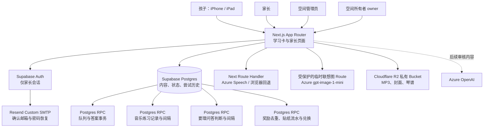
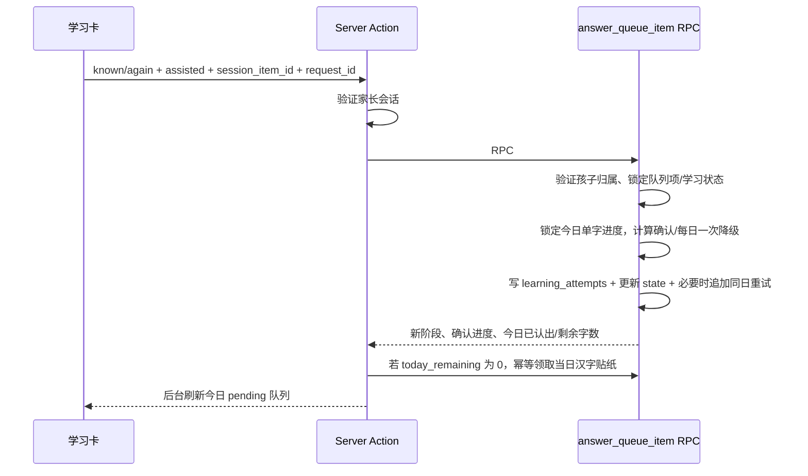

# 字芽 MVP｜详细架构与 AI Agent 交接说明

本文件是后续人类开发者或 AI Agent 的工作约束。目标不是抽象得“万能”，而是在不破坏孩子学习记录的前提下持续迭代。

## 1. 产品与技术边界


```mermaid
flowchart TB
  Kid[孩子：iPhone / iPad] --> UI[Next.js App Router\n学习卡与家长页面]
  Parent[家长] --> UI
  Admin[空间管理员] --> UI
  Owner[空间所有者 owner] --> UI
  UI --> Auth[Supabase Auth\n仅家长会话]
  Auth --> Mail[Resend Custom SMTP\n确认邮箱与密码恢复]
  UI --> DB[(Supabase Postgres\n内容、状态、尝试历史)]
  UI --> Speech[Next Route Handler\nAzure Speech / 浏览器回退]
  UI --> Image[受保护的临时联想图 Route\nAzure gpt-image-1-mini]
  UI --> R2[Cloudflare R2 私有 Bucket\nMP3、封面、琴谱]
  UI -.后续审核内容.-> AI[Azure OpenAI]
  DB --> Scheduler[Postgres RPC\n队列与答案事务]
  DB --> MusicScheduler[Postgres RPC\n音乐练习记录与间隔]
  DB --> CatechismScheduler[Postgres RPC\n要理问答判断与间隔]
  DB --> RewardLedger[Postgres RPC\n奖励去重、贴纸流水与兑换]
```

### 核心原则

1. **内容、当前状态、历史事实三者不能混在一张表。**
2. **前端只提交人工判断，不计算下一阶段。** 汉字走 `answer_queue_item`、音乐走 `record_music_practice`、要理问答走 `record_catechism_attempt`；复习规则只在对应数据库 RPC 中执行。
3. **孩子没有 Supabase 登录账号。** 当前 MVP 使用家长会话访问孩子档案；以后独立儿童会话必须重新设计授权模型。
4. **AI / Azure 不可用不能阻塞学习。** 它们是内容与朗读增强，不是系统事实来源。
5. **任何跨家庭读取都必须失败。** 前端隐藏、页面跳转不是权限控制，RLS 和函数内验证才是。
6. **奖励只能引用真实学习记录，且不能反向改变学习历史。** 贴纸余额由不可变流水求和；奖励失败时原学习记录仍然成功。
7. **owner 是 admin 的严格超集。** admin 审核/分配，owner 额外管理用户、邀请、临时密码和永久清理；破坏性操作默认归档，必须证明历史安全才删除。
8. **拼音与汉字是两个记忆域。** 029 增加拼音独立状态/队列/事实日志；汉字提示是 `helped` 中性结果，不可统计为独立答对或答错，也不可由前端直接改阶段。

## 2. 目录与责任地图

| 路径 | 职责 | 修改注意 |
| --- | --- | --- |
| `app/(app)/learn/page.tsx` | 已登录后的儿童学习入口 | 不在此处写复习算法。 |
| `components/learning-experience.tsx` | 卡片状态、揭示答案、提交回答、朗读回退、临时联想图 | 图片只留在当前浏览器内存，不能阻塞答题。 |
| `components/pinyin-practice.tsx` / `components/pinyin-parent-panel.tsx` | 汉字完成后的拼音小练习、家长设置和逐拼音统计 | 不复用汉字阶段或贴纸；浏览器只提交人工判断。 |
| `lib/pinyin-actions.ts` | 拼音模式保存、拼音队列/作答及汉字中性提示 RPC | 服务端校验家长会话和孩子汉字模块权限；需先运行 029。 |
| `app/(app)/library/page.tsx` | 全字册掌握统计、服务端筛选与分页 | `get_library_rows` 的参数/返回字段必须与最新 SQL 同步。 |
| `components/library-priority-manager.tsx` | 本页重点字勾选、批量保存反馈与字卡详情 | 只提交选择，不计算复习日或阶段。 |
| `app/(app)/parent/page.tsx` | 家长档案、导入、基础进度 | 所有写入走 `lib/actions.ts`。 |
| `components/feedback-form.tsx` | 关键保存、导入确认、处理中防连点、成功弹窗和失败反馈 | 禁用字段前捕获 `FormData`；失败不清空用户填写内容；真实成功由 Action 返回值确认。 |
| `lib/import-safety.ts` | 汉字/诗词/问答 CSV 指纹检查、稳定导入标识、未完成草稿重试 | 使用当前用户 RLS；复用现有唯一约束，不自动删除历史重复资源。 |
| `components/app-shell.tsx` / `components/app-shell.module.css` | 原有顶部/底部导航及即时加载反馈 | 按悬停、焦点、触摸意图预取目标，避免预取全部模块。 |
| `app/(app)/admin/*` | 空间看板、资源审核、按孩子分配；`users/members` 为 owner 专属 | 页面、Action、RLS/RPC 都要验证角色，不只隐藏入口。 |
| `app/account/change-password/page.tsx` | 临时密码首次登录后的强制改密 | 成功修改 Auth 密码后才清除 `must_change_password`。 |
| `app/forgot-password/page.tsx` / `components/forgot-password-form.tsx` | 公开的密码恢复申请与 60 秒防重复提交 | 统一返回结果，不查询或泄露邮箱是否已注册。 |
| `app/auth/recovery/route.ts` / `app/reset-password/page.tsx` | 验证一次性 recovery token、建立恢复会话和设置新密码 | 只接受 `recovery` token 或 PKCE code；成功后退出全部旧会话。 |
| `app/join/page.tsx` | 受邀家长接受一次性链接 | 明文 token 不入库；当前一个账号只加入一个空间。 |
| `lib/access.ts` / `lib/admin-actions.ts` | 服务端角色上下文和管理员写入边界 | 最终授权仍由 Supabase RLS/函数完成。 |
| `lib/user-management-actions.ts` | owner 创建账号、改角色/家庭、停用、重置密码 | 临时密码只返回一次，不写数据库/审计/日志。 |
| `lib/supabase/admin.ts` | server-only Auth Admin client | 只读 `SUPABASE_SECRET_KEY` 或旧 service_role；绝不从客户端导入。 |
| `lib/dashboard.ts` | 只聚合当前活跃分配的学习概况 | 7 天首答率只统计首次独立回答。 |
| `app/(app)/poems/page.tsx` | 诗词背诵概览、筛选、推荐、分页 | 只展示记录与建议，不运行汉字复习算法。 |
| `app/(app)/poems/[poemId]/page.tsx` | 单首诗正文、打卡历史、评分概况 | 每条记录必须来自 `poem_recitation_attempts`。 |
| `app/(app)/poems/game/page.tsx` / `components/*poem-game*` | 选诗、桌面 Canvas 主玩法、手机轻量玩法、结算与人工评分 | 游戏答题不自动等同会背；帧循环不直接写数据库。 |
| `app/api/ai/poem-game-map/route.ts` | 校验孩子/诗词分配后生成并缓存诗意地图 | Azure 不可用时返回稳定降级，不决定答案或评分。 |
| `components/poem-recitation-form.tsx` | “今天背过一次”可重复打卡表单 | 不在客户端合并同日点击。 |
| `app/(app)/music/page.tsx` | 音乐总览、孩子切换、类型筛选与建议 | 只展示数据库已计算的阶段和到期日。 |
| `components/music-playlist.tsx` / `app/api/music/playlist-audio/route.ts` | 当前孩子多首歌曲的列表循环、控制与私有音频地址更新 | 播放器不创建练习历史；每次取音频验证孩子、歌曲分配、发布/审核状态，服务端签名后跳转 R2。 |
| `app/(app)/music/[itemId]/page.tsx` | 播放、歌词/琴谱、辨音揭晓、结果打卡与历史 | 读取 R2 文件前必须验证孩子已被分配。 |
| `app/(app)/music/manage/*` | 家长内容创建、编辑、发布、孩子分配与媒体维护 | 删除内容/资源是破坏性操作，保留二次确认。 |
| `app/(app)/catechism/page.tsx` | 问答册概览、掌握状态、来源筛选、搜索与分页 | 汇总所有已分配问答册；不在页面计算新的学习阶段。 |
| `app/(app)/catechism/study/page.tsx` | 生成当日到期复习与新问题队列 | 默认每天 3 新问 / 10 复习，实际值来自孩子档案。 |
| `app/(app)/catechism/manage/*` | CSV 导入、问答册发布/分配、逐问修正与归档 | 获授权文本不得由 AI 自动改写；已有历史时使用归档。 |
| `components/catechism-study-experience.tsx` | 答案揭晓、双语朗读和二值人工判断 | 只提交 `recited/again`，不计算升降级。 |
| `lib/catechism.ts` / `lib/catechism-actions.ts` | 问答聚合、今日建议、CSV 写入边界与练习 RPC | 每次判断必须带唯一 `request_id`。 |
| `app/(app)/rewards/page.tsx` | 孩子贴纸册、十格花园、成长星、礼物与最近流水 | 只读取奖励表，不从前端推算余额。 |
| `app/(app)/rewards/manage/page.tsx` | 数学/手工贴纸、礼物维护、兑换与撤销 | 余额变化必须走奖励 RPC，不直接改余额。 |
| `lib/reward-service.ts` / `lib/reward-actions.ts` / `lib/rewards.ts` | 自动奖励接入、家长写操作和奖励聚合 | 奖励故障不得阻断原学习写入。 |
| `app/api/music/assets/upload-url/route.ts` | 验证文件类型/大小/归属，签发 R2 PUT URL | R2 密钥永远不返回浏览器。 |
| `lib/music-actions.ts` / `lib/music-data.ts` | 音乐写入边界与只读聚合 | 练习结果走 `record_music_practice`，不在 Action 中计算阶段。 |
| `lib/r2.ts` | S3 Client、上传/读取签名 URL、R2 删除 | 延迟初始化，避免无 R2 变量时阻断 Next.js 构建。 |
| `lib/actions.ts` | Server Actions、CSV 校验/导入、RPC 调用 | 必须先 `auth.getUser()`；不可用 service role。 |
| `lib/poems.ts` | 诗词册、内容与背诵记录的只读聚合 | 供诗词页面使用；不要混入汉字 stage。 |
| `lib/supabase/*`、`proxy.ts` | Supabase SSR cookie 会话刷新 | 跟随 Supabase SSR 官方模式；不要改为 localStorage-only。 |
| `app/api/speech/route.ts` | 持有 Azure Speech key 的服务器端语音代理 | 绝不把 Azure key 返回给浏览器。 |
| `app/api/hanzi-frog/speech/route.ts` / `lib/hanzi-frog-speech-{cache,server,client}.ts` | 游戏慢读两遍、R2 内容哈希缓存、短效读取签名与客户端预加载 | 仅接受已学游戏字 ID；缓存命中不调用 Azure；音频不写入学习状态，不能放宽付费保护。 |
| `app/api/ai/character-content/route.ts` | 预留的受保护 AI 生成接口 | 输出必须审核/缓存后才给孩子端。 |
| `app/api/ai/character-memory-image/route.ts` | 临时儿童联想图 | 先验证家长、孩子和字库归属；只传服务端规范内容给 Azure。 |
| `supabase/001_hanzi_mvp.sql` | 识字基础表、RLS、RPC、索引 | 当前数据库结构以已按顺序执行的迁移脚本累计结果为准。 |
| `supabase/009_music_learning_mvp.sql` | 音乐表、RLS、索引与练习 RPC | 不修改汉字/诗词表；必须整段运行。 |
| `supabase/010_catechism_learning_mvp.sql` | 要理问答表、孩子设置、RLS、索引与练习 RPC | 不修改旧模块历史；必须整段运行。 |
| `supabase/011_priority_character_learning.sql` | 孩子级重点字、RLS、批量保存和汉字队列/字库查询升级 | 不得修改 `answer_queue_item` 真值表。 |
| `supabase/012_reward_sticker_module.sql` | 奖励账户、不可变流水、成长星、礼物、兑换与五个 RPC | 不修改任何学习阶段；必须整段运行。 |
| `supabase/013_fix_get_today_queue_session_id_ambiguity.sql` | 修复旧日待答卡带入时 `ON CONFLICT` 与返回列 `session_id` 同名歧义 | 只替换 `get_today_queue`，保持 011 的重点字顺序。 |
| `supabase/014_dynamic_double_confirmation.sql` | 每日单字确认进度、无限次队尾重试、柔和降级与新版队列/回答 RPC | 保留全部旧历史；今日通过与跨天 stage 必须分开。 |
| `supabase/015_multi_family_admin.sql` | 空间/家庭/角色、公共资源审核、可恢复分配、邀请和 RLS 升级 | 先回填旧数据，不删除孩子或历史。 |
| `supabase/016_adaptive_queue_and_shared_content_rpcs.sql` | 新权限边界下的学习 RPC、字库查询与有界自适应队列 | 保持 014 真值表不变，只调整每日取题数。 |
| `supabase/017_owner_user_management_and_duplicate_cleanup.sql` | owner 用户目录、首次改密、邀请升级和重复资源安全合并 | 不修改旧密码；音乐/问答有历史时拒绝永久删除。 |
| `supabase/018_poem_tank_game.sql` | 诗词游戏地图、场次、逐题、逐句状态和两个保存/评分 RPC | 不修改汉字算法；整首诗掌握仍由家长评分。 |
| `supabase/029_pinyin_learning.sql` | 29 个拼音单元、孩子设置/状态/每日队列/事实日志、RLS、索引与 3 个 RPC | 汉字仅扩充 `helped` 事实及中性重试；原 `answer_queue_item` 不变。 |
| `supabase/022_music_folders_activity_and_cost.sql` | 音乐文件夹与整夹自动分配触发器、App 使用时长、孩子概况与用量统计 RPC | 只新增；取消整夹分配只收回 `assigned_via_folder_id` 带来的分配。 |
| `supabase/023_capacity_guard_50_learners.sql` | 50 位孩子数据库上限、Azure 原子占位/拦截审计、容量快照与单孩子概况聚合 | 需先有 021、022；先运行 SQL 再部署对应代码，不修改学习规则。 |
| `lib/service-guard.ts` / `lib/metered-fetch.ts` | Azure 四服务可配置空间/账号阈值、服务端原子占位后调用 | 无 SQL/Secret key 则付费请求 fail closed；不从浏览器暴露密钥。 |
| `components/admin-capacity-panel.tsx` / `lib/auth-directory.ts` | 管理员容量信号和 Auth 批量目录 | 是应用记录，不是 Azure/Vercel/Supabase 真实账单。 |
| `lib/csv-import.ts` / `app/api/templates/*` | 三类 CSV 模板（`#` 说明行）、UTF-8/GBK 读取、中文表头别名、逐行收集全部错误 | 有任何错误整份拒绝，写库前完成全部校验。 |
| `components/poem-adventure-game.tsx` | 默认诗词游戏：听→拼字→过桥→排序→家长裁判赶雾怪 | 阶段映射到 018 的 stage 枚举；星星/伙伴只存浏览器，不影响学习记录。 |
| `app/(app)/admin/families/page.tsx` / `lib/workspace-overview.ts` | 空间→家庭→孩子组织图、提醒与已分配资源 | 一次 RPC 读取全部孩子，避免每个孩子十几次查询。 |
| `components/activity-tracker.tsx` / `app/api/activity/route.ts` | 前台且近期有操作的使用时长心跳 | 只记聚合秒数，不记页面内容；RPC 按真实间隔封顶。 |
| `app/(app)/admin/usage/child-usage.tsx` / `lib/usage-cost.ts` | 每个孩子的时长、学习记录、AI/语音与估算成本 | 单价可用 `COST_*` 环境变量覆盖；仅测算，不是账单。 |
| `samples/characters-sample.csv` | 30 字真实试跑内容 | 修改后需重新人工检查拼音/例句。 |

## 3. 数据模型与归属


```mermaid
erDiagram
  LEARNING_WORKSPACES ||--o{ WORKSPACE_MEMBERS : authorizes
  LEARNING_WORKSPACES ||--o{ FAMILIES : contains
  AUTH_USERS ||--o{ WORKSPACE_MEMBERS : joins
  AUTH_USERS ||--o| WORKSPACE_USER_PROFILES : describes
  LEARNING_WORKSPACES ||--o{ WORKSPACE_USER_PROFILES : contains
  FAMILIES ||--o{ FAMILY_MEMBERS : authorizes
  AUTH_USERS ||--o{ FAMILY_MEMBERS : belongs_to
  FAMILIES ||--o{ LEARNER_PROFILES : owns
  LEARNING_WORKSPACES ||--o{ CONTENT_PACKAGES : shares
  LEARNING_WORKSPACES ||--o{ POEM_COLLECTIONS : shares
  LEARNING_WORKSPACES ||--o{ MUSIC_ITEMS : shares
  LEARNING_WORKSPACES ||--o{ CATECHISM_COLLECTIONS : shares
  AUTH_USERS ||--o{ LEARNER_PROFILES : owns
  AUTH_USERS ||--o{ CONTENT_PACKAGES : creates
  AUTH_USERS ||--o{ CHARACTERS : creates
  CONTENT_PACKAGES ||--o{ PACKAGE_CHARACTERS : contains
  CHARACTERS ||--o{ PACKAGE_CHARACTERS : appears_in
  LEARNER_PROFILES ||--o{ LEARNING_STATES : has
  LEARNER_PROFILES ||--o| PINYIN_SETTINGS : configures
  LEARNER_PROFILES ||--o{ PINYIN_STATES : remembers
  PINYIN_UNITS ||--o{ PINYIN_STATES : tracks
  LEARNER_PROFILES ||--o{ PINYIN_DAILY_SESSIONS : starts
  PINYIN_DAILY_SESSIONS ||--o{ PINYIN_DAILY_ITEMS : queues
  PINYIN_DAILY_SESSIONS ||--o{ PINYIN_DAILY_PROGRESS : confirms
  PINYIN_DAILY_ITEMS ||--o| PINYIN_ATTEMPTS : records
  CHARACTERS ||--o{ LEARNING_STATES : tracks
  LEARNER_PROFILES ||--o{ LEARNER_CHARACTER_PRIORITIES : chooses
  CHARACTERS ||--o{ LEARNER_CHARACTER_PRIORITIES : prioritizes
  LEARNER_PROFILES ||--o{ DAILY_SESSIONS : starts
  DAILY_SESSIONS ||--o{ DAILY_SESSION_ITEMS : queues
  DAILY_SESSIONS ||--o{ DAILY_CHARACTER_PROGRESS : summarizes
  CHARACTERS ||--o{ DAILY_CHARACTER_PROGRESS : confirms
  LEARNING_STATES ||--o{ LEARNING_ATTEMPTS : records
  DAILY_SESSION_ITEMS ||--|| LEARNING_ATTEMPTS : answers_once
  AUTH_USERS ||--o{ POEM_COLLECTIONS : creates
  AUTH_USERS ||--o{ POEMS : creates
  POEM_COLLECTIONS ||--o{ POEM_COLLECTION_ITEMS : contains
  POEMS ||--o{ POEM_COLLECTION_ITEMS : appears_in
  LEARNER_PROFILES ||--o{ LEARNER_POEM_COLLECTIONS : receives
  POEM_COLLECTIONS ||--o{ LEARNER_POEM_COLLECTIONS : links
  LEARNER_PROFILES ||--o{ POEM_RECITATION_ATTEMPTS : practices
  POEMS ||--o{ POEM_RECITATION_ATTEMPTS : is_recited
  AUTH_USERS ||--o{ MUSIC_ITEMS : creates
  MUSIC_ITEMS ||--o{ MUSIC_ASSETS : has
  LEARNER_PROFILES ||--o{ LEARNER_MUSIC_ITEMS : receives
  MUSIC_ITEMS ||--o{ LEARNER_MUSIC_ITEMS : assigns
  LEARNER_PROFILES ||--o{ MUSIC_LEARNING_STATES : tracks
  MUSIC_ITEMS ||--o{ MUSIC_LEARNING_STATES : is_practiced
  LEARNER_PROFILES ||--o{ MUSIC_PRACTICE_ATTEMPTS : practices
  MUSIC_ITEMS ||--o{ MUSIC_PRACTICE_ATTEMPTS : records
  AUTH_USERS ||--o{ CATECHISM_COLLECTIONS : creates
  CATECHISM_COLLECTIONS ||--o{ CATECHISM_ITEMS : contains
  LEARNER_PROFILES ||--o{ LEARNER_CATECHISM_COLLECTIONS : receives
  CATECHISM_COLLECTIONS ||--o{ LEARNER_CATECHISM_COLLECTIONS : links
  LEARNER_PROFILES ||--o{ CATECHISM_LEARNING_STATES : tracks
  CATECHISM_ITEMS ||--o{ CATECHISM_LEARNING_STATES : is_memorized
  LEARNER_PROFILES ||--o{ CATECHISM_ATTEMPTS : practices
  CATECHISM_ITEMS ||--o{ CATECHISM_ATTEMPTS : records
  LEARNER_PROFILES ||--|| REWARD_ACCOUNTS : owns
  LEARNER_PROFILES ||--o{ REWARD_LEDGER : earns_and_spends
  LEARNER_PROFILES ||--o{ REWARD_GROWTH_EVENTS : accumulates
  AUTH_USERS ||--o{ REWARD_CATALOG_ITEMS : creates
  LEARNER_PROFILES ||--o{ REWARD_REDEMPTIONS : redeems
  REWARD_CATALOG_ITEMS ||--o{ REWARD_REDEMPTIONS : snapshots
```

### 每张表的含义

| 表 | 一句话定义 | 不能做什么 |
| --- | --- | --- |
| `learning_workspaces` / `workspace_members` | 学习空间与 owner/admin/parent 角色 | 角色不存在 Auth metadata。 |
| `families` / `family_members` | 家长可见孩子的隔离边界 | 普通家长不可跨家庭读取。 |
| `workspace_invitations` / `workspace_audit_events` | 一次性邀请和管理操作追踪 | 不保存邀请 token 明文。 |
| `workspace_user_profiles` | 账号称呼和首次改密标记 | 不保存明文/哈希密码，不作为角色授权来源。 |
| `content_packages` | 空间内待审或已批准的字册 | 不存孩子进度。 |
| `characters` | 空间内共用的规范字、拼音、释义和基础例词 | 不直接存“孩子认识吗”。 |
| `package_characters` | 字册内的顺序 | 不存复习阶段。 |
| `learner_character_priorities` | 某个孩子当前优先学习哪些字，跨全部关联字册生效 | 不存阶段、不复制历史、不自动视为已掌握。 |
| `learner_profiles` | 家庭下的孩子、每日新字和自适应复习设置 | 不是可登录的 Auth 用户。 |
| `learning_states` | 一个孩子对一个字当前的阶段/到期日 | 不可代替历史记录。 |
| `daily_sessions` | 孩子本地日期的一次今日任务容器 | 不代表每次点击。 |
| `daily_session_items` | 今日/补带/重试卡队列，`retry_no` 区分同字多次出现 | 每张项只允许回答一次。 |
| `daily_character_progress` | 一天一个字的确认要求、连续独立认出次数、是否降级与通过时间 | 不代替跨天 `learning_states`。 |
| `learning_attempts` | 每一次 `known/again`、是否辅助、当日第几次和确认结果的不可变事实 | 不更新、不覆盖。 |
| `poem_collections` | 一次 CSV 导入形成的一份诗词册 | 不存孩子的背诵次数。 |
| `poems` | 空间内由 `poem_key` 稳定识别的诗词正文与作者信息 | 家长重复导入不得自动覆盖公共正文。 |
| `learner_poem_collections` | 诗词册与孩子的可启停分配 | 取消分配不能删除旧打卡。 |
| `poem_recitation_attempts` | 每次“今天背过一次”的历史事实，含本地日期、可空评分与备注 | 不合并同一天的多次打卡。 |
| `poem_game_sessions` / `poem_game_attempts` | 一局游戏汇总与每个答案事实 | 游戏命中率不覆盖家长背诵评分。 |
| `learner_poem_line_states` | 每句诗的暴露/对错/首次答对/到期建议 | 不接入汉字 stage，也不代替整首诗记录。 |
| `poem_game_maps` | AI 或稳定诗意地图 JSON 蓝图缓存 | 不保存孩子隐私或学习结果。 |
| `music_items` | 唱一唱、辨声音或打节奏的内容与发布状态 | 不存 MP3 二进制，不存孩子进度。 |
| `music_assets` | R2 `object_key`、原文件名、MIME、大小、类型与顺序 | 不存公开 URL；读取 URL 必须临时签发。 |
| `learner_music_items` | 内容与孩子的可启停分配关系 | 只有 active 且资源已批准/已发布才能进孩子页。 |
| `music_learning_states` | 某孩子对某音乐项的阶段、到期日和最近结果 | 不可代替历史。 |
| `music_practice_attempts` | 每一次听/唱/辨认/节奏结果，含孩子本地日期和可选猜测备注 | 不覆盖或合并；同日多次就是多行。 |
| `catechism_collections` | 一次导入形成的一份有版本、来源与授权说明的问答册 | 不跨版本自动合并问题。 |
| `catechism_items` | 某一版本内的中英文问题、答案、经文和稳定编号 | 不存孩子进度，不由 AI 自动改写。 |
| `learner_catechism_collections` | 问答册与孩子的可启停分配 | 取消分配不删除历史，重新分配后可恢复。 |
| `catechism_learning_states` | 某孩子对某问题的当前阶段、次数和到期日 | 不可代替不可变历史。 |
| `catechism_attempts` | 每次 `recited/again` 的事实、前后阶段、本地日期与幂等键 | 同日多次不合并，不更新覆盖。 |
| `reward_accounts` | 每个孩子的贴纸目标、成长星门槛/日上限和当前未兑换星数 | 不作为贴纸余额来源。 |
| `reward_ledger` | 每次获得、消费和返还贴纸的不可变有符号流水 | 不更新、不删除；余额必须求和。 |
| `reward_growth_events` | 诗词/音乐项目在某天是否计入成长星 | 不替代原模块练习历史。 |
| `reward_catalog_items` | 家长的礼物愿望、图标、成本和上下架状态 | 不保存孩子余额。 |
| `reward_redemptions` | 礼物兑换快照与撤销状态 | 误操作用反向流水，不删除记录。 |

## 4. 当前复习算法（不可拆分）

阶段间隔：stage 1/2/3/4/5/6/7 分别对应 1/3/7/14/30/60/90 天；stage 7 再答对进入 180 天长期维护。

### 动态双确认

| 当前 | 今日通过标准 | 没有独立认出 |
| --- | --- | --- |
| 新字、stage 0–2 | 连续两次独立认出，完成后正常升一级 | 清空确认、柔和降级一次、追加 `same_day_retry` |
| stage 3–6 | 第一次独立认出即正常升一级 | 柔和降级一次，之后改为连续两次确认 |
| stage 7 | 第一次独立认出即保持 stage 7，180 天维护 | 降到 stage 5、清除 `mastered_at`，之后双确认 |
| 当日已经失败的重试 | 连续两次独立认出后今日通过，但不恢复阶段 | 只清空确认并继续重试，不再次降级 |

柔和降级：`0→0、1→0、2→1、3→1、4→2、5→3、6→4、7→5`。听朗读、展开答案/拼音/词句、查看联想图或得到口头提示后，本轮不算独立认出。详细规则以 [14_汉字动态双确认规则说明.md](./14_汉字动态双确认规则说明.md) 为准。

### 今日队列与重点字

`get_today_queue` 负责创建孩子本地日期的固定任务。`016` 之后的候选顺序是：

1. 以前未答完且已开始的字优先转成今日 `carry`，但不突破当天复习安全上限；
2. 到期重点字；
3. 到期普通字，按最久逾期、低阶段优先，补到当天计划复习量；
4. 跨全部已分配、已审核且已发布字册的未学重点字；
5. 按“字册分配顺序 + CSV sequence”排列的普通新字，同字跨字册只进一次；
6. 未达到今日确认标准时追加的 `same_day_retry`。

重点仅参与排序：必须仍满足 `due_at <= now()` 才能成为复习候选；未学重点字占用当天新字名额。自适应量参考到期积压和近 7 天首答独立认出率：积压 31–60 时用复习安全上限且新字最多 2 个，积压超过 60 或有足够样本且首答率低于 60% 时暂停新字。完整阈值见 [15 号说明](./15_多家庭管理员与智能复习说明.md)。

队列计划在当天第一次打开时快照到 `daily_sessions`。当天修改设置不重排，孩子时区的第二天才生效。漏学不会自动降级，阶段只由 `answer_queue_item` 根据真实回答改变。

### 为什么同日重试不恢复阶段

若 stage 5 字没认出后降到 stage 3，却在几分钟后连续认出，仍可能是短时记忆。因此当天只标记“今日通过”，保持 stage 3 和次日到期；翌日独立认出后才正常升到 stage 4。

### 更新算法的硬规则

若要调间隔/增加评级，必须同一 PR 同时修改：

1. `01_产品方案与MVP.md` 的真值表；
2. 当前最新升级脚本中的 `answer_queue_item`（现为 `016`，真值表继承 `014`）；
3. `ARCHITECTURE.md` 本节；
4. SQL 函数测试用例（未来加入）；
5. 学习页的提示文案（不要向孩子显示“失败/降级”）。

不得把这段规则搬到 `components/learning-experience.tsx` 计算；客户端可以刷新、断线、重复提交，数据库才有事务和幂等性。

## 5. 一次答题的数据流


```mermaid
sequenceDiagram
  participant K as 学习卡
  participant A as Server Action
  participant DB as answer_queue_item RPC
  K->>A: known/again + assisted + session_item_id + request_id
  A->>A: 验证家长会话
  A->>DB: RPC
  DB->>DB: 验证孩子归属、锁定队列项/学习状态
  DB->>DB: 锁定今日单字进度，计算确认/每日一次降级
  DB->>DB: 写 learning_attempts + 更新 state + 必要时追加同日重试
  DB-->>A: 新阶段、确认进度、今日已认出/剩余字数
  A->>DB: 若 today_remaining 为 0，幂等领取当日汉字贴纸
  A-->>K: 后台刷新今日 pending 队列
```

幂等键是 `learning_attempts.request_id`。网络重试时，前端使用同一个 request id；数据库只处理第一次请求。每个 `daily_session_item` 也有唯一回答记录，避免双击导致两次升级。

## 6. Auth、RLS 与数据库函数

### RLS

- 每张 `public` 表显式启用 RLS。
- 角色来自 `workspace_members`，家庭可见范围来自 `family_members`，不读取 `user_metadata` 做授权。
- `private.can_access_learner` 统一判断主家长、同家庭监护人和空间 owner/admin；`private.is_workspace_admin` 统一判断审核/分配权。
- 普通家长可读空间已批准资源与自己的待审提交，但只能读自己家庭的孩子和派生学习表。
- 孩子队列必须同时满足资源 `approved + published` 和分配 `active`。

### 为什么使用 `SECURITY DEFINER` RPC

`get_today_queue` 和 `answer_queue_item` 要跨多张表、保持同一事务，若让前端分多次写会出现重复题、丢记录或竞态。因此使用经过严格约束的函数：

- 函数 `set search_path = ''`，所有 relation 显式写 `public.`。
- 默认 `PUBLIC`/`anon` 执行权被收回，只 `grant execute` 给 `authenticated`。
- 每次调用先查 `private.can_access_learner(...)`，没有家庭或管理员权限即抛错。
- 函数不接受 SQL 字符串、表名、其他家长 ID 或服务角色 key。

以后如改函数签名，必须相应更新最后的 `revoke/grant execute`；否则旧函数可能仍默认对 `PUBLIC` 可执行。

`record_music_practice` 在 `016` 中改为受限 `SECURITY DEFINER`：它先用 `private.can_access_learner` 验证家庭/管理员边界，再检查资源已审核、已发布且已活跃分配。`request_id` 唯一，同一次点击网络重试也只记一次。

`record_catechism_attempt` 采用受限的 `SECURITY DEFINER`，因为 `catechism_learning_states` 和 `catechism_attempts` 对普通登录用户只开放读取，所有写入必须经过同一事务。函数必须保持空 `search_path`、全限定表名、显式 `auth.uid()` 归属检查，并只向 `authenticated` 授予执行权。问答历史不允许前端直接更新或删除。

`set_character_priorities` 仍是原子批量保存，`016` 后用 `private.can_access_learner` 和已分配公共字册验证候选。`learner_character_priorities` 的主键 `(learner_id, character_id)` 确保不同孩子可有不同重点，同一字跨多个 CSV 只保留一个重点标记。

`daily_character_progress` 只向孩子所属家庭和空间管理员开放读取，写入只能通过受限的 `answer_queue_item`。RPC 使用空 `search_path`、全限定表名、权限验证和 session 行锁，在一个事务中完成确认进度、阶段、历史和新重试卡。

奖励模块的五个函数采用受限的 `SECURITY DEFINER`，负责跨表核验真实练习、锁定奖励账户、去重与追加流水；奖励账户、流水、成长星和兑换表只给普通登录用户读取权限，不能绕过 RPC 直接写。`claim_hanzi_daily_reward` 只有在当天会话有已答卡且没有待答卡时才发放；`register_reward_activity` 从诗词/音乐历史反查项目、结果和孩子本地日期，不接受客户端自行声明“已完成”。函数保持空 `search_path`、全限定表名，只向 `authenticated` 开放并再次核验孩子归属。同一业务日期、项目或请求都有唯一键，重试不会重复记账。

### 迁移纪律

- 已部署环境的真实结构是 `001` 加后续适用的 `002`–`018` 累计结果，不要回头改已经在线执行过的旧脚本来“假装升级”。
- 新的数据库变化应新增下一个编号脚本，并在执行前备份相关内容表、状态表和历史表。
- SQL 文件要尽量可重复运行；函数签名变化时同时清理旧签名权限，外键和 RLS 变更要验证已有数据能安全通过。
- 内容只有错字/标点修正可原地更新；答案含义、授权文本版本或译本变化必须创建新问答册。

## 7. Next.js 与认证边界

- Server Component 默认读取数据；页面在 `(app)` 路由组内，layout 用 `auth.getUser()` 拦截未登录访问。
- 服务端 `createClient` 每次调用都从当前请求重新读取 Cookie，不缓存带会话的 Supabase 客户端；`loadAccessContext` 只在当前渲染内复用同一客户端的权限读取。不能改为跨请求的全局 Map、持久缓存或 `use cache`，避免账号 Cookie 和权限串用。
- 邮箱密码登录成功后使用完整页面跳转进入受保护路由，确保浏览器写完 Supabase 会话 Cookie 后服务端才开始渲染；不要连续调用 `router.replace()` 与 `router.refresh()` 制造登录前后请求竞争。
- `AppShell` 通过 `onNavigate + useTransition` 显示目标页打开状态，同一目标等待中避免重复导航；保留正常链接地址和新标签打开方式。预取只在悬停、聚焦或触摸时触发，并在短时间内去重；`loading.tsx` 提供服务端读取期间的页面占位。
- `proxy.ts` 每个请求刷新 Supabase SSR cookie，会话响应强制 `Cache-Control: private, no-store`。
- `/auth/callback` 服务于注册/邀请，并兼容旧版 recovery 模板；`/auth/recovery` 专门验证密码恢复。新版 Recovery 邮件模板使用 `SiteURL + /auth/recovery + TokenHash`，不把 token 写日志或数据库。
- 忘记密码前端直接调用 Supabase `resetPasswordForEmail`，不传入当前浏览器的 `redirectTo`；邮件链接统一由模板从正式 `SiteURL` 构造。Supabase Auth 通过 Resend Custom SMTP 发信；前端、Vercel 和浏览器都不持有 Resend API Key。
- 密码恢复对存在与不存在的邮箱显示相同结果；同一用户 60 秒内不能重复发送。设置成功后调用全局 sign-out，再要求用户用新密码登录。
- Client Component 仅用于卡片点击、浏览器朗读和局部状态；不含任何管理员密钥。
- `lib/actions.ts` 是 server-only 的写入边界。每一个 Action 都先获取用户再写入。
- `lib/user-management-actions.ts` 先用普通 SSR 会话验证 owner，只有创建 Auth 用户/重置密码时才调用 server-only Admin client。service key 不能代替业务角色校验。
- `/api/speech`、`/api/ai/*` 都先校验登录，并且只在服务器读取 Azure 变量。
- `/api/music/assets/upload-url` 在 Node.js Route Handler 中校验登录、内容归属、MIME 与大小，再返回单个对象的短时 PUT URL。
- R2 SDK 只在签名/删除时延迟初始化；因此未配置 R2 时仍可构建、登录并使用汉字/诗词模块。

### 关键保存与 CSV 导入反馈

`FeedbackForm` 沿用现有字段与布局，在用户提交时先捕获完整 `FormData`，再禁用字段；导入先打开包含名称、文件、孩子的确认对话框。同步 ref 锁阻止连点，等待超过 8 秒会继续显示“仍在处理中”，不自动发起第二次写入。成功或重复内容通过弹窗确认，错误保留表单内容供修正或重试。普通学习打卡仍遵循原有“每次练习独立记录”规则，不能使用 CSV 去重策略合并学习历史。

三类 CSV 导入通过内容指纹检查当前 RLS 可见的已有资源，并为同账号相同内容生成稳定 `code`；现有 `UNIQUE(created_by, code)` 约束处理同账号并发重试。新资源先为导入草稿，内容完整后才审核/发布；同一用户、同一稳定标识的未完成草稿允许重试补齐。目录 upsert 是幂等写入，单次短暂失败会自动重试，随后以精确计数核对目录完整性；数量不符时保持草稿，不进入发布态。已完成资源不重复新建；分配和审核仍使用原有权限。跨账号不可见资源、不同版本文本或真实不同内容不应被模糊匹配合并。旧重复数据和历史半成品不自动删除，管理员按资源管理提示处理。本轮无需新增数据库表、SQL 或环境变量。

## 8. 环境变量与部署边界

诗境守卫战的电脑玩法支持 5/6/7 分钟三档难度，Canvas 内部交替进行诗句回忆与补给战斗。暂停时间不计入时长，语音播放期间锁定答案处理。`lib/poem-game-scene.ts` 预绘制静态山水背景，`/api/ai/poem-game-map` 同时提供文本蓝图和显式点击生成的 Azure 绘本背景；图片只存当前页面内存，不进入学习记录。所有游戏结果继续使用 `018` 的场次/逐题/逐句状态表，家长背诵评分与游戏识别表现仍分开。配置及验收见 `18_诗境守卫战模块说明.md`。

| 变量 | 可到浏览器？ | 用处 |
| --- | --- | --- |
| `NEXT_PUBLIC_SUPABASE_URL` | 可以 | Supabase 项目地址。 |
| `NEXT_PUBLIC_SUPABASE_ANON_KEY`/`PUBLISHABLE_KEY` | 可以 | 受 RLS 保护的公开客户端 key。 |
| `SUPABASE_SECRET_KEY` | 不可以 | 推荐的 `sb_secret_...`，仅 owner 创建 Auth 用户/重置密码。 |
| `SUPABASE_SERVICE_ROLE_KEY` | 不可以 | 仅旧项目兼容；新项目优先 Secret key。 |
| `AZURE_SPEECH_KEY` | 不可以 | Route Handler 调 Azure TTS。 |
| `AZURE_OPENAI_API_KEY` | 不可以 | Route Handler 调 Azure OpenAI。 |
| `AZURE_IMAGE_DEPLOYMENT` / `AZURE_IMAGE_API_VERSION` | 不可以 | Azure `gpt-image-1-mini` 的服务器端部署配置。 |
| `R2_ACCOUNT_ID` | 不可以 | 生成 Cloudflare R2 S3 endpoint。 |
| `R2_ACCESS_KEY_ID` / `R2_SECRET_ACCESS_KEY` | 不可以 | 生成短时预签名 URL 与删除对象。 |
| `R2_BUCKET_NAME` | 不可以 | 当前音乐私有 Bucket，默认 `fisher-learning-media`。 |

## 9. 计划内扩展点

### 拼音小助手（1.1）

新增 `pinyin_parts` 或由服务端可靠词典预计算，不要在浏览器用正则猜所有拼音。卡片只展示，学习状态仍使用 `learning_states`。

### AI 内容审核（1.1）

增加 `character_ai_candidates`：`character_id, prompt_version, model, generated_json, review_status, approved_at`。AI endpoint 只能创建候选；只有家长发布后的人工内容才进入孩子卡片。绝不让生成结果覆盖 `pinyin_marked` 和 `meaning`。

### 临时联想图（当前已实现）

- 它是帮助孩子记忆字义的**联想**，不是任何汉字的字源考据结论；界面和提示词均不得把它表述为“真实造字来历”。
- 只在家长已登录、该字确实属于所选孩子字库时才能调用；浏览器只持有一次生成后的临时图片，收起或换卡不改变数据库内容。
- 图片模型不可用、被安全过滤或网络失败时，只显示失败提示，不能影响“我自己认出来了 / 还要再学一次”与复习记录；只要孩子点击过联想图，本轮必须标为得到帮助。

### 诗词背诵记录（当前已实现）

- 诗词模块目前是独立的“内容 + 记录”模型：`poem_recitation_attempts` 允许同日多行，`recited_local_date` 是孩子时区的真实练习日期，`score` 可为 null。
- 首次和后续新增内容会创建来源诗词册并按权限关联到所选孩子；相同内容优先复用已有诗词册，避免重复导入。页面默认汇总全部批次，并可按来源筛选。
- `018` 新增独立诗词游戏场次、逐题事实、逐句状态和地图缓存；仍没有把诗词接入汉字的 `get_today_queue` / `answer_queue_item`，这是刻意的边界。
- `record_poem_game_result` 原子写入整局证据并计算逐句 `mastery_score/next_due_at`；游戏帧循环不访问数据库。`rate_poem_game_session` 才把家长 1–10 分写回原有背诵记录，并保持幂等。
- AI 地图 Route Handler 先验证当前会话、孩子和已分配诗词，再读取 Azure 变量；生成失败时使用本地稳定蓝图。AI 不产生标准答案、不判断孩子会不会背。
- 若将来加入今日自动推荐，应基于 `learner_poem_line_states.next_due_at` 生成候选，不要给 `learning_states` / `learning_attempts` 临时加 nullable `poem_id`。

### 音乐学习（当前已实现）

- 内容类型为 `song / instrument / rhythm`，分别对应“唱一唱 / 辨声音 / 打节奏”。封面、乐器图和节奏谱都可空；歌曲可维护最多 5 张统一命名的“琴谱”。
- 每条内容当前只保留 1 个主音频：一条辨音记录对应一种要辨认的声音。如果有两个 MP3 要检查两种声音，应建立两条辨音内容，让各自拥有独立的记忆阶段和历史。播放器会循环播放当前音频。
- 音乐总览的“全部 / 唱一唱”增加多选歌单，按勾选顺序列表循环；歌单只保存在当前页面内存，切换孩子或离开页面会停止播放。更改勾选后需点击“播放所选，更新歌单”才替换当前播放队列。
- 歌单复用一个 `<audio>` 元素。每次切歌请求 `/api/music/playlist-audio`，服务器校验当前孩子的有效分配及歌曲已发布、已审核，再以不可缓存的 307 跳转到短时 R2 签名地址；避免长时间循环后沿用过期签名。播放失败可重试本首或跳过，不能自动记为练习成功。
- 歌曲结果有“只听过 / 跟着唱 / 提示下会唱 / 独立会唱”；只听过不升阶。辨音与节奏采用二值结果，答错降两级并第二天再练。
- 阶段 0–7 的正向间隔为 1/1/3/7/14/30/60/90 天；阶段 7 再次成功后间隔 180 天。该算法是家庭学习建议，不是音乐能力评价。
- 每次点击都追加 `music_practice_attempts`；同一天练习多次就有多行。乐器实际猜测放在可选 `guess_note`，不强制填写。
- 文件放在私有 Cloudflare R2；上传 URL 10 分钟过期，读取 URL 1 小时过期。R2 密钥只存在 Vercel 服务器环境变量。
- 当前不需要 Supabase Edge Functions：事务走 Postgres RPC，签名走 Next.js Route Handler。未来需要转码、波形或长任务时再评估异步工作流。

### 要理问答（当前已实现）

- 首份内容是已获授权的《要理问答》（*First Catechism: Biblical Truth for God’s Children*）；系统只保存和展示家长导入的正式文本，不自动翻译或改写。
- 中文和英文同时显示并分别朗读；`/api/speech` 根据 `lang=zh/en` 选择 Azure 声音，失败时由浏览器系统朗读回退。
- 家长按“与原答案基本相同，约 80%–100%”人工判断 `recited/again`。未来语音转写只能辅助家长，不能覆盖人工事实。
- `record_catechism_attempt` 通过受限 `SECURITY DEFINER` 再次核验家长归属后锁定状态，检查 `request_id`，追加历史并更新阶段。答出上升一级，未答出下降两级且次日再问；同日答对不连续升级、同日连续答错不重复降级；正向间隔为 1/3/7/14/30/60/90/180 天。
- 每位孩子独立设置每日新问题（默认 3）和到期复习上限（默认 10）。前端只选择今日候选，不写阶段；同一问题可从问答册“单独练这一问”产生额外独立记录。
- 不需要 Supabase Edge Functions：数据库事务走 Postgres RPC，CSV/维护走 Server Actions，朗读走 Next.js Route Handler。

### 小芽贴纸奖励（当前已实现）

- 完成当天全部汉字卡自动发 1 枚贴纸，每个孩子每天一次；`learner_id + dedupe_key` 防止刷新和重复请求多发。
- 诗词、跟唱、辨音、节奏的真实练习可产生成长星；同项目同日最多一颗、每日最多两颗、三颗自动换一枚贴纸。歌曲仅听不加星，辨音/节奏奖励认真尝试而非正确率。
- 家长可记录每日一次数学贴纸、一次性导入线下余额、特别表扬与有原因的修正。
- 兑换追加负数流水，撤销兑换追加等额正数流水；任何余额不得通过更新一列来“改成某个数”。
- 不需要 Edge Function 或新增环境变量。数据库负责事务和幂等，Next.js 负责页面、Server Action 与学习完成后的非阻断式调用。
- 规则、部署和验收以 [13_奖励贴纸模块说明.md](./13_奖励贴纸模块说明.md) 为准。

### 跟读/背诵（4）

音频录入前要增加家长同意、私有 Storage policy、录音删除与自动过期。Azure Speech 评分只能作为“再练习建议”，不作为孩子的能力/排名数据。

## 10. 后续 AI Agent 的启动提示

在让新的 AI Agent 修改项目时，先把下面内容给它：

```text
请先阅读 ARCHITECTURE.md、DEPLOYMENT.md、01_产品方案与MVP.md、14_汉字动态双确认规则说明.md、15_多家庭管理员与智能复习说明.md、16_用户家庭管理与资源安全清理说明.md、supabase/015_multi_family_admin.sql、supabase/016_adaptive_queue_and_shared_content_rpcs.sql 和 supabase/017_owner_user_management_and_duplicate_cleanup.sql；再按任务阅读 09–13 号模块文档及对应旧迁移。
这是一个 Next.js + Supabase SSR + 私有 Cloudflare R2 的多家庭儿童学习 PWA。普通家长只能看本家庭，owner/admin 可看空间全部孩子并审核/分配公共资源。
owner 是 admin 的严格超集；只有 owner 可管理账号、邀请和永久清理。不要在前端计算复习阶段；不要暴露 Azure、R2 或 Supabase service key；只有 approved + published + active assignment 可以进孩子队列；取消分配/归档不得删除学习历史；汉字动态双确认以 daily_character_progress 为准且每字每天最多降级一次；自适应队列只调节当天取题数，不改真值表；各模块每次学习必须追加不可变历史；奖励余额只能来自 reward_ledger 流水求和；修改权限、复习或奖励规则时同步修改 SQL、文档和测试。
```

并要求 Agent 完成真实检查：`npm run lint`、`npm run build`、移动端浏览器验收；若修改 SQL，使用两个测试家长账号验证跨家庭 RLS。

## 11. 成人运动与会议英语（019，2026-09-18）

### 11.1 模块隔离与入口

使用现有 Next.js App Router、Supabase SSR 会话与 Azure REST 接口，不增加框架、登录体系、Edge Functions 或 service role 调用。`app/(app)/together/[[...section]]` 提供今天/记录/设置，`app/(app)/english/[[...section]]` 提供练习/资料/积累。`app-shell` 只新增顶层模块和对应底部导航。

`AdultHub` 是交互入口：请求完成前禁用重复提交、显示成功/失败、保存后刷新当前数据；切换参与者时保留账号私有边界。英语面板按需加载。儿童学习完成页只增加可关闭的 `ParentGrowthInvitation`，它使用本机启用偏好，不增加儿童保存链路上的网络依赖，也不发额外贴纸。

### 11.2 数据和权限

所有新增表位于 `supabase/019_parent_growth.sql`，使用 `adult_` 前缀。这里的 `owner_id` 指数据所属 Auth 用户，**不是工作空间的 owner 角色**。每表开启仅 `auth.uid()` 可访问的 RLS，并用包含 owner 的复合外键防止跨账号挂接。

| 表组 | 职责 |
| --- | --- |
| `adult_profiles` | 同账号爸爸/妈妈等成人档案，英语偏好 |
| `adult_exercise_goals / adult_goal_versions` | 固定运动单位与按生效日期保存的目标版本 |
| `adult_exercise_logs` | 逐次打卡、实际日期与撤销时间 |
| `adult_english_sources / adult_english_lessons` | 私有会议原文、生成/草稿/发布版本 |
| `adult_english_concepts / adult_english_lesson_concepts` | 账号内按表达+意思去重的学习点与来源 |
| `adult_english_plans / adult_english_attempts` | 档案每日任务快照、逐次作答事实 |
| `adult_english_states` | 档案×表达×听力/口语的复习状态 |
| `adult_ai_jobs` | AI 请求 ID、状态、结果、模型及 token 用量（服务有返回时） |

新模块的账号私有 RLS 不使用儿童空间 admin/owner 通读策略，不把会议资源放进公共资源分配表。成人同账号档案互相可见；不同登录账号隔离。账号的 active workspace membership 在 API 中校验。RLS 主要保护跨账号隔离，认证账号对自己的表有写权限；本模块不是强防作弊考试系统，也不宣称服务器审核过的成绩无法由高级用户改写。数据库管理员仍有底层权限。

### 11.3 API 与事务

- `lib/adult-learning.ts`：无副作用类型、北京时间日历、目标快照/统计、课程结构校验、队列、掌握标签。不能引入服务器密钥。
- `lib/adult-server.ts`：会话鉴权、输入检查、分页读取、命令编排、Azure JSON 生成与反馈。读取分页避免 Supabase 默认 1000 行造成无提示截断，当前仍将账号范围数据加载后在 UI 分页，适合家庭规模；大规模应改服务端列表分页和聚合。
- `/api/adult`：客户端 GET 加载、POST 命令，不缓存私有响应。同源校验、长度限制、鉴权在服务端，不信任前端传来的 owner。
- `/api/adult/media`：读取已授权任务或课程中的文本朗读，接收单声道 PCM16/16kHz 短录音转写；不允许任意外链抓取。语音转写与 plan/task 绑定，修改转写标记 corrected。
- `/api/adult/family`：按需汇总当前账号自己孩子近 30 天学习日期，不查询其他家庭，不阻塞成人或儿童保存。
- `adult_save_goal` RPC：锁定档案；首次当天生效，已有目标仅写次日起版本，历史计算不变。
- `adult_log_exercise` RPC：归属、日期范围检查；请求 UUID 保证普通网络重试幂等，真实第二次运动使用新 UUID。
- `adult_publish_lesson` RPC：原子发布、表达去重和来源关联，重复发布无重复关系。
- `adult_record_attempt` RPC：锁定计划，按请求 UUID 追加记录并原子更新状态；同日独立答对不重复升级。
- `adult_delete_source` RPC：原子删除源资料及含相关课程的整份计划，清除孤立表达/状态和账号 AI 缓存；保留其他账号和运动表。

RPC 为 `SECURITY INVOKER`、固定空 search_path、显式限定表名并撤销匿名执行权。与儿童模块某些受限 definer 函数不同，不套用其角色策略。

### 11.4 课程、复习与幂等

原文按标准化正文 hash 去重。生成任务先入库，生成内容必须通过结构和原文引文检查，家长人工修改草稿后发布。发布版本不覆盖，计划记录完整题目快照，未来改资料不影响旧题目。

生成 job 与课程同一 UUID。AI 结果先持久化；若写草稿失败，重试从完成结果恢复，不再次生成；已有编辑草稿不会被恢复逻辑覆盖。运行中任务 90 秒内拒绝重复执行；过期任务使用条件更新重新占用。这个机制减少常见重复调用，不是分布式任务队列或严格计费 exactly-once 保证。近 24 小时 200 项新 AI/语音任务提供应用层保护，并非原子全局计费限额。

每日档案/日期唯一（Asia/Shanghai），已有计划优先返回。到期技能优先，未到期技能不会作为新表达重复出题，听力和口语分别建立状态；达到到期上限时减少新表达。标准/精简/小测由用户选，修改偏好不重建当日快照。

口语独立证据要求本题未改写语音转写、无提示和 AI 内容答对。听力可用文字解释。自评、修正转写和提示不增加独立成功日。阶段 0～5，正向间隔 1/3/7/14/30 天，同日最多因成功升一级；明显错误降一级并当日到期，其他非独立尝试缩短至最多次日。稳定掌握还要求 3 个独立成功日期及至少一次 7 天间隔回忆。普通听力理解/情境题保留逐次历史，不强行映射某个表达的掌握。

AI 只评价文字内容，不能从转写文本推断发音或口音。练习通过率与发音、CEFR 水平分开，不以播放音频充当有效学习。

### 11.5 音频与敏感资料生命周期

录音在浏览器录制、转为短 WAV，服务器转发 Azure 后不持久化原始文件；转写文本和作答记录写数据库。`lib/adult-media.ts` 合成朗读，正常/慢速按账号+声音+速度+文本 hash 缓存。可选 `R2_ADULT_BUCKET_NAME` 必须是独立私有桶，复用现有 R2 凭据，绝不回退到 `R2_BUCKET_NAME` 音乐桶。未配置时直接 TTS 可用。

音频走登录鉴权后的服务器响应，`private, no-store`，浏览器使用短生命周期 object URL。永久删除资料先清理账号私有合成缓存，再执行数据库事务；清理失败时不删除数据库，便于重试。共享缓存清理会使该账号其他会议的音频重新生成。删除含源资料的整份计划会连同同计划其他题历史删除，UI 明确提示，平时停用用归档。

目前没有运行中生成与删除的跨服务分布式锁，勿并发删除正在生成的源资料；正式扩大多用户规模前可增加 tombstone、后台清理队列和分桶专用凭据。不要为简化缓存把会议内容改成公共资源。

### 11.6 验证与后续修改

`scripts/test-parent-growth.cjs` 纯逻辑测试可直接运行；设置 `PGLITE_MODULE` 指向本地安装的 `@electric-sql/pglite` 后，会在一次性本地库执行迁移两遍并测试 RLS、复合外键、目标版本、幂等、发布、复习和删除隔离，不连接线上 Supabase。PGlite 仅为测试工具，没有加入应用依赖。

```sh
node --test scripts/test-parent-growth.cjs
node --test scripts/test-resource-imports.cjs scripts/test-poem-tank.cjs
npm run lint
npm run build
```

`scripts/check-parent-azure.cjs` 只有显式 `--live` 才发送虚构句子测试 Azure，可能产生少量费用，不使用真实纪要。浏览器测试部分使用模拟 API；尚需部署后进行真实登录、麦克风、完整作答与第二账号验收，详见 21 号文档。后续不要把模拟流程通过写成生产验收完成。

儿童英语已在 024 独立实现，使用孩子档案和 owner 授权，不复用成人私有档案。修改成人模块仍优先阅读本章节、21 号文档和 019 SQL；儿童英语请阅读本文件 11.10 节和 25 号教程。原儿童的 001–018 学习算法仍保持原有文档定义。

### 11.7 新版会议英语（020，2026-09-25）

默认英语入口改为分节听力/选择题/词句复习，以上 11.3～11.4 的口语逻辑作为 legacy 保留。完整规则和验收见 [22 号说明](./22_会议英语听力与词句学习升级说明.md)，优先级高于旧规划中的英语内容。

- `lib/english-listening.ts` 管理 15,000 英文词且 150,000 字符的双上限、段落/句子无损分节、三道理解题和 4～6 词句的运行时校验、选项轮换。原文保留，不一次把长文交给 AI 重新切写。
- 双语字幕：`lib/english-source.ts` 识别相邻 EN/ZH 或 ZH/EN 对照及常见 SRT/VTT 元数据。分节保留原稿全部非空白内容，已识别的中英组不拆开；生成输入分为 `english_source / chinese_reference / bilingual_pairs`，英文是事实主体，中文仅辅助。词数上限按有效英文计，字符上限按原稿计；单节至少 80 个有效英文词。预览不是语义校对，同一行混排会提示整理。既有分节/发布快照不自动重写，本次无新增迁移。
- 词句跟读：`lib/english-audio.ts` 只选择已授权 session 快照中的保存字段；积累页通过 `concept_id` 请求词句或英文例句，media 路由再次按当前 `owner_id` 查表。客户端不提交任意 TTS 文本。默认慢速、可循环，播放不修改作答/掌握记录，不要求录音。
- `lib/english-listening-server.ts` 使用现有账号鉴权/AI 任务去重。`/api/adult/listening` GET 读取目录元数据或单节详情；`/api/adult` POST 分发 `listen-*`；`/api/adult/media` 从已授权 session 快照取听力稿、解析句或词句朗读。
- `adult_english_sections` 为原文分节；`adult_english_lessons.format_version=2` 为新版课程。旧数据默认 1，旧界面只读取 1；共享资料与表达词典，但不混淆课程 JSON 和掌握状态。
- `adult_listening_sessions` 固定当天课程与选项，保存 `assisted` 和 `assisted_tasks`，档案×北京时间日期唯一；`adult_listening_attempts` 追加逐次作答；`adult_english_word_states` 单独保存新版词句识别阶段。新表沿用账号私有 RLS、复合归属外键，工作空间 owner/admin 没有额外通读权。
- RPC `adult_split_source` 检查拼接后原文完整并幂等创建；`adult_listening_hint` 持久化提示；`adult_listening_answer` 按快照判题、锁行、请求 UUID 幂等、原子更新词句状态。同日最多升/降一级，1/3/7/14/30 天间隔，辅助/自评不升级，独立回忆与七天间隔另存。不是强防作弊考试。
- 自动计划：到期词句（最多 5，尊重档案更小值）；到期总数达到 5 默认只复习；否则优先近 30 天检测到的薄弱小节、未完成/重点/较久没学的小节。可手选已发布版或只复习。当日快照不重建。尚未到期的重复词句从本次词句任务剔除。
- 每节只允许一个 generating/draft/failed 版本，已发布版不可由 UI 原地覆盖；生成结果/job 持久化后才发布，支持网络重试恢复。目录分节每页 8 项，词句每页 12 项；数据读取仍是家庭规模的账号范围分页收集，不是无限规模的数据仓库。
- 新版永久删除同步清除相关复习场次和旧版计划；同计划其他题记录也会删除，UI 明示。归档优先，不并发删除生成中资料。
- 新增 `scripts/test-english-listening.cjs`；旧 `test-parent-growth.cjs` 现在在 019+020 后测试兼容性。完整本地回归需配置 PGlite 路径，否则 SQL 测试明确 skip。不得将本地或模拟检查表述为生产迁移/真实 Azure/浏览器验收。

SQL Editor 使用 `supabase/020_english_listening_courses.sql`；CLI 迁移镜像同内容，后续更改必须同步并测试。不要在历史 019 中回写新版规则；CLI 全历史基线尚未建立，不可直接用本轮单份 migration 初始化空库。

### 11.8 邀请与服务用量（021，2026-09-26）

- SQL Editor 执行 `supabase/021_invitation_and_service_usage.sql` 后部署；前置 015/017，不修改学习算法或历史。CLI 暂不可用，本轮只有编号 SQL，无 CLI 镜像。详细配置见 [23 号说明](./23_安全邀请与AI语音用量配置.md)。
- `accept_workspace_invitation` 修复空 search_path 下 pgcrypto.digest 无法解析，改内置 SHA256（兼容旧链接），校验已确认邮箱、空间、邀请状态与有效期。账号级锁＋邀请行锁保证并发安全，同账号重复接受幂等，不覆盖既有/停用成员权限。
- 接受邀请使用 `useActionState` 返回预期错误，失败留在携带 token 的 URL；切换账号先退出当前会话，回调失败保留安全 next。敏感邀请/认证页禁止 Referer 传递。
- owner 自动临时密码在创建/重置结果显示，不保存明文。私有 `initial_password_baselines` 与触发器记录 Auth 加盐哈希基线；完成改密 RPC 必须确认 Auth 密码不同才能清标记。普通客户端不能读私有基线。不是完整会话即时撤销系统。
- 所有 Azure HTTP 统一经 `lib/metered-fetch.ts`，验证 Auth、active 空间成员及已改密状态。服务端 Secret 专写 `service_usage_events`，写初始事件失败则不发起付费请求；响应提取 Token/图片数，不存提示词或正文；语音记录提交字符/估计秒数。
- `workspace_service_usage` 是 invoker 聚合，RLS 只允许同空间 active owner/admin 查看；家长不能查看或伪造用量。管理页按账号/服务/部署、7/30/90 天查看；仅实际提供方调用计数，缓存命中不重复记。
- 从上线起计量，不回填未知历史；超时或最终写账失败保留 unknown/started，缺失 Token 为 null。仅使用量，不计算价格/剩余额度/全站硬预算，不包含 R2/Vercel/Supabase 费用。请求成功不保证生成业务内容有效。
- 回归 `scripts/test-invitation-usage.cjs` 覆盖错误邮箱/过期/撤销/未确认邮箱、重复确认、停用保护、改密证明、客户端拒写、跨空间隔离及 meteredFetch 的拒绝/成功/未知分支。

### 11.9 50 位孩子容量与 Azure 保护（023，2026-10）

- 完整运行 `021`、`022` 后，先安装 `supabase/023_capacity_guard_50_learners.sql` 再部署新版。50 人是**孩子档案上限**，不是 50 个同时在线请求的性能承诺。数据库 BEFORE 触发器在空间级事务锁中检查，避免两个并发创建都通过；归档家庭内档案也计数。若以后要提高上限，必须同步 SQL、UI、文档和压力测试。
- 所有现有 Azure HTTP 调用继续集中经过 `lib/metered-fetch.ts`。023 的 `reserve_metered_service_call` 仅给服务端 service role 执行，按空间串行，检查空间/账号近 60 秒和北京时间日额度并插入初始事件；超限只写 `service_guard_denials`，不发付费请求。TTS 字符和 STT 音频秒数另设日限。进程中断时初始事件仍占用额度并可在账单页看到 uncertain，优先防止无账请求；未来如需退还未发出的占位，需要另设计可信服务端补偿与防重复调用，不允许由客户端回滚计数。
- 默认阈值由 `lib/service-guard.ts` 定义，可用 `.env.example` 中的 `AZURE_GUARD_*` 服务端环境变量覆盖。保护的是本 App 对服务的调用，**不是** Azure OpenAI TPM 或供应商实际费用；共享 Azure 资源的其他应用不计入。服务端 Secret key、数据库 RPC 或保护表故障时 fail closed，不自动绕过调用。孩子朗读现有浏览器语音回退保持不变。
- `workspace_capacity_snapshot` 仅供同空间 admin/owner 获取四项服务的分钟/日请求、拦截和 Azure 429；`components/admin-capacity-panel.tsx` 在管理首页及成本页显示 40/45/50 人和 80% 用量提示。无站外推送或自动购买套餐。`learner_dashboard_snapshot` 将单孩子统计在数据库内准确聚合，避免客户端 1000 行截断；`workspace_today_remaining` 给 owner 目录一次返回所有孩子当天剩余数；Auth 账号批量查询避免 N+1 请求。
- 023 顺带让 `record_app_activity` 核查孩子级可访问权限，同空间不同家庭不能伪报孩子使用时长。其他孩子学习 RPC 和阶段算法不变。完整运维/验收边界见 [24 号配置](./24_50位孩子容量与Azure限额配置.md)。
- `scripts/test-capacity-guard.cjs` 在可选本地 PGlite 中两次运行 023，并检查第 51 个档案、空间/账号占位、管理员快照与实际孩子统计；`scripts/test-invitation-usage.cjs` 同时检查 meteredFetch 在 RPC 缺失、未知返回、限额拦截时均不发付费请求。此类本地测试不代表线上已迁移或云配额已核实。

### 11.10 模块开通与儿童英语（024）

- `account_module_access` 与 `learner_module_access` 分离：成人英语/运动只需账号开通；汉字、诗词、音乐、要理、儿童英语同时需要账号与孩子开通。具体内容还需原有资源分配。owner 通过 `owner_set_module_access` 写入并记审计；客户端只能读授权，不能直接改开关。旧账号/孩子原模块权限在 024 中回填，新建默认关闭。贴纸跟随汉字，不单独授权。关闭模块保留历史。
- 应用外壳按账号权限显示模块，模块 layout 拦截直接访问；具体孩子学习页与核心写入 action 再检查孩子层。Azure Speech 路由也要求携带孩子与模块，并在计费调用前校验两层开通。成人直接表写入增加 restrictive RLS；儿童英语内容与进度有独立 RLS，所有学习状态仅由鉴权 RPC 写入。历史旧模块的 security-definer RPC 会绕过表 RLS，因此 024 在汉字、诗词、音乐和要理的关键学习事实表增加写入触发器，关闭模块后直调旧 RPC 也不能继续写成绩。旧 RPC 的只读结果仍由原有家庭归属逻辑保护，未全部改为按模块授权过滤；下一次改写旧 RPC 时应把模块检查下沉到函数入口。
- `kids_english_books/words` 为共享内容；`learner_kids_english_books` 管分配，`kids_english_videos` 与 `kids_english_word_videos` 为私有 R2 对象键和多对多链接。家长导入草稿由管理员审核；管理员可直接发布分配。`import_kids_english_book` 在数据库单事务完成指纹查重、内容插入和可选分配，避免半成品。
- `get_kids_english_queue` 在孩子本地日期首次进入时安排默认最多 3 新 + 10 到期，不改旧汉字队列；026 起每日新词目标可为每个孩子单独调整为 1～20，见 11.12。`answer_kids_english_word` 锁定今日卡与状态，按请求 UUID 幂等记录；低阶段双确认、当天答错不限重试、一天只降一次、阶段 0～7 和 1/3/7/14/30/60/90 天间隔。
- 视频上传走浏览器 → R2 预签名 PUT，Vercel 只签名、存元数据；播放 GET 先验证账号+孩子+词册+链接，再 307 到临时签名。默认私有桶，无公开域名。英文朗读复用现有 Azure Speech；图片/视频播放不自动记作答。
- 部署顺序：备份 → SQL Editor 运行 `supabase/024_module_access_and_kids_english.sql` → 生产构建/部署 → owner 开通两层权限 → 审核分配单词册 → 真实账号/视频/复习验收。详见 [25 号教程](./25_模块开通与儿童英语配置教程.md)。仓库 CLI 未建立完整历史，本次仍以编号 SQL 为手动交付，不要把单份脚本当空库初始化。

### 11.11 家中箴言（025）

- 这是**家庭私有内容 + 孩子级背诵**，不是现有 `poem` 或 `catechism` 表的附属列。`family_maxims` 按家庭保存中英文原文、出处、译本和解释；`family_maxim_reflections` 多条追加、作者本人可改，只有显式 `show_to_child` 才在孩子卡出现。owner/admin 没有跨家庭读取私有册/感悟的 RLS 特权。
- `learner_family_maxims` 控制本家庭某孩子的具体条目；账号、孩子两层 `family_maxims` 模块开关还须同时启用。`family_maxim_states` 按孩子/条目/语种保存阶段及到期日，`family_maxim_attempts` 每次练习单独追加。中文与英文互不替代；`record_family_maxim_attempt` 在事务内重新验证家庭、模块与分配，锁状态并通过 UUID 幂等，阶段同日最多升/降一次。默认每天 1 新、3 复习，可在孩子页调整。
- `family_maxim_shares` 是经过确认的**共享快照**，不含感悟、孩子解释或学习进度。家长提交待审，管理员只审核快照；另一个家庭主动收入时建立自己家庭的独立副本。撤回/归档阻止以后收入，但不改变既有副本。CSV 由 `import_family_maxims` 单事务追加，重复跳过且不覆盖父母感悟；UI 用现有 `FeedbackForm` 确认和成功/错误反馈。
- 朗读复用 `/api/speech`：请求必须包含孩子与 `family_maxims` 模块，现有 Azure 计量与保护继续生效；失败退回浏览器语音。无额外付费模型、Storage 或 Edge Function。新代码先运行 [025 SQL](./supabase/025_family_maxims.sql) 再部署，逐步验收见 [26 号教程](./26_家中箴言配置与使用.md)。

### 11.12 汉字打印与儿童英语新词节奏（026）

- 打印入口在 `app/(app)/library/page.tsx`，独立无应用导航的 `app/(print)/library/print/page.tsx` 提供浏览器 A4 预览与打印。`get_hanzi_print_sheet` 再次校验孩子汉字模块授权，将孩子**有真实作答**的汉字（包括后续解除字册分配的历史）汇总为单个 JSON 快照；当前有效字册仅用于排序，同字跨册去重，次数合计，状态取最近作答的那条。支持全量、最近 30／60 天、阶段未满 7，以及可叠加的未熟练筛选。纸质勾选不回写学习状态。不要受字库浏览页分页限制而截断打印。
- `kids_english_learning_settings` 以 `learner_id` 为主键保存 `daily_new_limit` 与待生效目标/日期；只有授予孩子儿童英语模块的账号可读，修改须走 `set_kids_english_daily_limit`。`get_kids_english_queue` 在孩子时区的本地日确定生效目标：首次生成复习队列仍最多 10 条；当天提高目标只补入尚未学过且未在今日队列出现的差额，已完成/待完成项不删、答题 RPC 不改。事务级孩子+日期锁防止同时打开或保存造成重复。明日生效无需定时任务；到日期后读取即按待生效目标计算。
- 先运行 [026 SQL](./supabase/026_hanzi_print_and_kids_daily_limit.sql) 再部署。页面和操作细节见 [27 号教程](./27_汉字打印与儿童英语新词节奏.md)；升级不需要新环境变量。

### 11.13 未来 7／14 天预计新字打印（027）

- `get_hanzi_upcoming_print_sheet(learner_id,days)` 是独立、只读、鉴权的 RPC，不修改 016 的汉字队列或 026 的历史打印 RPC。仅接受 7／14 天，先由 `private.can_use_learner_module(...,'hanzi')` 校验两层授权。候选须在有效分配且已发布/审核的字册中，没有孩子学习状态，也未进入孩子当地今天的任何队列。查询按重点字勾选时间、字册分配顺序、CSV 顺序排列，与当前 `get_today_queue` 的新字优先级相符；按 `daily_new_limit × days` 截取（最多 700 项），单个 JSON 快照返回，不受 Data API 默认行数限制。
- 该 RPC **不推算未来复习积压、自适应降速和之后设置变动**，因此打印页必须持续标注“预计候选／非确定日期”，不得将序号显示为承诺的具体某天。它不调用 `get_today_queue`，不创建未来 `daily_sessions`，不会为了打印消耗今日名额。027 SQL 须在 026 后运行，使用说明见 [27 号教程](./27_汉字打印与儿童英语新词节奏.md)。

### 11.14 父母专业英语（028）

- 入口 `/english/academic` 仍受账号级 `adult_english` 模块授权保护，与会议英语并列；不新增儿童模块开关。完整使用与部署见 [28 号教程](./28_父母专业英语配置与使用.md)。
- `adult_academic_courses → adult_academic_sources → adult_academic_chunks` 管理课程、整篇私有原文和可恢复的 AI 分段候选。导入按账号正文哈希去重；英文主体从原文确定性识别，Azure 每次只处理一段。AI 引文必须能在清理后的英文原文中找到；生成候选不等于发布词库。
- 审核调用 `adult_academic_publish` 原子复用／新增 `adult_english_concepts`，写 `adult_academic_terms` 的规范词义映射和 `adult_academic_source_concepts` 的多来源关联。同形异义由家长在发布前选择；不得凭中文译文差异无条件新建第二张卡，也不得清空被复用的进度。
- 学习继续使用 `adult_english_word_states(profile_id,concept_id)`，因此与会议英语相同词义共用阶段、次数与到期日；`adult_academic_daily_items` 独立保存专业英语当天队列，不消耗 `adult_listening_sessions`。`adult_academic_answer` 锁定当日词卡、按请求 UUID 幂等，首次新词需当天二次确认，复习首次答对可完成，答错最多降一级且随后正确不立即补级。正向间隔 1／3／7／14／30 天。
- `app/api/adult/media/route.ts` 在朗读专业英语原句时必须按账号同时核对 `source_id + concept_id` 的来源关联；不能把前端任意文本直接送入 Speech。AI 提取使用 `adult.academic` 计费特征，其余成人付费保护与私有缓存照旧。
- 028 是独立编号 SQL，依赖 019、020；先运行 SQL 再部署。新增表账号私有 RLS，跨账号复合外键、invoker RPC 与明确授权齐全。`scripts/test-adult-academic.cjs` 有纯文本测试；数据库集成测试仅在配置 PGlite 后运行。上线时还必须用两个真实登录账号验证隔离与真实 Azure 调用，不能把本地构建等同于线上验收。

### 11.15 汉字听音游戏：青蛙跳字岛（030–032）

- `/learn/frog` 属于现有 `hanzi` 模块，沿用账号＋孩子两层权限。`get_hanzi_frog_pool` 只读从孩子当前有效分配、已审核发布的字册与 `learning_states` 交集取最多 180 个候选，到期字靠前；不调用会初始化正式每日队列的 `get_today_queue`。前端 `lib/hanzi-frog.ts` 纯逻辑从候选中组题，避开同音候选，易／中／难分别展示 4／5／6 字。错字间隔两跳再出现，最多额外两次。
- 游戏朗读独立走 `/api/hanzi-frog/speech`，其他模块的 `/api/speech` 不变。每次最多 3 个 ID，先验证家长、账号／孩子汉字权限，再用 `get_hanzi_frog_pool` 核对有效已学内容；前端不能提交任意文本触发付费。规范音频为 -32% 慢读两遍、650ms 间隔，SSML 用 SAPI 拼音锁定所学读音。
- 音频保存在现有私有 Bucket 的 `learning-audio/hanzi-frog/v1/<workspace>/zh-CN/<voice>/slow32-repeat2-gap650/<hash前两位>/<hash>.mp3`，哈希包含汉字、规范拼音、音色与规格；同空间复用，与上传配乐／成人缓存分开。先查 R2，只有未命中才经过 `meteredFetch` 的 023 原子占位与计量（特征 `hanzi.frog.read_aloud`，字符估算包含重复正文及内层 SSML，中文字符双计；实际费用以 Azure 为准）；命中不占 Azure 次数。缓存读取失败不触发付费，写失败保留本次临时音频。进程内同键合并，不保证跨 Vercel 实例冷缓存恰好生成一次；没有新数据库表／SQL。
- 首题单独优先准备、开场等待最多 8 秒，接着预加载后两题；浏览器提前下载到有界内存 Blob 缓存，重听不请求后端，离开页撤销 Blob／中止预加载。未准备好的单题约 2.5 秒后回退设备慢读两遍；总体语音 watchdog 12 秒防卡死。声音实际开始后开放点选并开始计时；切题需等待两遍播完，不用固定计时截断纠正音频。切题取消标识和语音 token 防止旧异步回调污染新题。付费保护默认值保持原样，首次大量冷缓存遇限额时提示并退避，仍能播放其他已有缓存。
- 可选 BGM 有三种来源：孩子专用 `hanzi_frog_music_tracks` 的 HTTPS 直链（031）、同表中的私有 R2 对象键（032），以及沿用 `/api/music/playlist-audio` 的「唱一唱」音乐授权。游戏专用配乐由汉字模块两层权限和 RLS 管理，不需音乐模块。R2 上传经 `/api/hanzi-frog/music/upload-url` 签发 10 分钟 PUT、浏览器直传，登记前 `HeadObject` 核对，播放经 `/api/hanzi-frog/music/audio` 重查权限并重定向到短效 GET，不代理 MP3 大文件；密钥只在服务器。网页 HTML URL 不能作为音频源；单一配乐失败不影响游戏。三幕池塘背景为本地 CSS/SVG，不调用图像模型。
- 一局结束，Server Action 再次检查汉字模块授权，调用 `save_hanzi_frog_game` 原子核对目标和全部候选属于孩子已学字册，再存 `hanzi_frog_sessions`／`hanzi_frog_taps`。同一 `request_id` 幂等。游戏数据仅是有提示的听音辨字，不参与 `learning_states`、`learning_attempts`、`daily_sessions`、每日队列、贴纸或记忆阶段计算；结算页明确引导回正式字卡。部署与验收见 [30 号教程](./30_青蛙跳字岛配置与使用.md)。
