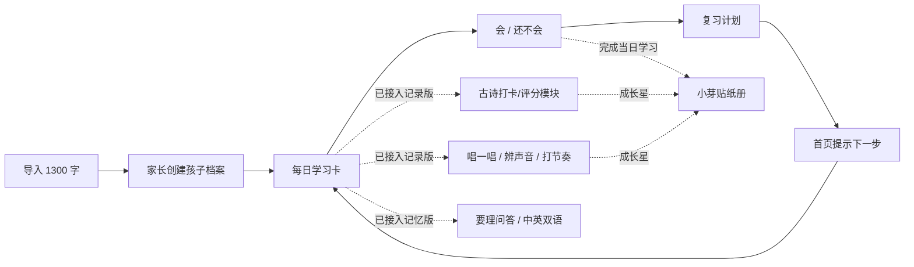

# 亲子汉字学习系统｜方案总览

> 目标：先为一位孩子做出一套每天愿意打开、能持续复习、父母看得懂进度的学习工具；目前已包含识字、诗词背诵、音乐练习、要理问答与小芽贴纸奖励五个模块。

## 最初 MVP 决策（历史背景）

项目最初只做 **「汉字识认 + 拼音辅助 + 间隔复习 + 家长导入/看进度」**。在这一闭环稳定后，现已按独立数据边界加入诗词、音乐和要理问答；录音自动评分与开放式 AI 对话仍不在当前范围。

原因很简单：孩子每天实际使用的是“看到一个字 → 想一想 → 说会/不会 → 明天再遇到”的闭环。这个闭环的内容、学习记录和复习算法一旦可靠，古诗和音乐都可以复用同一套内容/学习项/复习记录基础设施。

## 文档导航

| 文档 | 作用 | 先读对象 |
| --- | --- | --- |
| [01_产品方案与MVP.md](./01_产品方案与MVP.md) | 产品目标、MVP 边界、学习流程与迭代顺序 | 产品负责人、开发者 |
| [02_移动端UI与交互设计.md](./02_移动端UI与交互设计.md) | iPhone/iPad 信息架构、页面线框、视觉与无障碍规则 | 产品负责人、设计/前端 |
| [03_数据模型与技术架构.md](./03_数据模型与技术架构.md) | Supabase、Vercel、Azure AI/Speech、RLS 与数据表建议 | 开发者 |
| [04_内容导入与实施路线图.md](./04_内容导入与实施路线图.md) | 1300 字导入规范、验收标准、开发分期 | 内容整理者、开发者 |
| [05_待确认的产品问题.md](./05_待确认的产品问题.md) | 基本已经决定、但不阻碍先做原型的问题 | 产品负责人 |
| [DEPLOYMENT.md](./DEPLOYMENT.md) | 从 SQL、环境变量到 Vercel 发布的逐步操作 | 部署者 |
| [07_自定义域名配置_le.fisherai6.top.md](./07_自定义域名配置_le.fisherai6.top.md) | Cloudflare、Vercel、Supabase 的 `le.fisherai6.top` 正式域名配置 | 部署者 |
| [08_联想图功能配置.md](./08_联想图功能配置.md) | Azure 部署 `gpt-image-1-mini`、环境变量、成本与验收 | 部署者 |
| [09_诗词背诵模块说明.md](./09_诗词背诵模块说明.md) | 诗词 CSV、打卡/评分规则与后续迭代边界 | 家长、后续开发者 |
| [10_Cloudflare_R2保姆级配置教程.md](./10_Cloudflare_R2保姆级配置教程.md) | R2 Bucket、CORS、API Token、Vercel 变量与音乐上传验收 | 部署者 |
| [11_要理问答模块说明.md](./11_要理问答模块说明.md) | 双语问答 CSV、人工判断、复习规则、管理与验收 | 家长、后续开发者 |
| [12_汉字重点字功能说明.md](./12_汉字重点字功能说明.md) | 跨字册选择重点字、队列优先级、漏学处理和验收 | 家长、后续开发者 |
| [13_奖励贴纸模块说明.md](./13_奖励贴纸模块说明.md) | 贴纸/成长星规则、礼物兑换、Supabase 配置与验收 | 家长、部署者、后续开发者 |
| [14_汉字动态双确认规则说明.md](./14_汉字动态双确认规则说明.md) | 新字/不稳定字双确认、柔和降级和当天反复认 | 家长、后续开发者 |
| [15_多家庭管理员与智能复习说明.md](./15_多家庭管理员与智能复习说明.md) | 家庭隔离、管理员审核/分配、家长看板和有界自适应复习 | 管理员、部署者、后续 AI Agent |
| [16_用户家庭管理与资源安全清理说明.md](./16_用户家庭管理与资源安全清理说明.md) | owner 用户管理、首次改密、Secret key 与重复资源安全合并 | 所有者、部署者、后续 AI Agent |
| [17_Resend密码恢复邮件配置教程.md](./17_Resend密码恢复邮件配置教程.md) | 忘记密码、Resend SMTP、Cloudflare 邮件 DNS、恢复模板与验收 | 所有者、部署者 |
| [18_诗境守卫战模块说明.md](./18_诗境守卫战模块说明.md) | 电脑/手机诗词游戏、AI 地图、家长评分、018 SQL 与验收 | 家长、部署者、后续 AI Agent |
| [ARCHITECTURE.md](./ARCHITECTURE.md) | 当前代码边界、数据流、迭代约束与 AI Agent 交接说明 | 后续开发者 / AI Agent |

## 本次参考了什么

### 可以继承

- 英语系统的首页“继续学习 + 今日待复习”，不让学习者自己判断下一步。
- 英语系统的卡片式复习、学习状态和上下文内容展示。
- 英语系统学习页底部常驻的播放控制；汉字系统可改成卡片内的“朗读”主按钮。
- 管理系统已有的 Next.js App Router、Supabase SSR、统一应用外壳、角色/资料管理经验。

### 不应照搬

- iPhone 不用左侧长导航和桌面表格；应为底部四栏导航与一页一件事。
- 儿童学习页不展示“课程、统计、筛选、设置”这类管理信息；让大字和明确按钮占据屏幕。
- 第一版不要把 AI 变成聊天机器人；AI 只负责生成、缓存、可审核的儿童内容。

## 一句话的产品定义

**“字芽”**（暂定名）是一套面向家庭的 PWA 汉字学习工具：孩子每天只需完成一小组大字卡，系统记录每次“会/不会”，按记忆曲线安排重逢；家长负责导入内容、查看进度和调整节奏。

## MVP 成功标准

- 能导入并发布第一批 1300 个汉字。
- 孩子在 iPhone 上能独立完成一次 5–10 分钟的“新字 + 复习”学习。
- 每次判断都留有可追溯记录，系统能给出下次复习日。
- 家长在 iPad/电脑上能看到：今日完成、会/不会比例、薄弱字、近期建议。
- 汉字有可靠的拼音、声调和朗读；AI 失败时，核心学习与复习仍可使用。

## 推荐的第一条开发路径

```mermaid
flowchart LR
  A[导入 1300 字] --> B[家长创建孩子档案]
  B --> C[每日学习卡]
  C --> D[会 / 还不会]
  D --> E[复习计划]
  E --> F[首页提示下一步]
  F --> C
  C -.已接入记录版.-> G[古诗打卡/评分模块]
  C -.已接入记录版.-> H[唱一唱 / 辨声音 / 打节奏]
  C -.已接入记忆版.-> I[要理问答 / 中英双语]
  D -.完成当日学习.-> J[小芽贴纸册]
  G -.成长星.-> J
  H -.成长星.-> J
```

## 使用本方案的方式

先按 [01_产品方案与MVP.md](./01_产品方案与MVP.md) 做一个可用版本。开发中遇到具体取舍时，以 [05_待确认的产品问题.md](./05_待确认的产品问题.md) 为准；这些问题的答案会直接影响文案、复习参数和账号模型。

## 当前 MVP 代码

本目录同时是 MVP 应用根目录：`app/` 是 Next.js 前端；`supabase/001_hanzi_mvp.sql` 是识字基础表、RLS 和复习函数；`004`–`007` 是早期识字升级；`008`–`012` 分别加入诗词、音乐、要理问答、重点字和小芽贴纸；`013`–`014` 完成队列歧义修复、动态双确认和同日重试；`015` 新增学习空间、家庭、角色、资源审核/分配和安全邀请；`016` 将学习 RPC 接到新权限边界并增加汉字有界自适应复习；`017` 增加 owner 用户目录、首次改密和重复资源安全合并；`018` 增加诗境守卫战的场次、逐题、逐句状态和家长评分桥接。游戏使用与配置见 [18 号说明](./18_诗境守卫战模块说明.md)。密码恢复使用 Supabase Auth + Resend SMTP，按 [17 号配置教程](./17_Resend密码恢复邮件配置教程.md) 操作；音乐文件放在私有 Cloudflare R2，请严格按 [DEPLOYMENT.md](./DEPLOYMENT.md) 与 [R2 配置教程](./10_Cloudflare_R2保姆级配置教程.md) 操作。

若已部署的学习页出现队列函数返回类型错误，使用 [002_fix_get_today_queue.sql](./supabase/002_fix_get_today_queue.sql) 热修复即可；它不会删除学习数据。
